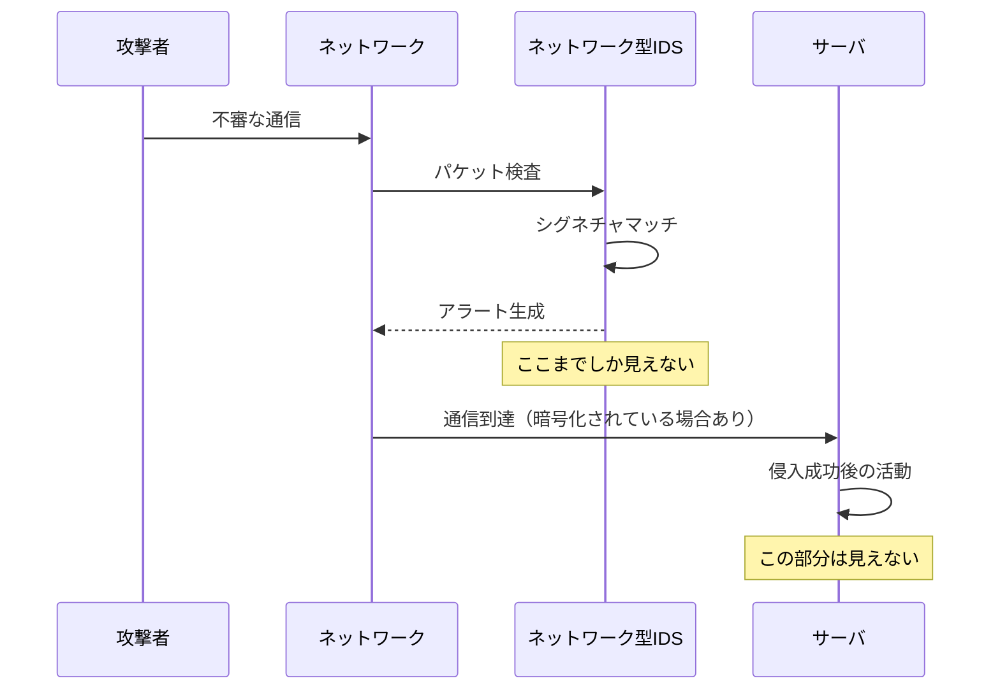
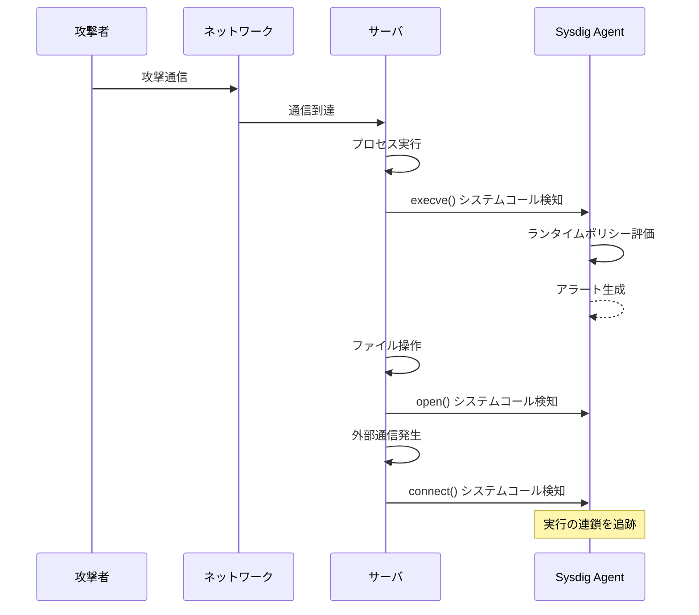
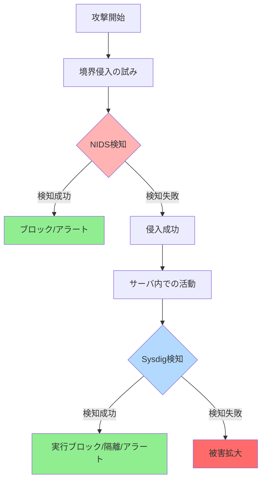
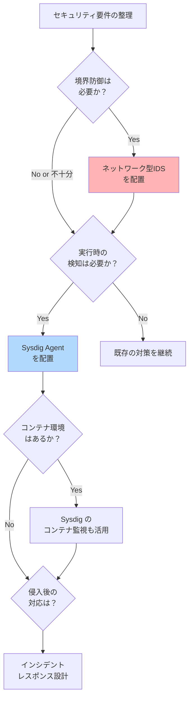

# IDSはもう要らないのか？ネットワーク型IDSとSysdig Agentが「見ている世界」の違い

## はじめに

「既にIDS機器を入れていますが、サーバにSysdig Agentを入れると何が違うのですか？」

これは実際にお客様からよく聞かれる質問です。そして、インフラエンジニアであればあるほど、この疑問を持つのは自然だと思います。

既存のセキュリティ投資があるのに、なぜ新しいエージェントを入れる必要があるのか。その疑問は正しいですし、むしろ健全な問いかけだと考えています。

本記事では、**ネットワーク型IDSとSysdig Agentが「何を見ているのか」**という根本的な違いを整理し、それぞれの役割を明確にしていきます。

営業資料的な内容ではなく、技術的な観点から「見ているレイヤーの違い」を理解することで、設計・運用の判断材料にしていただければと思います。

---

## 1. そもそも「IDS」と一口に言っても何を見ているのか

まず、従来のネットワーク型IDS（NIDS）が何を監視しているのかを整理しましょう。

### ネットワーク型IDS（NIDS）の仕組み

NIDSは、ネットワークの特定地点（FW/LBの外側or内側）に配置され、以下を監視します：

- **パケット・セッション情報**
- **通信パターン**
- **シグネチャベースの不審な通信**


NIDSは「怪しい通信が来ていないか」を検知する仕組みです。

### しかし、ここで限界が出てくる

NIDSが苦手とするケースが増えています：

| 課題 | 詳細 |
|------|------|
| **TLS暗号化** | 通信内容が見えない（復号化が必要） |
| **攻撃成功後の挙動** | 侵入後にサーバ内で何が起きたかは追えない |
| **East-West トラフィック** | サーバ間通信、コンテナ間通信は見えづらい |
| **クラウド環境** | 物理的な配置が難しい、VPC間通信の監視が複雑 |

これはNIDSが「悪い」という話ではありません。**設計思想として「境界での検知」を前提にしているため**、そもそも見るべき対象が異なるのです。

---

## 2. Sysdig Agent は「IDS」なのか？

結論から書きます。

**Sysdig Agentは、従来のネットワーク型IDSとは見ているレイヤーがまったく異なります。**

### Sysdig が見ているもの

Sysdig Agentは、各サーバ（ホスト）のLinuxカーネルイベントを監視します：

- **プロセス実行**（`execve`システムコール）
- **ファイル操作**（`open`, `write`, `delete`）
- **権限昇格**（`setuid`, `sudo`の実行）
- **ネットワーク接続の発生**（`connect`, `bind`）

ここが重要なポイントです：

> **Sysdigは通信を「見る」のではなく、通信を行った「実行事実」を見る。**

### 具体例：不審なアクセスが発生した場合

#### ネットワーク型IDSの視点
```
[ALERT] 192.168.1.100 から 172.16.0.50:22 への SSH接続を検知
シグネチャ: ブルートフォース攻撃の可能性
```

ここで検知は終わりです。その後、サーバ内で何が起きたかは見えません。

#### Sysdig の視点
```
[ALERT] SSH接続後、以下の実行を検知
1. bash プロセス起動（ユーザ: unknown）
2. /etc/passwd ファイル読み取り
3. curl コマンド実行 → 外部IP 203.0.113.10 へ接続
4. /tmp/malware バイナリのダウンロード
5. chmod +x /tmp/malware 実行
6. /tmp/malware の実行開始（プロセスID: 12345）
```

**侵入後の挙動まで追跡できる**のがSysdigの特徴です。

---

## 3. 図で見る：見ている世界の違い

### ネットワーク型IDSの視点



### Sysdig の視点



---

## 4. では、SysdigはIDSの代替なのか？

ここは慎重に整理する必要があります。

結論としては、**「完全な置き換え」ではありません。**

### 置き換えにならないケース

| シナリオ | 理由 |
|----------|------|
| **境界防御が主目的** | 外部からの攻撃を水際で止めることが目的の場合、NIDSの方が適している |
| **通信傾向の俯瞰が必要** | ネットワーク全体のトラフィック分析にはNIDSが有利 |
| **エージェント導入が難しい** | レガシーシステム、組み込み機器など、エージェントが入れられない環境 |

### Sysdigの方が強いケース

| シナリオ | 理由 |
|----------|------|
| **暗号化通信が前提** | TLS通信でもカーネルレベルで実行を検知できる |
| **攻撃成功後の検知が重要** | 侵入後の横展開、データ窃取などを検知したい |
| **コンテナ / Kubernetes 環境** | コンテナ単位での実行監視、Pod間通信の可視化が得意 |
| **ゼロトラストアーキテクチャ** | 「境界」が存在しない前提の設計 |

---

## 5. なぜ「補完関係」と考えるのが自然か

ここで一段抽象度を上げて考えてみましょう。

**NIDSは「入口」を守る。Sysdigは「中で何が起きたか」を守る。**

### 比較表

| 観点 | ネットワーク型IDS | Sysdig |
|------|-------------------|--------|
| **見るもの** | 通信（パケット） | 実行（システムコール） |
| **暗号化対応** | 弱い（復号化が必要） | 強い（実行レベルで検知） |
| **侵入後の検知** | 見えない | 見える |
| **クラウド適応** | 苦手（物理配置が必要） | 得意（エージェントベース） |
| **コンテナ対応** | 困難 | ネイティブ対応 |
| **検知の粒度** | 通信セッション単位 | プロセス・ファイル単位 |

### 実際の攻撃シナリオでの役割分担



この図が示すように、**多層防御（Defense in Depth）**の考え方では、両者は補完関係にあります。

---

## 6. 実際の設計でどう考えるべきか

今回の質問への最終回答です。

「SysdigでIDSを置き換えられるか？」ではなく、

**「現在のIDSは、何を守るために存在しているのか？」を整理することが重要です。**

### 設計時の判断フロー



### 具体的な判断基準

#### パターン1：オンプレ・境界防御中心
```
NIDS：必須
Sysdig：サーバクリティカル度に応じて導入
```

#### パターン2：クラウドネイティブ・マイクロサービス
```
NIDS：AWS WAF/Network Firewall など軽量なもの
Sysdig：コンテナ・ランタイム監視として必須
```

#### パターン3：ハイブリッド環境
```
NIDS：境界に配置
Sysdig：全サーバに配置し、統一的な可視化
```

---

## まとめ

Sysdigは「通信を検知するIDS」ではありません。
**「実行を検知するランタイムセキュリティ」**です。

その違いを理解した上で導入を検討すると、設計も運用も大きく変わります。

### 覚えておくべき3つのポイント

1. **NIDSは「通信」を見る、Sysdigは「実行」を見る**
2. **完全な置き換えではなく、補完関係**
3. **環境の特性（オンプレ/クラウド、VM/コンテナ）で最適解は変わる**

「既にIDSがあるから不要」ではなく、
「IDSでは見えない部分をSysdigで補完する」という視点で検討されることをお勧めします。

---

## 付録：PoC評価観点チェックリスト

Sysdig のPoCを実施する際、以下の観点で評価すると効果的です。

### A. 検知能力の評価

- [ ] **既存NIDSで検知できなかったイベントを検知できるか**
  - 暗号化通信後の実行
  - コンテナ内での不審なプロセス起動
  - 権限昇格の試み

- [ ] **侵入後の挙動をどこまで追跡できるか**
  - プロセスの親子関係
  - ファイルアクセスの履歴
  - ネットワーク接続の発生元プロセス

### B. 運用面の評価

- [ ] **アラートの精度（誤検知の少なさ）**
  - 初期ポリシーでの誤検知率
  - チューニング後の改善度

- [ ] **既存ツールとの連携**
  - SIEM連携（Splunk, QRadar等）
  - チケットシステム連携
  - Slackなどへの通知

- [ ] **パフォーマンスインパクト**
  - CPU使用率の増加
  - メモリ使用量
  - 本番環境での許容範囲か

### C. クラウド/コンテナ環境での評価

- [ ] **Kubernetes環境での可視性**
  - Pod単位での監視
  - Namespace単位でのポリシー適用
  - サービスメッシュとの併用

- [ ] **マルチクラウド対応**
  - AWS/Azure/GCP での統一的な監視
  - 各クラウドのネイティブサービスとの棲み分け

### D. インシデント対応での評価

- [ ] **フォレンジック情報の充実度**
  - 攻撃の全体像が把握できるか
  - タイムラインが明確か
  - 証跡として十分か

- [ ] **レスポンスアクション**
  - プロセスの自動停止
  - コンテナの自動隔離
  - カスタムスクリプトの実行

### E. 投資対効果の評価

- [ ] **既存投資との関係**
  - NIDSとの役割分担が明確か
  - 既存ツールを置き換えられるものはあるか
  - 統合による運用コスト削減

- [ ] **段階的導入の可能性**
  - クリティカルなシステムから段階導入
  - コンテナ環境のみ先行導入
  - ライセンス体系が柔軟か

---

**この評価軸を持ってPoCに臨むと、「既存IDSとの違い」を定量的に示すことができます。**

---

## 参考情報

- Sysdig 公式ドキュメント: https://docs.sysdig.com/
- MITRE ATT&CK Framework: https://attack.mitre.org/
- NIST Cybersecurity Framework: https://www.nist.gov/cyberframework

---

**著者所感**

この記事は、実際のお客様対応で感じた疑問を整理したものです。「新しいツールを入れる」ことが目的ではなく、「何を守りたいのか」を明確にすることが、セキュリティ投資の第一歩だと考えています。

技術的な正確性を保ちつつ、実務での判断材料になれば幸いです。
