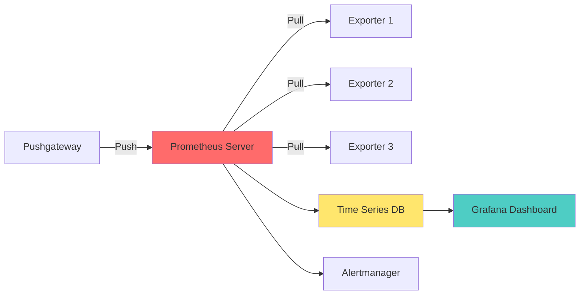
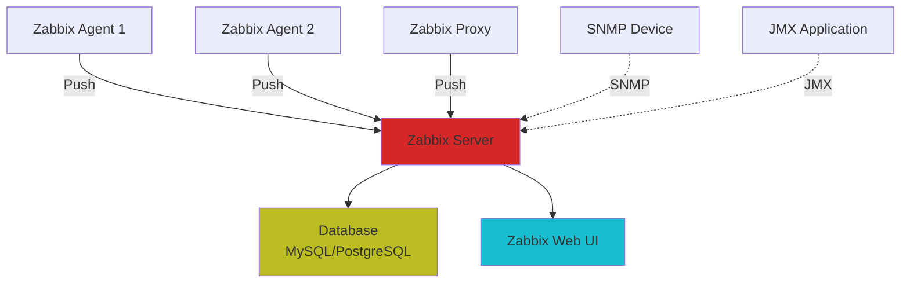
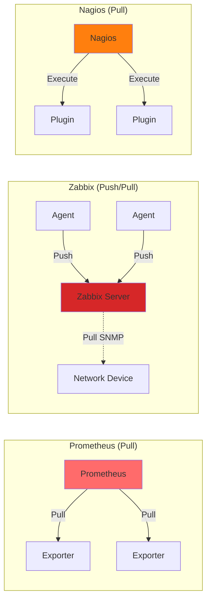
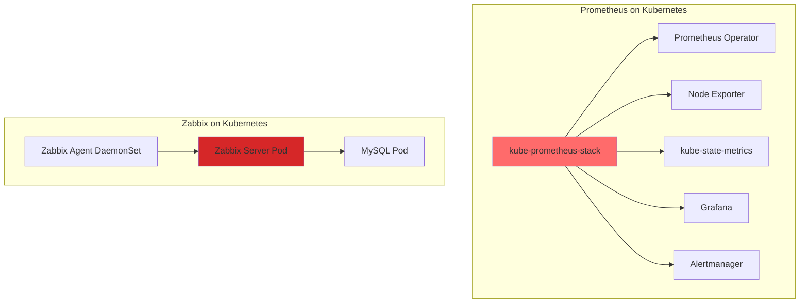
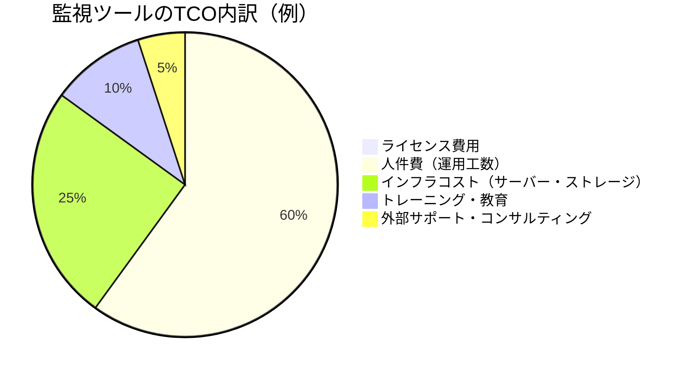
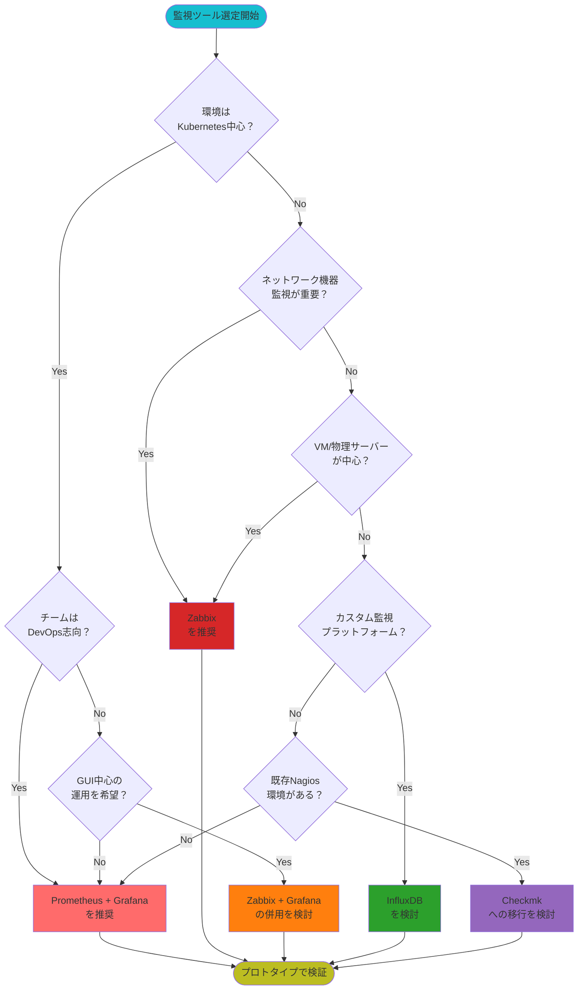
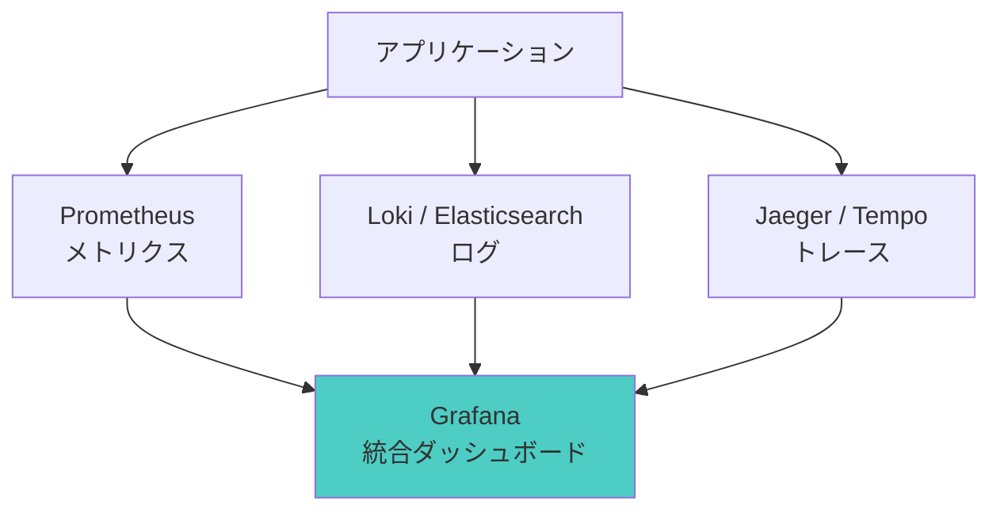

# OSS監視ツール徹底比較：あなたの環境に合う選択はどれか

***Prometheus vs Zabbix vs Nagios — 2025年最新版の完全比較ガイド。実践的な選定フローチャート、TCO分析、ユースケース別推奨構成を網羅***

## はじめに

クラウドネイティブ化、マルチクラウド、マイクロサービスアーキテクチャの普及により、システムの複雑性は飛躍的に増大しています。こうした環境において、**適切な監視ツールの選定**は、システムの安定稼働とビジネスの成功に直結する重要な決定となっています。

2025年現在、監視ツール選定において以下の課題が顕在化しています：

- **環境の多様化**: コンテナ、VM、物理サーバー、ネットワーク機器が混在
- **可観測性の要求増大**: メトリクス、ログ、トレースの統合管理
- **運用コストの最適化**: ツールのライセンスコストだけでなく、運用工数も考慮
- **スキルセットの違い**: DevOpsチームと従来のインフラチームで求められる機能が異なる

### なぜOSS監視ツールなのか

オープンソースの監視ツールには、以下の明確なメリットがあります：

1. **コスト効率**: ライセンス費用が不要（運用コストは別途考慮が必要）
2. **拡張性**: プラグインやExporterによる柔軟なカスタマイズ
3. **透明性**: ソースコードが公開され、内部動作を理解可能
4. **コミュニティ**: 活発なコミュニティによる継続的な改善
5. **ベンダーロックイン回避**: 特定ベンダーへの依存を回避

ただし、**OSSだからといって「無料で簡単」というわけではありません**。適材適所の選定と、適切な運用体制の構築が不可欠です。

### 本記事の目的

本記事では、主要なOSS監視ツールを以下の観点で徹底的に比較します：

- **用途・適用シーン**: どのような環境に最適か
- **アーキテクチャ**: データ収集モデル、スケーラビリティ
- **制約・注意点**: 導入前に知っておくべき課題
- **選定ポイント**: 実践的な選定基準

これにより、読者の皆様が**自社環境に最適な監視ツールを選定できる**ようになることを目指します。

---

## 比較対象ツール概要

本記事では、以下のOSS監視ツールを比較します：

### メイン比較対象

1. **Prometheus + Grafana**: クラウドネイティブ環境のデファクトスタンダード
2. **Zabbix**: レガシーインフラ・エンタープライズ環境で実績豊富

### サブ比較対象

3. **Nagios**: 老舗の監視ツール
4. **Checkmk**: Nagiosベースの多機能監視ツール
5. **InfluxDB**: 時系列データベース（監視プラットフォームの基盤として）

---

## 1. Prometheus + Grafana

### 概要

**Prometheus**は、SoundCloudで開発され、2016年にCNCF（Cloud Native Computing Foundation）の2番目のプロジェクトとして採用された時系列データベース＋監視ツールです。**Grafana**は、メトリクスを可視化するダッシュボードプラットフォームで、Prometheusと組み合わせて利用されることが一般的です。

### アーキテクチャの特徴



#### プルモデルの採用

Prometheusの最大の特徴は、**プルモデル（Pull-based）**によるメトリクス収集です：

- **Exporter**: 各監視対象にExporterを配置し、HTTPエンドポイントでメトリクスを公開
- **Scraping**: Prometheus Serverが定期的に各Exporterからメトリクスを取得（デフォルト15秒間隔）
- **Service Discovery**: Kubernetes、Consul、EC2など、動的な環境に対応

#### 高次元ラベリング

Prometheusは、メトリクスに複数のラベルを付与できる**多次元データモデル**を採用：

```promql
http_requests_total{method="GET", endpoint="/api/users", status="200"}
```

これにより、柔軟なクエリとアグリゲーションが可能になります。

### 強み

#### 1. Kubernetes / マイクロサービスへの最適化

- **ネイティブ統合**: Kubernetes環境では、PodやServiceの自動検出が可能
- **動的環境対応**: コンテナの追加・削除に自動で対応
- **高カーディナリティ**: 大量のラベルを持つメトリクスを効率的に処理

#### 2. 強力なクエリ言語（PromQL）

PromQL（Prometheus Query Language）により、複雑な集計・分析が可能：

```promql
# 過去5分間のHTTPリクエスト成功率
sum(rate(http_requests_total{status=~"2.."}[5m]))
/
sum(rate(http_requests_total[5m]))
```

#### 3. 豊富なExporterエコシステム

- **公式Exporter**: Node Exporter、Blackbox Exporter、HAProxy Exporter等
- **サードパーティ**: MySQL、PostgreSQL、Redis、Nginxなど、あらゆるミドルウェアに対応
- **カスタムExporter**: 独自アプリケーションのメトリクス公開が容易

#### 4. Grafanaとの統合

- **美しいダッシュボード**: 直感的なビジュアライゼーション
- **テンプレート機能**: 変数を使用した動的ダッシュボード
- **アラート統合**: Grafana Alerting、Alertmanagerとの連携

### 注意点・制約

#### 1. 長期データ保持の課題

Prometheusのローカルストレージは、**デフォルトで15日間のデータ保持**を想定：

- **ストレージ容量**: 大規模環境では数TB以上必要
- **長期保存**: Thanos、Cortex、VictoriaMetricsなどの外部ソリューションが必要
- **バックアップ**: スナップショット機能はあるが、運用設計が必要

#### 2. スケーリングの複雑性

単一のPrometheus Serverでは、以下の限界があります：

- **メトリクス数**: 数百万メトリクスが上限（環境に依存）
- **Scraping対象数**: 数千台が現実的な上限
- **マルチクラスタ**: 複数のPrometheus Serverを統合する仕組みが必要（Thanos等）

#### 3. 運用工数

- **インストール・設定**: Helm Chartで簡易化されているが、理解が必要
- **PromQL習得**: 効果的な活用には学習コストがかかる
- **Exporterメンテナンス**: 各監視対象にExporterの配置と管理が必要

#### 4. プッシュモデルへの対応

バッチジョブなど、短命なプロセスの監視には**Pushgateway**が必要：

- **追加コンポーネント**: アーキテクチャが複雑化
- **メトリクスの永続性**: Pushgatewayが単一障害点になるリスク

### 適用シーン

Prometheus + Grafanaは、以下の環境に最適です：

✅ **最適な環境**:
- Kubernetes / コンテナ環境
- マイクロサービスアーキテクチャ
- クラウドネイティブアプリケーション
- DevOpsチームが主体の運用
- 高頻度のデプロイと動的なスケーリング

❌ **不向きな環境**:
- レガシーな物理サーバー中心の環境
- ネットワーク機器の詳細監視（SNMP中心）
- GUI中心の運用を希望する場合
- 長期データ保持が必須で、追加ソリューション導入が困難な場合

### セットアップ例（Kubernetes）

```yaml
# prometheus-values.yaml
prometheus:
  prometheusSpec:
    retention: 15d
    storageSpec:
      volumeClaimTemplate:
        spec:
          accessModes: ["ReadWriteOnce"]
          resources:
            requests:
              storage: 50Gi
    resources:
      requests:
        cpu: 500m
        memory: 2Gi
      limits:
        cpu: 2000m
        memory: 8Gi

grafana:
  adminPassword: "your-secure-password"
  persistence:
    enabled: true
    size: 10Gi

alertmanager:
  alertmanagerSpec:
    storage:
      volumeClaimTemplate:
        spec:
          accessModes: ["ReadWriteOnce"]
          resources:
            requests:
              storage: 10Gi
```

```bash
# Helm Chart でのインストール
helm repo add prometheus-community https://prometheus-community.github.io/helm-charts
helm repo update

helm install prometheus prometheus-community/kube-prometheus-stack \
  -n monitoring \
  --create-namespace \
  -f prometheus-values.yaml
```

---

## 2. Zabbix

### 概要

**Zabbix**は、2001年にAlexei Vladishevによって開発された、エンタープライズ向けのオープンソース監視ツールです。20年以上の歴史を持ち、**レガシーインフラとエンタープライズ環境**での実績が豊富です。

### アーキテクチャの特徴



#### プッシュ & プルの両対応

Zabbixは、**プッシュとプルの両モデル**をサポート：

- **Zabbix Agent**: エージェントがサーバーにメトリクスをプッシュ（アクティブモード）
- **Zabbix Server Pull**: サーバーがエージェントからメトリクスを取得（パッシブモード）
- **SNMP / IPMI**: ネットワーク機器やハードウェア監視

#### 集中管理型アーキテクチャ

- **Zabbix Server**: すべての監視ロジック、アラート、データ処理を集中管理
- **Zabbix Proxy**: 大規模環境やリモートサイトの監視を分散
- **Database**: MySQL、PostgreSQL、TimescaleDBなどのRDBMSを使用

### 強み

#### 1. レガシーインフラへの対応力

Zabbixは、**物理サーバー、VM、ネットワーク機器**の監視に特に強みを持ちます：

- **SNMP監視**: ルーター、スイッチ、ファイアウォールなどのネットワーク機器
- **IPMI**: サーバーのハードウェアヘルス（温度、ファン、電源）
- **Windows**: WMI、Perfmonカウンターのネイティブサポート
- **Linux**: CPU、メモリ、ディスク、プロセスの詳細監視

#### 2. GUI中心の操作性

- **Web UI**: すべての設定をGUIで完結
- **テンプレート**: 豊富な監視テンプレート（MySQL、Apache、Nginxなど）
- **ビジュアル化**: スクリーン、マップ、グラフの作成が直感的
- **ダッシュボード**: カスタマイズ可能なダッシュボード機能

#### 3. 組み込みアラート機能

Prometheusとは異なり、Zabbixは**アラート機能を内蔵**：

- **トリガー設定**: 閾値ベースのアラート設定がGUIで可能
- **通知チャネル**: Email、Slack、PagerDuty、SMS等に対応
- **エスカレーション**: 段階的なアラート通知
- **依存関係**: ホスト間の依存関係を考慮したアラート抑制

#### 4. 長期データ保持

Zabbixは、RDBMSを使用するため、**長期データ保持が標準機能**：

- **データ保持ポリシー**: アイテムごとに保持期間を設定可能
- **履歴データ**: デフォルトで90日間保持
- **トレンドデータ**: 集計データを長期保存（年単位）
- **パーティショニング**: TimescaleDBやMySQLパーティショニングで性能最適化

#### 5. エージェントレス監視

Zabbix Agentをインストールせずに監視可能：

- **SNMP**: ネットワーク機器、プリンター
- **IPMI**: サーバーハードウェア
- **SSH / Telnet**: リモートコマンド実行による監視
- **Web監視**: HTTPシナリオチェック

### 注意点・制約

#### 1. クラウドネイティブ対応の限界

Zabbixは、コンテナ・Kubernetes環境では、Prometheusほど柔軟ではありません：

- **動的環境**: PodやServiceの自動検出は、追加設定が必要
- **高カーディナリティ**: 大量のラベル・タグを持つメトリクスの処理が非効率
- **コンテナ監視**: Docker、Kubernetesのテンプレートはあるが、ネイティブ統合ではない

#### 2. スケーラビリティの制約

Zabbixのスケーリングには、以下の課題があります：

- **データベース負荷**: 大量のメトリクスはDBのボトルネックに
- **Zabbix Server負荷**: 単一サーバーでの処理能力に限界
- **Zabbix Proxy**: プロキシによる分散は可能だが、設計が必要

#### 3. クエリ言語の柔軟性

- **計算済みアイテム**: 基本的な演算は可能だが、PromQLほど柔軟ではない
- **複雑な集計**: 高度な分析には外部ツール（Grafana等）が必要

#### 4. 設定の複雑性（大規模環境）

- **テンプレート管理**: 大規模環境では、テンプレートの管理が煩雑
- **アイテム数**: ホストあたり数百〜数千のアイテムを管理する必要
- **パフォーマンス調整**: キャッシュ、プロセス数などの最適化が必要

### 適用シーン

Zabbixは、以下の環境に最適です：

✅ **最適な環境**:
- 物理サーバー、VM中心のインフラ
- ネットワーク機器（ルーター、スイッチ）の監視
- Windows環境の詳細監視
- エンタープライズ環境（金融、製造、通信など）
- GUI中心の運用を希望する場合
- 長期データ保持が必須の場合

❌ **不向きな環境**:
- Kubernetes / コンテナ中心の環境
- 高頻度デプロイと動的スケーリング
- DevOpsチームが主体で、IaCを重視する場合
- マイクロサービスアーキテクチャ

### セットアップ例（Docker Compose）

```yaml
# docker-compose.yml
version: '3.8'

services:
  zabbix-server:
    image: zabbix/zabbix-server-mysql:alpine-6.4-latest
    container_name: zabbix-server
    environment:
      DB_SERVER_HOST: mysql
      MYSQL_DATABASE: zabbix
      MYSQL_USER: zabbix
      MYSQL_PASSWORD: zabbix_password
      MYSQL_ROOT_PASSWORD: root_password
    ports:
      - "10051:10051"
    volumes:
      - /etc/localtime:/etc/localtime:ro
      - zabbix-server-data:/var/lib/zabbix
    depends_on:
      - mysql

  zabbix-web:
    image: zabbix/zabbix-web-nginx-mysql:alpine-6.4-latest
    container_name: zabbix-web
    environment:
      DB_SERVER_HOST: mysql
      MYSQL_DATABASE: zabbix
      MYSQL_USER: zabbix
      MYSQL_PASSWORD: zabbix_password
      ZBX_SERVER_HOST: zabbix-server
      PHP_TZ: Asia/Tokyo
    ports:
      - "80:8080"
    depends_on:
      - zabbix-server

  mysql:
    image: mysql:8.0
    container_name: zabbix-mysql
    environment:
      MYSQL_DATABASE: zabbix
      MYSQL_USER: zabbix
      MYSQL_PASSWORD: zabbix_password
      MYSQL_ROOT_PASSWORD: root_password
    volumes:
      - mysql-data:/var/lib/mysql
    command:
      - --character-set-server=utf8mb4
      - --collation-server=utf8mb4_bin
      - --default-authentication-plugin=mysql_native_password

volumes:
  zabbix-server-data:
  mysql-data:
```

```bash
# Zabbix Agent のインストール（監視対象サーバー）
# Ubuntu / Debian
wget https://repo.zabbix.com/zabbix/6.4/ubuntu/pool/main/z/zabbix-release/zabbix-release_6.4-1+ubuntu22.04_all.deb
sudo dpkg -i zabbix-release_6.4-1+ubuntu22.04_all.deb
sudo apt update
sudo apt install -y zabbix-agent

# 設定
sudo vi /etc/zabbix/zabbix_agentd.conf
# Server=<Zabbix Server IP>
# ServerActive=<Zabbix Server IP>
# Hostname=<ホスト名>

sudo systemctl restart zabbix-agent
sudo systemctl enable zabbix-agent
```

---

## 3. その他のOSS監視ツール（概要）

### Nagios

**概要**: 1999年にリリースされた老舗の監視ツール。多くのエンタープライズ環境で使用されています。

**強み**:
- プラグインエコシステムが成熟（Nagios Plugins）
- シンプルで理解しやすいアーキテクチャ
- コミュニティが大きい

**注意点**:
- UIが古く、設定ファイルベース
- スケーラビリティに限界
- クラウドネイティブ環境には不向き

**適用シーン**: 小規模〜中規模の従来型インフラ、既存Nagios環境の継続利用

---

### Checkmk

**概要**: NagiosをベースにしたRAW版（無料）と、エンタープライズ版（有料）が存在。

**強み**:
- Nagiosの機能を大幅に拡張
- 自動検出機能（ホスト、サービス）
- 優れたWeb UI
- 豊富なプラグイン

**注意点**:
- RAW版は機能制限あり
- Nagiosベースのため、アーキテクチャの制約を継承

**適用シーン**: Nagiosからの移行、中規模エンタープライズ環境

---

### InfluxDB

**概要**: 時系列データベース（TSDB）。監視ツールというより、監視プラットフォームの基盤として使用。

**強み**:
- 高速な書き込み・読み込み性能
- SQLライクなクエリ言語（InfluxQL、Flux）
- ダウンサンプリング機能
- Telegrafによるデータ収集

**注意点**:
- 監視ツールではなく、データベース
- アラート機能は別途Kapacitorが必要
- クラスタリングはエンタープライズ版（有料）

**適用シーン**: カスタム監視プラットフォーム構築、IoTデータ管理、Prometheusの長期ストレージ

---

## 徹底比較：選定基準別

### 比較表：全体像

| 比較項目 | Prometheus + Grafana | Zabbix | Nagios | Checkmk | InfluxDB |
|---------|---------------------|--------|--------|---------|----------|
| **データ収集モデル** | プル中心 | プッシュ / プル | プル | プル | プッシュ |
| **主な対象** | コンテナ / K8s | VM / ネットワーク | サーバー | サーバー / ネットワーク | 時系列データ全般 |
| **スケーラビリティ** | ⭐⭐⭐⭐⭐ | ⭐⭐⭐ | ⭐⭐ | ⭐⭐⭐ | ⭐⭐⭐⭐⭐ |
| **可視化** | Grafana（優秀） | 組み込みUI | 基本的 | 優秀 | Grafana推奨 |
| **導入容易性** | ⭐⭐⭐ | ⭐⭐⭐⭐ | ⭐⭐ | ⭐⭐⭐⭐ | ⭐⭐⭐ |
| **クラウドネイティブ** | ⭐⭐⭐⭐⭐ | ⭐⭐ | ⭐ | ⭐⭐ | ⭐⭐⭐⭐ |
| **レガシー対応** | ⭐⭐ | ⭐⭐⭐⭐⭐ | ⭐⭐⭐⭐ | ⭐⭐⭐⭐ | ⭐⭐ |
| **長期データ保持** | ⭐⭐⭐（要外部） | ⭐⭐⭐⭐⭐ | ⭐⭐⭐ | ⭐⭐⭐⭐ | ⭐⭐⭐⭐⭐ |
| **アラート機能** | Alertmanager別途 | 組み込み | 組み込み | 組み込み | Kapacitor別途 |
| **学習コスト** | 高（PromQL） | 中 | 低 | 中 | 中（InfluxQL） |
| **コミュニティ** | ⭐⭐⭐⭐⭐ | ⭐⭐⭐⭐ | ⭐⭐⭐⭐ | ⭐⭐⭐ | ⭐⭐⭐⭐ |

---

### 比較軸1: データ収集モデル



#### プルモデル（Prometheus、Nagios、Checkmk）

**メリット**:
- 監視サーバーが収集を制御（対象がダウンしても検知可能）
- ネットワークトラフィックを監視サーバー側で制御

**デメリット**:
- 短命なジョブ（バッチ処理）の監視が困難
- ファイアウォール越えの監視が複雑

#### プッシュモデル（Zabbix、InfluxDB + Telegraf）

**メリット**:
- 短命なジョブの監視が容易
- ファイアウォール越えの監視がシンプル

**デメリット**:
- エージェント側の設定変更が必要
- 大量のエージェントからのプッシュでサーバー負荷増大

---

### 比較軸2: スケーラビリティ

| ツール | 単一インスタンスの限界 | スケールアウト方法 | 推奨規模 |
|-------|---------------------|-------------------|---------|
| **Prometheus** | 数百万メトリクス | Thanos / Cortex / VictoriaMetrics | 大規模 |
| **Zabbix** | 数万ホスト | Zabbix Proxy / パーティショニング | 中〜大規模 |
| **Nagios** | 数千ホスト | 複数インスタンス（手動統合） | 小〜中規模 |
| **Checkmk** | 数万ホスト | 分散監視サイト | 中〜大規模 |
| **InfluxDB** | 数百万ポイント/秒 | クラスタリング（Enterprise） | 大規模 |

#### Prometheusのスケーリング戦略

**Thanos**:
- 複数のPrometheus Serverを統合
- S3等のオブジェクトストレージに長期データ保存
- グローバルクエリビュー

```yaml
# Thanos Sidecar を使用した構成例
prometheus:
  prometheusSpec:
    thanos:
      objectStorageConfig:
        key: thanos.yaml
        name: thanos-objstore-config
```

**Cortex / Mimir**:
- マルチテナント対応
- 水平スケーリング
- 長期ストレージ統合

#### Zabbixのスケーリング戦略

**Zabbix Proxy**:
- リモートサイトや大量のホストを分散監視
- Proxy → Server への定期的なデータ転送

**データベース最適化**:
- TimescaleDB（PostgreSQL拡張）で性能向上
- パーティショニングによる大量データ処理

---

### 比較軸3: 可視化・ダッシュボード

| ツール | 可視化ツール | 強み | 注意点 |
|-------|------------|------|--------|
| **Prometheus** | Grafana | 高度なダッシュボード、テンプレート変数 | Grafana別途必要 |
| **Zabbix** | 組み込みUI | 統合管理、テンプレート豊富 | Grafanaほど柔軟ではない |
| **Nagios** | NagVis等 | 基本的なネットワークマップ | 可視化は弱い |
| **Checkmk** | 組み込みUI | 自動生成ダッシュボード | カスタマイズ性は中程度 |
| **InfluxDB** | Chronograf / Grafana | Grafana統合が一般的 | アラート機能は別途 |

---

### 比較軸4: コンテナ / Kubernetes 対応



#### Prometheus + Grafana

- **kube-prometheus-stack**: Helm Chartで簡単導入
- **Service Discovery**: KubernetesのAPIから自動検出
- **kube-state-metrics**: Kubernetesリソースのメトリクス公開
- **Node Exporter**: ノードレベルのメトリクス

#### Zabbix

- **Zabbix Agent 2**: Dockerプラグイン、Kubernetesプラグイン
- **テンプレート**: Docker、Kubernetes用テンプレートあり
- **制約**: 動的なPod検出はPrometheusほど柔軟ではない

---

### 比較軸5: ネットワーク機器 / レガシーインフラ対応

| ツール | SNMP監視 | IPMI | WMI（Windows） | エージェントレス |
|-------|---------|------|----------------|-----------------|
| **Prometheus** | △（SNMP Exporter） | △ | △ | △ |
| **Zabbix** | ⭐⭐⭐⭐⭐ | ⭐⭐⭐⭐⭐ | ⭐⭐⭐⭐⭐ | ⭐⭐⭐⭐⭐ |
| **Nagios** | ⭐⭐⭐⭐ | ⭐⭐⭐ | ⭐⭐⭐ | ⭐⭐⭐⭐ |
| **Checkmk** | ⭐⭐⭐⭐ | ⭐⭐⭐⭐ | ⭐⭐⭐⭐ | ⭐⭐⭐⭐⭐ |

**結論**: レガシーインフラ（物理サーバー、ネットワーク機器、Windows）の監視では、**Zabbix**または**Checkmk**が圧倒的に優位です。

---

## 選定のポイント＆実践アドバイス

### ステップ1: 自社インフラ構成の整理

以下のチェックリストで、自社環境を分析しましょう：

#### 環境タイプ

| 項目 | チェック | 推奨ツール |
|------|---------|-----------|
| Kubernetes / コンテナ中心（70%以上） | ☐ | Prometheus + Grafana |
| VM / 物理サーバー中心（70%以上） | ☐ | Zabbix |
| コンテナとVM混在（50:50） | ☐ | Prometheus + Zabbix 併用 |
| ネットワーク機器監視が重要 | ☐ | Zabbix または Checkmk |
| マイクロサービス（100以上のサービス） | ☐ | Prometheus + Grafana |

#### 運用体制

| 項目 | チェック | 推奨ツール |
|------|---------|-----------|
| DevOpsチームが主体 | ☐ | Prometheus + Grafana |
| 従来型インフラチーム | ☐ | Zabbix |
| GUI中心の運用を希望 | ☐ | Zabbix または Checkmk |
| IaC（Infrastructure as Code）重視 | ☐ | Prometheus + Grafana |
| コマンドライン / API操作が得意 | ☐ | Prometheus + Grafana |

#### データ要件

| 項目 | チェック | 推奨ツール |
|------|---------|-----------|
| 長期データ保持（1年以上）必須 | ☐ | Zabbix または InfluxDB |
| リアルタイム性重視（15秒以下） | ☐ | Prometheus |
| 高カーディナリティメトリクス | ☐ | Prometheus |
| コンプライアンス要件（データ保持） | ☐ | Zabbix または Thanos |

---

### ステップ2: チームスキルと運用工数の評価

#### 必要なスキルセット

| ツール | 必要なスキル | 学習期間（目安） | 運用工数（月） |
|-------|------------|----------------|---------------|
| **Prometheus + Grafana** | PromQL、Kubernetes、YAML、Helm | 2〜3ヶ月 | 20〜40時間 |
| **Zabbix** | SQL基礎、ネットワーク、Linux基礎 | 1〜2ヶ月 | 10〜20時間 |
| **Nagios** | シェルスクリプト、プラグイン開発 | 1ヶ月 | 5〜10時間 |
| **Checkmk** | Nagiosベース、自動検出設定 | 1〜2ヶ月 | 10〜15時間 |

#### 運用工数の内訳

**Prometheus + Grafana**:
- Exporterの配置・更新
- PromQLクエリのチューニング
- Grafanaダッシュボードのメンテナンス
- Alertmanagerルールの更新
- スケーリング（Thanos等）の管理

**Zabbix**:
- テンプレートの管理
- ホスト・アイテムの追加
- トリガーの調整
- データベースのパフォーマンス最適化
- バージョンアップグレード

---

### ステップ3: 将来の拡張を見据えた設計

#### クラウド移行を計画している場合

現在オンプレミスでも、将来クラウド移行を計画している場合：

✅ **推奨**: Prometheus + Grafana
- クラウドネイティブ環境への移行がスムーズ
- AWS、Azure、GCPのマネージドサービスと統合可能
- コンテナ化が進んでも対応可能

⚠️ **注意**: Zabbix
- クラウド移行後もZabbixを継続利用する場合、VM版の管理が必要
- コンテナ化が進むと、Prometheusへの移行を検討する必要

#### マルチクラウド戦略

複数のクラウドプロバイダーを使用する場合：

✅ **Prometheus + Thanos**: 複数クラスタを統合的に監視
✅ **Zabbix**: クラウドを問わず、エージェントベースで統一監視

---

### ステップ4: コスト分析（TCO: Total Cost of Ownership）

OSS監視ツールは「ライセンス無料」ですが、**運用コストを含めたTCO**を考慮する必要があります。



#### コスト比較（年間、1000ホスト規模の例）

| 項目 | Prometheus + Grafana | Zabbix | 商用SaaS監視ツール |
|------|---------------------|--------|-------------------|
| **ライセンス費用** | $0 | $0 | $50,000〜$200,000 |
| **インフラコスト** | $30,000（K8s + ストレージ） | $20,000（VM + DB） | $0（SaaSに含まれる） |
| **運用工数** | 480時間/年（$48,000） | 240時間/年（$24,000） | 120時間/年（$12,000） |
| **教育・トレーニング** | $10,000 | $5,000 | $2,000 |
| **合計（年間）** | **$88,000** | **$49,000** | **$64,000〜$214,000** |

**考察**:
- Zabbixは運用工数が少なく、TCOが最も低い
- Prometheus + Grafanaは運用工数が高いが、クラウドネイティブでは必須
- 商用SaaSは、運用工数は少ないが、ライセンス費用が高額

---

### ステップ5: プロトタイプ導入 & スモールスタート

**重要**: いきなり本番環境に導入せず、**プロトタイプで検証**しましょう。

#### プロトタイプ導入の手順

1. **検証環境の構築**（1週間）
   - 小規模なKubernetesクラスタまたはVM環境
   - 候補ツールを複数インストール

2. **実データでの検証**（2週間）
   - 実際のアプリケーションを監視
   - ダッシュボード、アラートの設定
   - チームメンバーによる評価

3. **運用シミュレーション**（1週間）
   - 障害発生時のアラート動作確認
   - メトリクスの長期保存テスト
   - スケーリングテスト

4. **評価 & 決定**（1週間）
   - チーム全体での評価会議
   - TCO計算
   - 最終決定

---

## 実践的な選定フローチャート



---

## ユースケース別の推奨構成

### ユースケース1: スタートアップ（Kubernetes中心）

**環境**:
- Kubernetes（EKS / GKE / AKS）
- マイクロサービス（20サービス）
- チーム規模: 10名

**推奨構成**:
```
Prometheus + Grafana（kube-prometheus-stack）
  ↓
Loki（ログ集約）
  ↓
（オプション）Managed Prometheus（AWS / GCP）
```

**理由**:
- クラウドネイティブ環境に最適
- チームがDevOps志向
- マネージドサービスで運用負荷軽減

---

### ユースケース2: エンタープライズ（レガシー + クラウド混在）

**環境**:
- オンプレミス VM（500台）
- Kubernetes（50ノード）
- ネットワーク機器（100台）
- チーム規模: 30名（インフラチーム + DevOpsチーム）

**推奨構成**:
```
Zabbix（VM + ネットワーク機器）
  ↓
Prometheus + Grafana（Kubernetes）
  ↓
Grafana（統合ダッシュボード）
```

**理由**:
- レガシーインフラはZabbixで安定監視
- Kubernetes環境はPrometheusで柔軟に対応
- Grafanaで統合ビューを実現

---

### ユースケース3: 製造業（オンプレミス中心）

**環境**:
- 物理サーバー（200台）
- Windows Server（100台）
- ネットワーク機器（300台）
- チーム規模: 5名（インフラチーム）

**推奨構成**:
```
Zabbix
  ↓
TimescaleDB（長期データ保存）
  ↓
Grafana（可視化強化）
```

**理由**:
- レガシーインフラ監視に強い
- SNMP、IPMI、WMI対応
- GUI中心の運用で習熟が容易

---

### ユースケース4: SaaS企業（マルチクラウド）

**環境**:
- AWS（EKS、EC2）
- GCP（GKE、GCE）
- Azure（AKS、VM）
- チーム規模: 50名（SREチーム）

**推奨構成**:
```
Prometheus（各クラウド）
  ↓
Thanos（統合クエリ）
  ↓
S3 / GCS（長期ストレージ）
  ↓
Grafana（統合ダッシュボード）
```

**理由**:
- マルチクラウドを統合監視
- 長期データ保存
- グローバルSLO監視

---

## よくある質問（FAQ）

### Q1: PrometheusとZabbixを併用すべきか？

**A**: 以下の場合、併用が有効です：

✅ **併用を推奨**:
- レガシーインフラ（VM、ネットワーク機器）とKubernetesが混在
- インフラチームとDevOpsチームが分かれている
- 段階的なクラウド移行を計画している

⚠️ **併用の注意点**:
- 運用工数が増加（2つのツールの管理）
- ダッシュボードの統合（Grafana推奨）
- アラートルールの二重管理を避ける設計

**統合ビューの実現**:
```yaml
# Grafana でZabbixとPrometheusのデータソースを統合
apiVersion: v1
kind: ConfigMap
metadata:
  name: grafana-datasources
data:
  datasources.yaml: |
    apiVersion: 1
    datasources:
      - name: Prometheus
        type: prometheus
        url: http://prometheus-server
      - name: Zabbix
        type: alexanderzobnin-zabbix-datasource
        url: http://zabbix-server/api_jsonrpc.php
```

---

### Q2: 長期データ保持はどうすべきか？

**A**: ツール別の推奨方法：

| ツール | 推奨方法 | 保持期間 | コスト |
|-------|---------|---------|--------|
| **Prometheus** | Thanos + S3 / GCS | 無制限 | 低（オブジェクトストレージ） |
| **Zabbix** | TimescaleDB + パーティショニング | 5年以上可能 | 中（RDBMSストレージ） |
| **InfluxDB** | ダウンサンプリング + 保持ポリシー | 無制限 | 低 |

**コンプライアンス要件がある場合**:
- Zabbix: RDBMSなので、バックアップが容易
- Prometheus + Thanos: S3のバージョニング、ライフサイクルポリシーを活用

---

### Q3: スケーリングの限界はどこか？

**A**: ツール別の現実的な限界：

| ツール | 単一インスタンスの限界 | スケールアウト後の限界 |
|-------|---------------------|---------------------|
| **Prometheus** | 100万メトリクス | 無制限（Thanos / Cortex） |
| **Zabbix** | 10万ホスト | 100万ホスト（Proxy分散） |
| **Nagios** | 5千ホスト | 10万ホスト（複数インスタンス） |

**大規模環境（10万ホスト以上）の場合**:
- Prometheus + Thanos / Cortex
- Zabbix + 複数Proxy + TimescaleDB
- 商用SaaS監視ツールの検討も視野に

---

### Q4: クラウドのマネージドサービスは使うべきか？

**A**: 以下の場合、マネージドサービスを推奨：

✅ **マネージドサービス推奨**:
- 運用リソースが限られている（5名以下のチーム）
- スタートアップで迅速な立ち上げが必要
- マルチリージョン展開

**主なマネージドサービス**:
- **AWS**: Amazon Managed Prometheus (AMP)、Amazon Managed Grafana (AMG)
- **GCP**: Google Cloud Managed Service for Prometheus
- **Azure**: Azure Monitor managed service for Prometheus

**注意点**:
- コストはOSS運用より高い（TCOを比較）
- ベンダーロックインのリスク
- カスタマイズ性が制限される場合がある

---

### Q5: アラート疲れを防ぐには？

**A**: 以下のベストプラクティスを推奨：

1. **適切な閾値設定**
   - 静的閾値ではなく、動的閾値（異常検知）を検討
   - 段階的なアラート（Warning → Critical）

2. **アラートのグルーピング**
   - Prometheusの場合: Alertmanagerのroute設定
   - Zabbixの場合: 依存関係設定

3. **サイレンシング**
   - メンテナンス時のアラート抑制
   - 時間帯別のアラート制御

4. **SLO / SLIベースのアラート**
   - エラーバジェット方式
   - ユーザー影響度重視

```yaml
# Prometheus Alertmanager のグルーピング例
route:
  group_by: ['alertname', 'cluster', 'service']
  group_wait: 30s
  group_interval: 5m
  repeat_interval: 12h
  receiver: 'team-X-slack'
```

---

### Q6: オンプレミスからクラウドへの移行時、監視ツールはどうすべきか？

**A**: 段階的な移行戦略を推奨：

**フェーズ1: ハイブリッド期（6ヶ月〜1年）**
- オンプレミス: Zabbix継続
- クラウド: Prometheus + Grafana導入
- 統合: Grafanaで両方を可視化

**フェーズ2: クラウド移行完了後**
- Zabbixの段階的廃止
- Prometheusに統一

**移行中の注意点**:
- 監視データの履歴は、必要に応じてエクスポート
- アラートルールの移行計画を明確に
- チームのトレーニング

---

### Q7: セキュリティ監視も統合すべきか？

**A**: 用途に応じて分離を推奨：

**分離推奨**:
- **性能監視**: Prometheus / Zabbix
- **セキュリティ監視**: Falco、SIEM（Splunk、Elastic Security）

**理由**:
- セキュリティ監視は、改ざん防止・監査ログが重要
- 性能監視とはデータ保持要件が異なる

**統合ダッシュボード**:
- Grafanaで性能とセキュリティの両方を可視化
- アラートは別々のチャネル（SREチーム vs SOCチーム）

---

### Q8: 既存のNagios環境からの移行は？

**A**: 段階的移行を推奨：

**オプション1: Checkmkへの移行**
- Nagiosプラグインをそのまま利用可能
- UIとオートディスカバリーが改善
- 移行が比較的容易

**オプション2: Prometheus / Zabbixへの移行**
- 新しいアーキテクチャに全面移行
- 学習コストと移行工数が大きい
- 長期的なメリットは大きい

**移行手順**:
1. 既存Nagios環境の監視項目を棚卸し
2. 新ツールでのプロトタイプ構築
3. 並行運用期間（1〜3ヶ月）
4. 段階的な切り替え

---

### Q9: ログ監視・分散トレーシングとの統合は？

**A**: 可観測性の3本柱（メトリクス・ログ・トレース）を統合推奨：



**推奨スタック**:
- **メトリクス**: Prometheus
- **ログ**: Loki（Prometheusと相性良い）または Elasticsearch
- **トレース**: Jaeger または Grafana Tempo
- **統合**: Grafana

**メリット**:
- 障害調査時に、メトリクス→ログ→トレースを一気通貫で確認
- コンテキストスイッチング不要

---

### Q10: 商用SaaS監視ツールとOSSの使い分けは？

**A**: 以下の基準で判断：

| 項目 | OSS推奨 | SaaS推奨 |
|------|---------|---------|
| **チーム規模** | 10名以上 | 5名以下 |
| **技術スキル** | 高い | 低〜中 |
| **カスタマイズ要件** | 高い | 低い |
| **データ保存場所** | オンプレミス必須 | クラウドOK |
| **コスト** | 運用工数かけられる | 運用工数削減重視 |
| **スケール** | 大規模 | 小〜中規模 |

**主な商用SaaS監視ツール**:
- Datadog
- New Relic
- Dynatrace
- Sysdig Monitor（Prometheus互換）

**ハイブリッド戦略**:
- 本番環境: 商用SaaS（安定性重視）
- 開発環境: OSS（コスト削減）

---

## まとめ

### 最終的な選定ポイント

1. **環境タイプが最優先**
   - Kubernetes中心 → Prometheus + Grafana
   - レガシーインフラ中心 → Zabbix

2. **OSSは「無料」ではなく「運用コストがかかる」**
   - TCO（Total Cost of Ownership）を必ず計算
   - 運用工数を過小評価しない

3. **プロトタイプで必ず検証**
   - 「導入してから気づく」を避ける
   - チーム全体で評価

4. **将来の拡張を見据える**
   - クラウド移行計画
   - マルチクラウド戦略
   - スケーリング要件

5. **複数ツール併用も有効**
   - レガシー + クラウドネイティブ混在環境
   - Grafanaで統合ビュー

6. **コミュニティとエコシステムを確認**
   - アクティブな開発
   - ドキュメントの充実度
   - プラグイン / Exporterの豊富さ

### 推奨アクション

1. **今すぐ実施**:
   - 自社インフラ構成の棚卸し
   - チームスキルの評価
   - TCO試算

2. **1ヶ月以内**:
   - プロトタイプ環境構築
   - 候補ツールの並行評価
   - チーム全体での評価会議

3. **3ヶ月以内**:
   - 本番環境への段階的導入
   - ダッシュボード・アラートの整備
   - 運用ドキュメント作成

4. **継続的に**:
   - 定期的な監視ツールの見直し（年1回）
   - 新技術・新ツールのキャッチアップ
   - コミュニティへの貢献

---

## 参考リンク

### 公式ドキュメント

- **Prometheus**: https://prometheus.io/docs/
- **Grafana**: https://grafana.com/docs/
- **Zabbix**: https://www.zabbix.com/documentation
- **Nagios**: https://www.nagios.org/documentation/
- **Checkmk**: https://docs.checkmk.com/
- **InfluxDB**: https://docs.influxdata.com/

### コミュニティ

- **CNCF（Cloud Native Computing Foundation）**: https://www.cncf.io/
- **Prometheus Community**: https://prometheus.io/community/
- **Grafana Community**: https://community.grafana.com/

### 学習リソース

- **Prometheus Up & Running（O'Reilly）**: https://www.oreilly.com/library/view/prometheus-up/9781492034131/
- **Zabbix 公式トレーニング**: https://www.zabbix.com/training

---

**最終更新**: 2025年1月
**著者**: Keita Higaki
**本記事は、実運用経験と公式ドキュメントに基づいて作成されています。**
