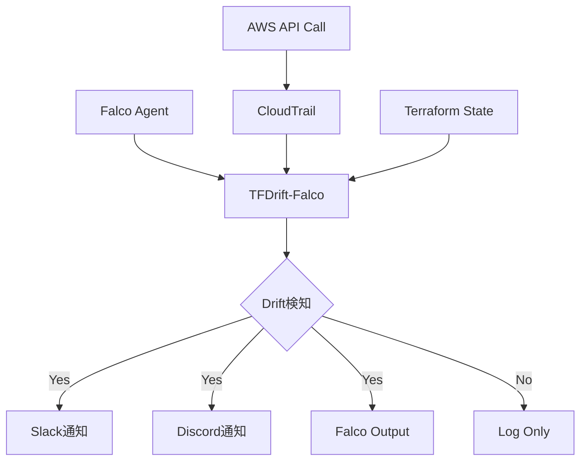

# TerraformのDrift検知をリアルタイム化するOSSを作った話

## はじめに

こんにちは、[@keitah0322](https://x.com/keitah0322)です。

「AWSコンソールで誰かがこっそりインフラ変更してた...」という経験、ありませんか？

Terraformで Infrastructure as Code (IaC) を実践していても、**手動変更（Configuration Drift）** は避けられない問題です。従来のツール（`driftctl`など）は定期的なスキャンしかできず、変更から検知までタイムラグがあります。

そこで、**Falcoのランタイムセキュリティ監視とCloudTrailイベントを組み合わせて、Terraformの設定ドリフトをリアルタイムで検知するOSS** を作りました。

**🛰️ TFDrift-Falco**
https://github.com/higakikeita/tfdrift-falco

この記事では、アイデアから実装、OSSとして公開するまでの道のりを紹介します。

---

## 目次

1. [なぜ作ったのか](#なぜ作ったのか)
2. [既存ツールとの違い](#既存ツールとの違い)
3. [アーキテクチャ](#アーキテクチャ)
4. [実装の流れ](#実装の流れ)
5. [OSSとして公開するまで](#ossとして公開するまで)
6. [今後の展開](#今後の展開)

---

## なぜ作ったのか

### 従来の課題

Terraformで管理されたインフラに対して、AWSコンソールやCLIで直接変更が加えられると、IaCとの乖離（Drift）が発生します。

**従来のドリフト検知ツールの問題点：**

| ツール | 方式 | 問題点 |
|--------|------|--------|
| `terraform plan` | 手動実行 | 毎回実行が必要、自動化が手間 |
| `driftctl` | 定期スキャン | リアルタイム性なし、検知までタイムラグ |
| `tfsec` | 静的解析 | コードのみ、実環境との乖離は検知不可 |

### TFDrift-Falcoのアプローチ

```
誰かがAWSコンソールでEC2の削除保護を無効化
    ↓
CloudTrailイベント "ModifyInstanceAttribute" を即座にキャッチ
    ↓
Terraform Stateと比較
    ↓
Slackに即座にアラート（誰が・何を・いつ変更したか）
```

**リアルタイム検知 + セキュリティコンテキスト** を実現します。

---

## 既存ツールとの違い

| 特徴 | TFDrift-Falco | driftctl | Terraform Cloud |
|------|---------------|----------|----------------|
| **検知速度** | ⚡ リアルタイム | ⏱️ 定期スキャン | ⏱️ 定期実行 |
| **イベント駆動** | ✅ CloudTrail/Falco | ❌ | ❌ |
| **ユーザー特定** | ✅ IAM情報付き | ❌ | ❌ |
| **セキュリティ統合** | ✅ Falco連携 | ❌ | ❌ |
| **通知** | ✅ Slack/Discord | ⚠️ 限定的 | ✅ VCS連携 |
| **コスト** | 💰 OSS（無料） | 💰 OSS（無料） | 💰💰 有料プラン必須 |

---

## アーキテクチャ

### システム構成図



### コンポーネント

| コンポーネント | 役割 |
|----------------|------|
| **CloudTrail Collector** | AWSイベントをSQS/S3から収集 |
| **Terraform State Manager** | Stateファイルを定期的に読み込み・インデックス化 |
| **Drift Detector** | イベントとStateを比較、ルールエンジンで評価 |
| **Notifier** | Slack/Discord/Webhook/Falco出力に通知 |
| **Diff Formatter** | 差分を複数形式で表示（Console/Unified/Markdown） |

---

## 実装の流れ

### 1. プロジェクト構造

```
tfdrift-falco/
├── cmd/
│   ├── tfdrift/         # メインCLI
│   └── test-drift/      # テストプログラム
├── pkg/
│   ├── cloudtrail/      # CloudTrailイベント収集
│   ├── terraform/       # Terraform State管理
│   ├── detector/        # ドリフト検知エンジン
│   ├── diff/            # 差分フォーマッター
│   ├── notifier/        # 通知マネージャー
│   ├── config/          # 設定管理
│   └── types/           # 共通型定義
├── examples/
│   ├── terraform/       # テスト用Terraform環境
│   └── terraform.tfstate # サンプルState
└── docs/                # ドキュメント
```

### 2. 循環依存の解決

初回ビルド時、`detector` パッケージと `cloudtrail` パッケージ間で循環依存エラーが発生しました。

**問題:**
```
detector → cloudtrail → detector (循環!)
```

**解決策:**
共有型を `pkg/types/` パッケージに分離

```go
// pkg/types/types.go
type Event struct {
    Provider     string
    EventName    string
    ResourceType string
    ResourceID   string
    UserIdentity UserIdentity
    Changes      map[string]interface{}
}

type DriftAlert struct {
    Severity     string
    ResourceType string
    ResourceID   string
    OldValue     interface{}
    NewValue     interface{}
    UserIdentity UserIdentity
}
```

これにより、両パッケージが `types` パッケージのみに依存する構造に変更しました。

### 3. 差分表示の実装

Terraformコードとの差分を視覚的に表示するため、複数のフォーマットを実装：

#### Console形式（カラー付き）

```
━━━━━━━━━━━━━━━━━━━━━━━━━━━━━━━━━━━━━━━━━━━━━━━━━━━
🚨 DRIFT DETECTED: aws_instance.webserver
━━━━━━━━━━━━━━━━━━━━━━━━━━━━━━━━━━━━━━━━━━━━━━━━━━━

📊 Severity: CRITICAL

📦 Resource:
  Type:       aws_instance
  Name:       webserver
  ID:         i-0abcd1234efgh5678

🔄 Changed Attribute:
  disable_api_termination

📝 Value Change:
  - true  →  + false

👤 Changed By:
  User:       admin-user@example.com
  Type:       IAMUser
  Account:    123456789012

⏰ Timestamp:
  2025-01-15T10:35:10Z
```

#### Unified Diff（Git形式）

```diff
--- terraform/aws_instance.webserver	(Terraform State)
+++ runtime/aws_instance.webserver	(Actual Configuration)
@@ -1,1 +1,1 @@
-true
+false
```

#### Markdown形式（Slack/GitHub用）

````markdown
## 🚨 Drift Detected: `aws_instance.webserver`

**Severity:** 🔴 **CRITICAL**

**Changed Attribute:** `disable_api_termination`

### Value Change

```diff
- true
+ false
```

### Changed By

- **User:** admin-user@example.com
- **Account:** 123456789012
````

### 4. テスト環境の構築

実際のAWSリソースでテストするため、Terraformで検証環境を用意：

**作成リソース:**
- VPC + Public Subnet
- EC2インスタンス（t2.micro、termination protection有効）
- S3バケット（暗号化・バージョニング有効）
- IAMロール

**コスト見積もり:** 月$0-10（Free Tier利用時はほぼ無料）

---

## OSSとして公開するまで

単なる「個人開発」から「OSSプロジェクト」にするため、以下のガバナンスを整備しました。

### 1. ライセンスと規約

| ファイル | 目的 |
|----------|------|
| `LICENSE` | MIT License（法的安心感） |
| `CODE_OF_CONDUCT.md` | Contributor Covenant 2.1（コミュニティ行動規範） |
| `CONTRIBUTING.md` | PR/Issue手順、開発ガイドライン |
| `SECURITY.md` | 脆弱性報告プロセス（セキュリティOSSには必須） |

### 2. Issue/PRテンプレート

GitHubで `.github/ISSUE_TEMPLATE/` を作成し、海外コントリビュータが参加しやすい環境を整備：

- `bug_report.yml` - バグ報告フォーム
- `feature_request.yml` - 機能リクエストフォーム
- `PULL_REQUEST_TEMPLATE.md` - PR チェックリスト

### 3. セキュリティ設計

**SECURITY.md に記載した内容:**

- 48時間以内の初回応答SLA
- Terraform State、CloudTrail、認証情報のセキュリティ考慮事項
- 最小権限IAMポリシーの例
- 脆弱性報告のHall of Fame

**例: 最小権限IAMポリシー**

```json
{
  "Version": "2012-10-17",
  "Statement": [
    {
      "Effect": "Allow",
      "Action": [
        "s3:GetObject",
        "sqs:ReceiveMessage",
        "sqs:DeleteMessage"
      ],
      "Resource": [
        "arn:aws:s3:::your-cloudtrail-bucket/*",
        "arn:aws:sqs:*:*:cloudtrail-events"
      ]
    }
  ]
}
```

### 4. READMEの設計

**バイリンガル対応（英語/日本語）** で、以下の構成に：

1. **What** - 何ができるか（図解付き）
2. **How** - 使い方（Quick Start）
3. **Why** - なぜ必要か（既存ツールとの比較）
4. **Roadmap** - 今後の展開

### 5. ドキュメント整備

```
docs/
├── architecture.md      # アーキテクチャ詳細
├── diff-formats.md      # 差分表示形式の説明
├── configuration.md     # 設定ガイド（予定）
└── deployment.md        # デプロイガイド（予定）
```

---

## 動作確認

### テストシナリオ

テストプログラム（`cmd/test-drift`）で3つのドリフトシナリオを検証：

1. **EC2削除保護の変更**（CRITICAL）
2. **S3暗号化の削除**（CRITICAL）
3. **インスタンスタイプの変更**（HIGH）

### 実行結果

```bash
$ go run ./cmd/test-drift

🧪 TFDrift-Falco Test - Drift Detection Simulation
============================================================

📋 Test Case 1: EC2 Instance Termination Protection Changed
━━━━━━━━━━━━━━━━━━━━━━━━━━━━━━━━━━━━━━━━━━━━━━━━━━━
🚨 DRIFT DETECTED: aws_instance.webserver
━━━━━━━━━━━━━━━━━━━━━━━━━━━━━━━━━━━━━━━━━━━━━━━━━━━

📊 Severity: CRITICAL

🔄 Changed Attribute:
  disable_api_termination

📝 Value Change:
  - true  →  + false

👤 Changed By:
  User:       admin-user@example.com
  Type:       IAMUser
  Account:    123456789012
```

すべてのフォーマット（Console、Unified Diff、Side-by-Side、Markdown）が正常に動作することを確認しました。

---

## 今後の展開

### Phase 1: MVP（現在）

- [x] AWS CloudTrail統合の骨組み
- [x] Terraform State比較（ローカル）
- [x] 差分表示フォーマット実装
- [x] テスト環境の構築
- [x] OSSガバナンス整備
- [ ] 実際のCloudTrail連携（開発中）
- [ ] Falcoイベント統合
- [ ] Slack/Discord通知の実装

### Phase 2: 機能拡張

- [ ] GCP Audit Logs対応
- [ ] Azure Activity Logs対応
- [ ] Terraform Cloud/Enterprise統合
- [ ] リモートStateバックエンド（S3/GCS）
- [ ] カスタムルールDSL

### Phase 3: エンタープライズ対応

- [ ] Webダッシュボード UI
- [ ] 機械学習ベースの異常検知
- [ ] 自動修復アクション
- [ ] Policy-as-Code統合（OPA/Rego）
- [ ] マルチアカウント/マルチOrg対応

---

## まとめ

**TFDrift-Falco** は、Terraformの設定ドリフトをリアルタイムで検知し、セキュリティコンテキスト付きでアラートするOSSです。

### 特徴

✅ **リアルタイム検知** - CloudTrail/Falcoイベント駆動
✅ **ユーザー特定** - IAMユーザー情報付き
✅ **柔軟な通知** - Slack/Discord/Webhook/Falco出力
✅ **視覚的な差分表示** - 複数フォーマット対応
✅ **OSS** - MIT License、誰でも利用・貢献可能

### こんな方におすすめ

- 「Terraformで管理してるのに、手動変更が絶えない...」
- 「誰がいつ変更したか追跡したい」
- 「セキュリティインシデント時の初動を速めたい」
- 「GitOps文化を徹底したい」

### リンク

- **GitHub**: https://github.com/higakikeita/tfdrift-falco
- **作者X**: [@keitah0322](https://x.com/keitah0322)
- **作者Qiita**: [@keitah](https://qiita.com/keitah)

---

## フィードバック募集中！

TFDrift-Falcoはまだ開発初期段階です。

- ⭐ **GitHubでStar**していただけると励みになります
- 🐛 **バグ報告・機能リクエスト**は[Issues](https://github.com/higakikeita/tfdrift-falco/issues)へ
- 💬 **質問・議論**は[Discussions](https://github.com/higakikeita/tfdrift-falco/discussions)で
- 🤝 **コントリビューション**大歓迎！

特に、以下の分野で協力者を募集しています：

- GCP/Azure対応の実装
- Falco plugin開発
- UI/UXデザイン
- ドキュメント翻訳
- セキュリティレビュー

---

**一緒により良いIaC運用の未来を作りましょう！**

---

## 参考資料

- [Falco公式サイト](https://falco.org/)
- [Terraform公式ドキュメント](https://www.terraform.io/docs)
- [AWS CloudTrail](https://aws.amazon.com/cloudtrail/)
- [driftctl](https://github.com/snyk/driftctl)
- [Contributor Covenant](https://www.contributor-covenant.org/)
