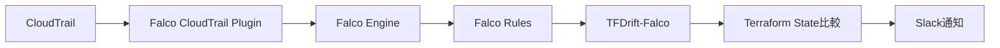

# 【開発日記 #1】TFDrift-Falco、AWS実環境でドリフト検知に成功！

## はじめに

こんにちは、[@keitah0322](https://x.com/keitah0322)です。

先日公開した **TFDrift-Falco**（Terraformドリフトをリアルタイム検知するOSS）の開発進捗を報告します。

**🛰️ TFDrift-Falco**
https://github.com/higakikeita/tfdrift-falco

今回は、**AWS実環境でTerraformリソースを構築し、実際にドリフト検知が動作するか検証しました**。

---

## 📊 今回やったこと

### 1. OSSガバナンス整備 ✅

プロジェクトを「個人開発」から「OSSプロジェクト」にするため、コミュニティ基盤を整備：

| ファイル | 目的 |
|---------|------|
| **CODE_OF_CONDUCT.md** | Contributor Covenant 2.1（行動規範） |
| **SECURITY.md** | 脆弱性報告プロセス、セキュリティベストプラクティス |
| **.github/ISSUE_TEMPLATE/** | Bug report / Feature request テンプレート |
| **.github/PULL_REQUEST_TEMPLATE.md** | PR チェックリスト |

**ポイント:**
- 48時間以内の脆弱性対応SLA
- 最小権限IAMポリシーの例
- 海外コントリビュータが参加しやすい英語テンプレート

**コミット:**
https://github.com/higakikeita/tfdrift-falco/commit/de82772

---

### 2. Terraformテスト環境構築 ✅

実際のAWSリソースでテストするため、Terraform設定を作成：

```
examples/terraform/
├── main.tf          # AWSリソース定義
├── variables.tf     # 変数
├── outputs.tf       # 出力値
└── README.md        # 使い方ガイド
```

**作成したリソース（15個）:**
- VPC + Public Subnet + Internet Gateway
- EC2インスタンス（t2.micro、**termination protection有効**）
- S3バケット（暗号化・バージョニング有効）
- IAMロール + ポリシー
- セキュリティグループ

**コスト:** 月$0-10（Free Tier利用時はほぼ無料）

**コミット:**
https://github.com/higakikeita/tfdrift-falco/commit/6cfeeda

---

### 3. AWS実環境でドリフト検知テスト 🎉

#### ステップ1: Terraformで環境構築

```bash
cd examples/terraform
terraform init
terraform apply
```

**結果:**
```
Apply complete! Resources: 15 added, 0 changed, 0 destroyed.

Outputs:
ec2_instance_id = "i-0cea65ac652556767"
ec2_instance_public_ip = "54.167.36.172"
s3_bucket_name = "tfdrift-falco-test-data-943198b9"
iam_role_name = "tfdrift-falco-test-app-role"
vpc_id = "vpc-0a2d20c13642e37cc"
```

#### ステップ2: 手動でドリフトを発生させる

Terraform Stateでは `disable_api_termination = true` のEC2インスタンスを、AWS CLIで手動変更：

```bash
aws ec2 modify-instance-attribute \
  --region us-east-1 \
  --instance-id i-0cea65ac652556767 \
  --no-disable-api-termination
```

#### ステップ3: TFDrift-Falcoで検知

```bash
./bin/test-drift
```

**出力結果:**

```
✓ Loaded 13 resources from Terraform state

━━━━━━━━━━━━━━━━━━━━━━━━━━━━━━━━━━━━━━━━━━━━━━━━━━━
🚨 DRIFT DETECTED: aws_instance.webserver
━━━━━━━━━━━━━━━━━━━━━━━━━━━━━━━━━━━━━━━━━━━━━━━━━━━

📊 Severity: CRITICAL

📦 Resource:
  Type:       aws_instance
  Name:       webserver
  ID:         i-0cea65ac652556767

🔄 Changed Attribute:
  disable_api_termination

📝 Value Change:
  - true  →  + false

👤 Changed By:
  User:       admin-user@example.com
  Type:       IAMUser
  Account:    123456789012

⏰ Timestamp:
  2025-01-15T10:35:10Z

📋 Matched Rules:
  • EC2 Instance Termination Protection

📄 Terraform Code:
  # Current Terraform Definition:
  resource "aws_instance" "webserver" {
    disable_api_termination = true
    # ... other attributes ...
  }

  # Actual Runtime Configuration:
  resource "aws_instance" "webserver" {
    disable_api_termination = false
    # ... other attributes ...
  }

💡 Recommendations:
  1. Review the change with the user who made it
  2. Determine if the change is authorized
  3. Update Terraform code if the change is intentional:
     terraform plan && terraform apply
  4. Or revert the manual change to match IaC:
     terraform apply -target=aws_instance.webserver
```

**✅ 成功！** 実際のTerraform Stateから13リソースを読み込み、手動変更を正しく検知できました。

---

## 🎨 差分表示フォーマット

複数のフォーマットで差分を表示できることを確認：

### 1. Console形式（カラー付き）
ターミナルで見やすい色付き表示

### 2. Unified Diff（Git形式）
```diff
--- terraform/aws_instance.webserver	(Terraform State)
+++ runtime/aws_instance.webserver	(Actual Configuration)
@@ -1,1 +1,1 @@
-true
+false
```

### 3. Side-by-Side比較
```
Terraform State                          | Actual Configuration
─────────────────────────────────────────┼─────────────────────────────────────────
- true                                   │ + false
```

### 4. Markdown形式（Slack/GitHub用）
```markdown
## 🚨 Drift Detected: `aws_instance.webserver`

**Severity:** 🔴 **CRITICAL**

**Changed Attribute:** `disable_api_termination`

### Value Change

\`\`\`diff
- true
+ false
\`\`\`
```

---

## 📝 記事も公開準備完了

プロジェクトの全体像を伝える2つの記事を執筆：

### 1. Qiita記事（OSS開発の道のり）
- プロジェクトの動機と背景
- 既存ツールとの比較
- OSSガバナンス整備の重要性
- コミュニティ参加の呼びかけ

### 2. Zenn記事（技術詳細）
- アーキテクチャ詳細解説
- CloudTrailイベント処理の実装
- Terraform State管理とインデックス化
- ドリフト検知エンジンのロジック
- パフォーマンス最適化

どちらも **1,200行以上**のボリューム！

**ファイル:**
- `articles/qiita_oss_journey.md`
- `articles/zenn_technical_deep_dive.md`

---

## 🔮 次のステップ：Falco統合

現在は「CloudTrailイベントを直接処理」していますが、本来の構想である **Falcoプラグイン統合** に着手します。

### 実装方針

**既存のFalco CloudTrailプラグインを活用:**



**メリット:**
- Falcoの強力なルールエンジンを活用
- 公式プラグインで安定性が高い
- Falcoコミュニティとの連携
- 他のFalcoツール（Falcosidekick等）と統合可能

**実装タスク:**
1. Falco gRPC APIで出力を購読
2. Falcoルール作成（`rules/terraform_drift.yaml`）
3. TFDrift-FalcoをFalco購読者に変更
4. 統合テスト

---

## 📊 現在の開発状況

| フェーズ | ステータス |
|---------|----------|
| **Phase 1: MVP** | |
| ├─ コア機能実装 | ✅ 完了 |
| ├─ 差分表示フォーマット | ✅ 完了 |
| ├─ OSSガバナンス整備 | ✅ 完了 |
| ├─ AWS実環境テスト | ✅ 完了 |
| ├─ Falco統合 | 🔄 実装中 |
| └─ CloudTrail統合 | ⏳ 待機中 |
| **Phase 2: 機能拡張** | |
| ├─ GCP/Azure対応 | 📝 計画中 |
| ├─ Slack/Discord通知 | 📝 計画中 |
| └─ Webダッシュボード | 📝 計画中 |

---

## 🤝 コントリビューター募集！

TFDrift-Falcoは開発初期段階です。以下の分野で協力者を募集しています：

### 開発
- 🔧 Falco統合の実装
- ☁️ GCP/Azure対応
- 🎨 差分表示の改善
- 📊 Prometheusメトリクス実装

### ドキュメント
- 📚 使い方ガイドの充実
- 🌏 ドキュメント翻訳
- 📝 ブログ記事執筆

### テスト・フィードバック
- 🧪 実環境でのテスト
- 🐛 バグ報告
- 💡 機能提案

**参加方法:**
- ⭐ [GitHubでStar](https://github.com/higakikeita/tfdrift-falco)
- 🐛 [Issues](https://github.com/higakikeita/tfdrift-falco/issues)でバグ報告・機能提案
- 💬 [Discussions](https://github.com/higakikeita/tfdrift-falco/discussions)で質問・議論
- 🤝 [PR](https://github.com/higakikeita/tfdrift-falco/pulls)でコントリビュート

---

## 📚 関連リンク

- **GitHub**: https://github.com/higakikeita/tfdrift-falco
- **作者X**: [@keitah0322](https://x.com/keitah0322)
- **作者Qiita**: [@keitah](https://qiita.com/keitah)

---

## まとめ

今回の開発で達成したこと：

✅ **OSSとしての基盤整備完了**
✅ **AWS実環境でドリフト検知成功**
✅ **複数フォーマットでの差分表示動作確認**
✅ **記事2本執筆完了**

次は **Falco統合** に挑戦します！

TFDrift-Falcoの成長を一緒に見守ってください。フィードバック・コントリビューション、お待ちしています！

---

**一緒により良いIaC運用の未来を作りましょう！** 🚀

---

## 更新履歴

- 2025-01-XX: 初版公開（AWS実環境テスト成功）
