# ECS Fargateの脆弱性管理 ― なぜRuntimeではなくレジストリスキャンが中心になるのか

**Serverless Containerのセキュリティモデルを技術的に理解する**

---

## はじめに

ECS Fargateは、EC2インスタンスの管理が不要なサーバレスコンテナ実行環境です。インフラ管理の負荷が大幅に下がる一方で、セキュリティエンジニアの間でよく議論になるのが次の疑問です。

> **「FargateではRuntimeの脆弱性スキャンができるのか？」**

結論から言えば、**Fargateの脆弱性管理はRuntimeスキャンではなく、レジストリスキャンが中心**になります。

これは単なるツールの制限ではありません。Fargateのアーキテクチャ設計から必然的に導かれる、**セキュリティモデルの転換**です。

本記事では以下を技術的に解説します。

- Fargateのアーキテクチャがなぜランタイムスキャンを困難にするのか
- レジストリスキャンが中心になる理由とその仕組み
- 実際のAWSサービス・セキュリティツールの構成
- Serverless Containerにおけるセキュリティ思想の変化

---

## 1. ECS Fargateのアーキテクチャ

まず前提として、FargateとEC2ベースのコンテナ実行環境のアーキテクチャの違いを整理します。

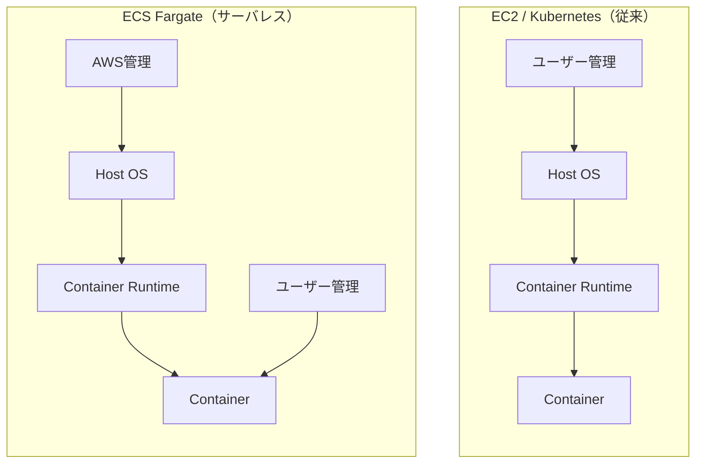

EC2やKubernetesでは、ホストOSからコンテナまで **すべてがユーザーの管理下** にあります。

Fargateでは、ホストOSとContainer Runtimeは **AWSが完全管理** します。ユーザーが管理できるのはコンテナ層のみです。

この設計の結果として、ユーザーはホストノードにSSHもできませんし、エージェントをホストに配置することもできません。

---

## 2. 通常のRuntime脆弱性スキャンの仕組み

EC2やKubernetesにおける典型的なランタイム脆弱性スキャンは次のフローです。

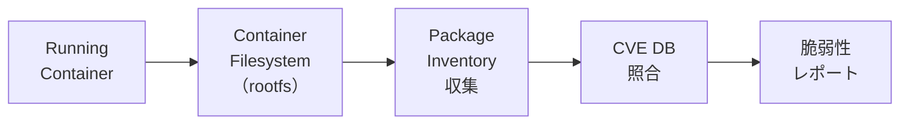

エージェントがノードまたはコンテナのファイルシステムに直接アクセスし、インストールされたパッケージ一覧（SBOM）を取得。それをCVEデータベースと照合して脆弱性を検出します。

代表的なツールとしては以下があります。

| ツール | ランタイムスキャン方式 |
|--------|----------------------|
| Sysdig | ノードエージェント + rootfs scan |
| Wiz | cloud API + in-node scan |
| Lacework | エージェントベース |
| Trivy | ローカルfsスキャン |

これらはすべて、**ノードまたはコンテナのファイルシステムへのアクセス**を前提としています。

---

## 3. FargateでRuntimeスキャンが困難な理由

Fargateでは次の2つの制約により、従来型のランタイムスキャンが構造的に困難です。

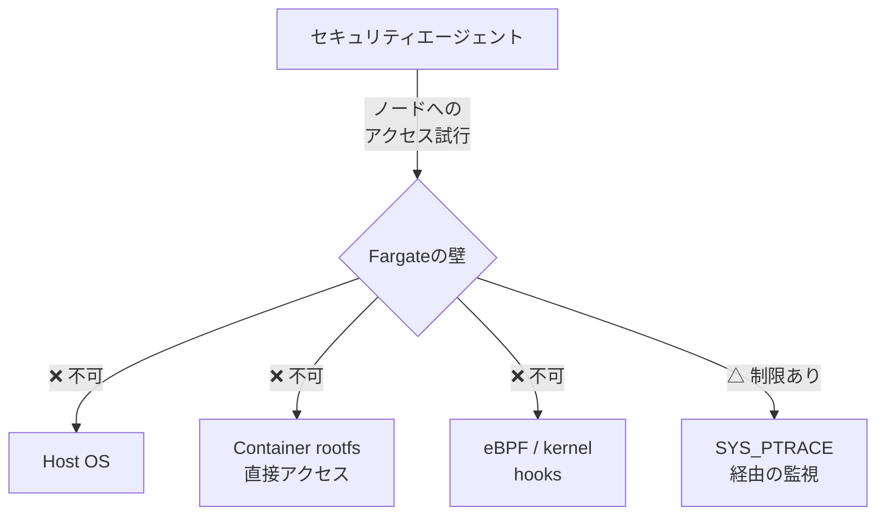

### 制約① ノードアクセス不可

FargateはホストOSをAWSが管理するため、ユーザーはノードにアクセスできません。従来のエージェントをDaemonSetやhost-networkで配置する方式は使えません。

### 制約② コンテナrootfsへの直接アクセスが制限される

ノードにアクセスできないため、実行中コンテナのルートファイルシステム（`/proc/<pid>/root` 等）を外部からスキャンすることができません。

### なぜeBPFも使えないのか

eBPFはLinuxカーネルのフック機構を利用してsyscallを低オーバーヘッドで追跡します。

$$\text{eBPF程序} \xrightarrow{\text{JITコンパイル}} \text{Kernel VM} \xrightarrow{\text{フック}} \text{syscall追跡}$$

Fargateではカーネルへのアクセスが不可であるため、この経路自体が存在しません。

---

## 4. Fargateの脆弱性管理の中心：レジストリスキャン

ではFargateではどのように脆弱性を管理するのか。答えはシンプルです。

**コンテナをデプロイする前に、イメージをスキャンする。**

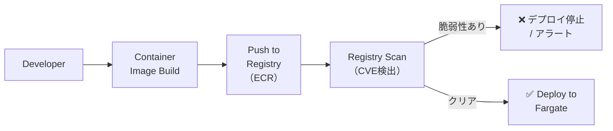

レジストリスキャンの特徴は以下の通りです。

- **スキャン対象**：コンテナイメージのレイヤー（OCI/Docker image）
- **タイミング**：push時 または CI/CDパイプライン内
- **方式**：イメージ内のパッケージ一覧をSBOMとして抽出し、CVE DBと照合
- **ホストアクセス不要**：RegistryのAPIまたはイメージのtar展開で完結

---

## 5. Runtime Inventory マッピング

レジストリスキャンだけでは「今動いているタスクにどの脆弱性があるか」が見えません。実際のセキュリティツールではこれを解決するために **Runtime Workload Mapping** を行います。

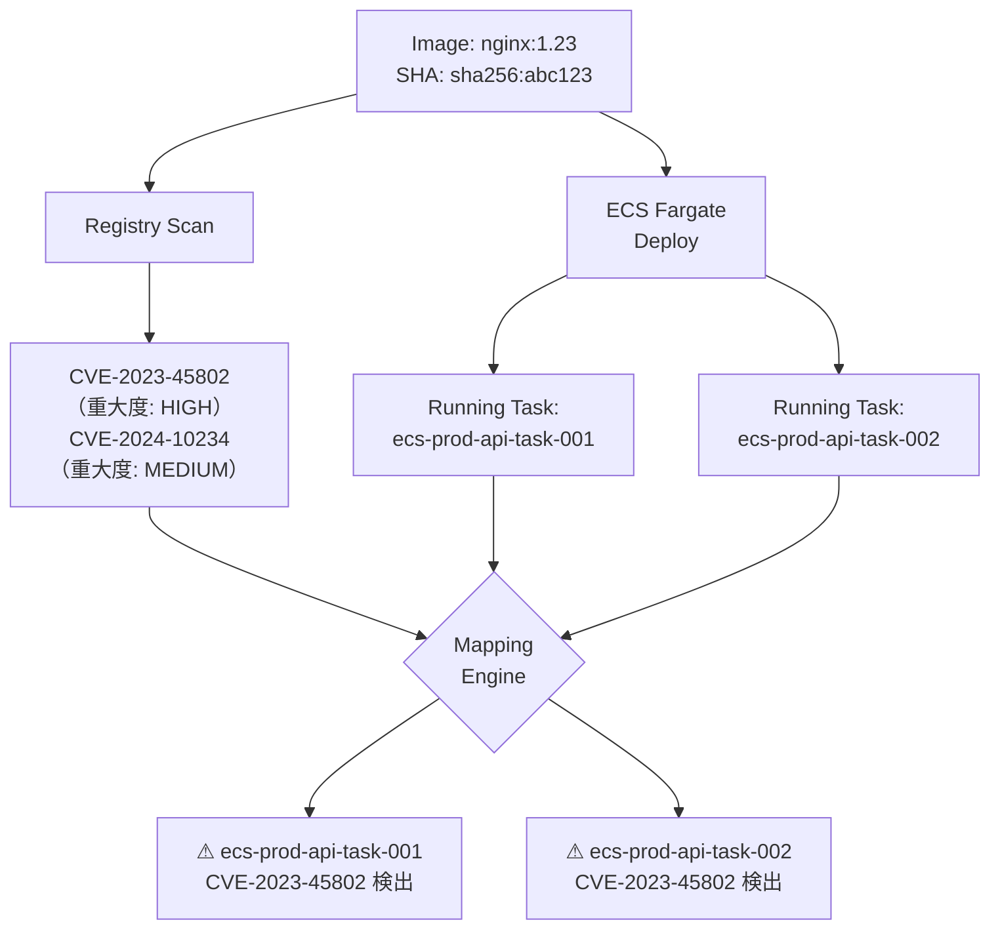

このマッピングにより、

- どのFargateタスクが脆弱なイメージで動いているか
- そのタスクのCVE重大度はいくつか
- いつデプロイされたか

を可視化できます。ホストに直接アクセスしなくても、**イメージのメタデータとECS APIの組み合わせ**で実現可能です。

---

## 6. AWSネイティブサービスの構成

AWSのマネージドサービスでFargate脆弱性管理を構成する場合は以下の組み合わせが標準です。

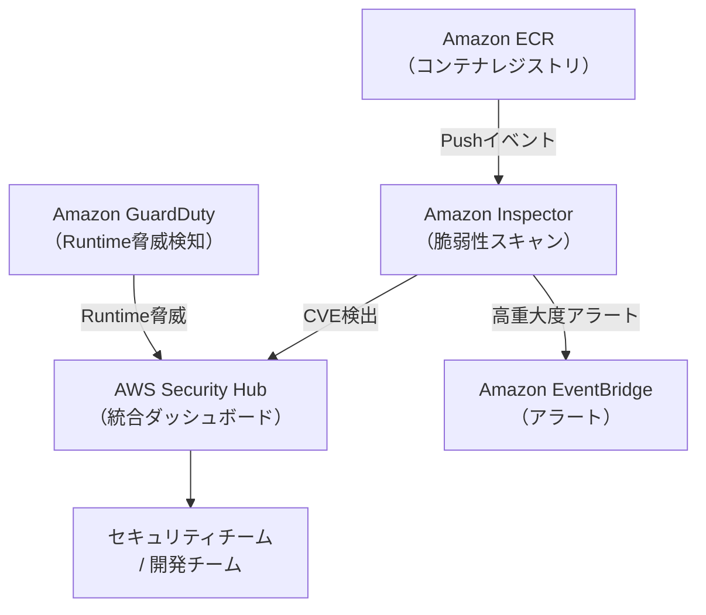

### Amazon Inspector の役割

Amazon Inspectorは2022年のリニューアル後、ECRとの深い統合を実現しています。

| 機能 | 説明 |
|------|------|
| **継続的スキャン** | ECRにpushされるたびに自動スキャン |
| **Runtime mapping** | 稼働中FargateタスクへCVE情報を紐付け |
| **再評価** | 新しいCVEが公開された際に既存イメージを自動再評価 |
| **SBOM出力** | CycloneDX / SPDX形式でSBOMをエクスポート |

### GuardDuty Runtime Monitoringの役割

GuardDuty ECS Runtime Monitoringは脆弱性スキャンではなく **脅威行動の検知** が目的です。

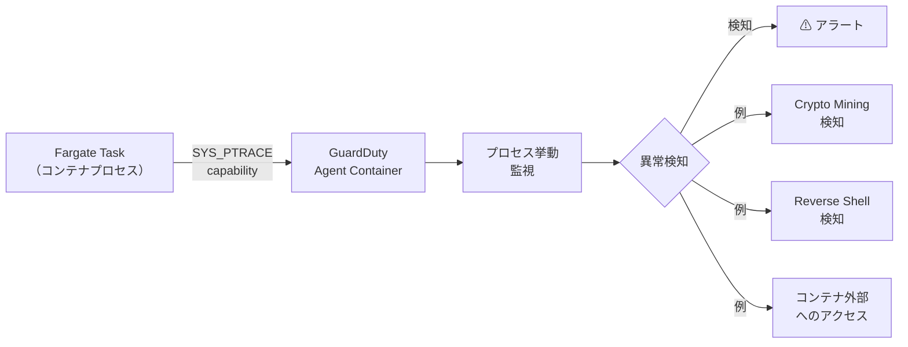

GuardDutyはFargateでもptrace経由でプロセスの振る舞いを監視できます。ただし、eBPFベースではないため検知の深さはEC2より制限されます。

---

## 7. 主要サードパーティツールの対応状況

AWSネイティブ以外のセキュリティツールのFargate対応状況を整理します。

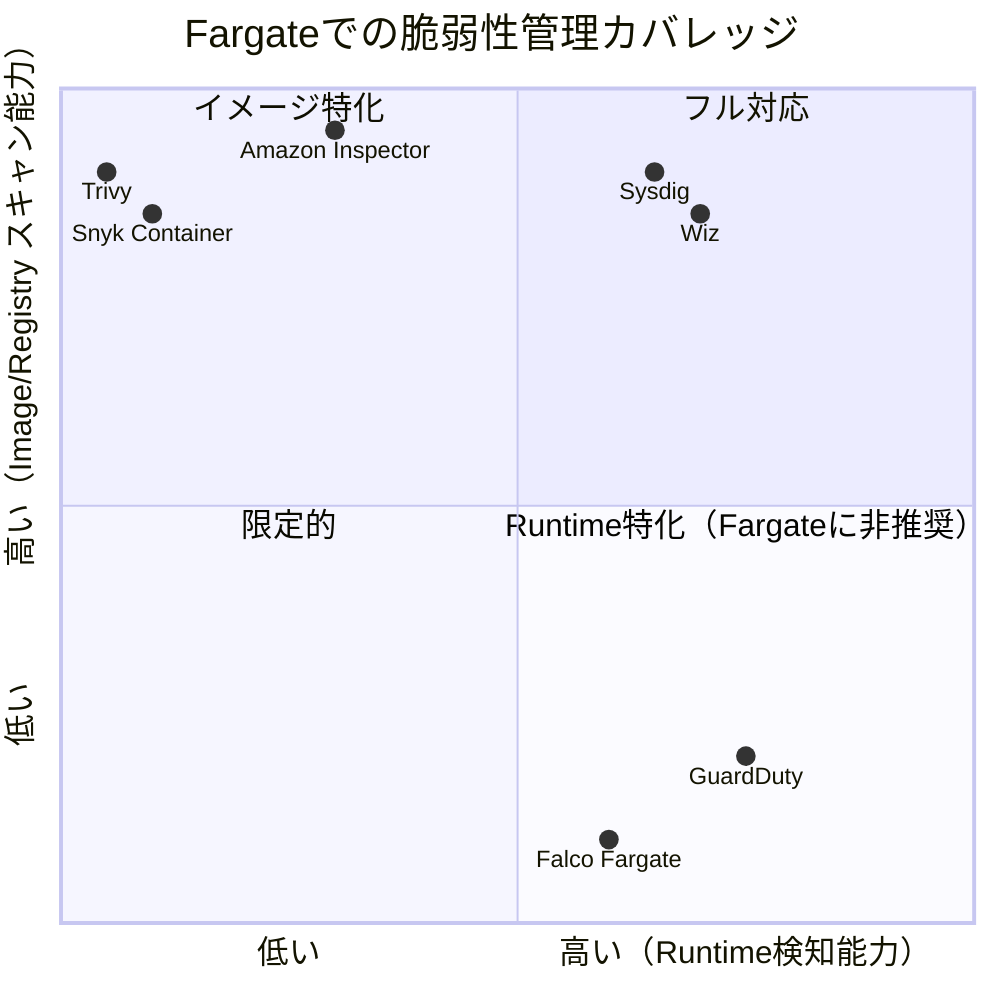

| ツール | Registry Scan | Runtime Mapping | Runtime Detection | Fargate対応 |
|--------|:---:|:---:|:---:|:---:|
| Amazon Inspector | ◎ | ◎ | △ | ◎ |
| GuardDuty Runtime | - | - | ◎ | ◎ |
| Wiz | ◎ | ◎ | △ | ◎ |
| Sysdig | ◎ | ◎ | △ | ◎ |
| Snyk Container | ◎ | △ | ✕ | ◎ |
| Trivy | ◎ | ✕ | ✕ | ◎（CI用途） |
| Falco（Fargate）| - | - | △（ptrace） | △ |

---

## 8. EC2とFargateのスキャン能力の対比

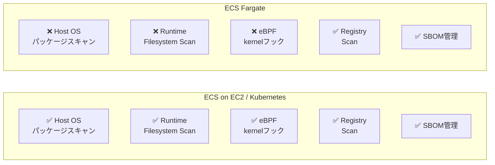

Fargateで失われる能力は **ホストレベルの可視性** です。コンテナイメージの検査に関しては、EC2と同等の能力を持ちます。

---

## 9. Serverless Containerにおけるセキュリティモデルの転換

これがこの記事で最も重要なポイントです。

従来のコンテナセキュリティは **Runtime中心** でした。

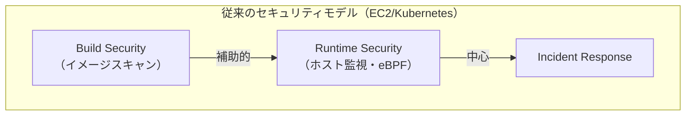

Fargateでは **Build-time中心** に転換します。

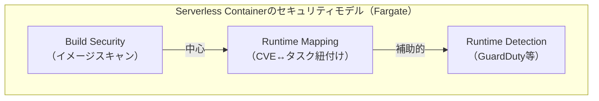

この転換を **Shared Responsibility Modelの変化** として捉えることもできます。

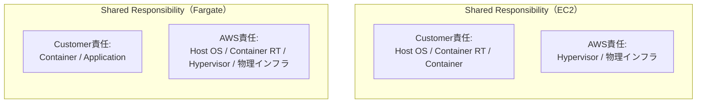

Fargateではカスタマーの責任範囲が**コンテナ層に集約**されます。その結果、セキュリティ対策もコンテナイメージを中心に設計するのが自然な帰結です。

---

## 10. 実践的なFargate脆弱性管理のベストプラクティス

### ① CI/CDパイプラインにスキャンを組み込む

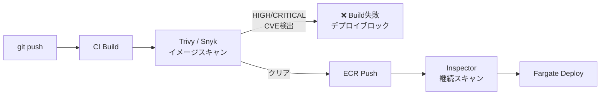

### ② ベースイメージの選定

| ベースイメージ | 特徴 |
|---------------|------|
| `scratch` | パッケージなし。CVEリスク最小 |
| `distroless` | Google製。必要最小限のパッケージ |
| `alpine` | 軽量。musl libc使用 |
| `debian-slim` | 互換性高い。パッケージ多め |

脆弱性の根本的な削減には、ベースイメージを `distroless` や `scratch` に変更するのが最も効果的です。

### ③ SBOMの管理

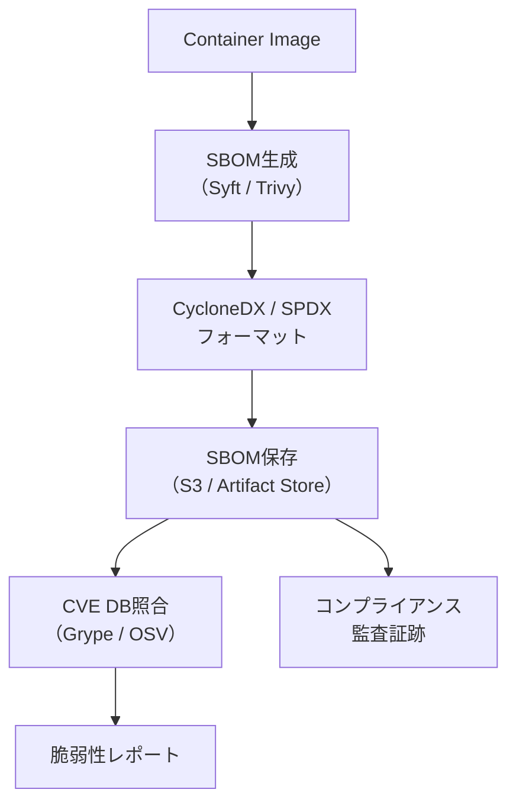

SBOMを管理することで、新しいCVEが公開された際に過去にデプロイしたイメージへの影響を即座に評価できます。

---

## まとめ

| 機能 | ECS on EC2 | ECS Fargate |
|------|:----------:|:-----------:|
| Host OSパッケージスキャン | ✅ | ❌ |
| Runtime Filesystem Scan | ✅ | ❌ |
| eBPF / kernel hooks | ✅ | ❌ |
| Registry / Image Scan | ✅ | ✅ |
| SBOM管理 | ✅ | ✅ |
| Runtime Workload Mapping | ✅ | ✅ |
| Runtime Detection（ptrace） | ✅ | △ |

ECS Fargateでは、ホストへのアクセスができないというアーキテクチャ上の制約から、**脆弱性管理の中心はレジストリスキャン（Build-time Security）** になります。

これはFargateが「セキュリティを弱くした」のではありません。

**セキュリティの責任境界とその実施タイミングが、RuntimeからBuildに移動した**のです。

---

> サーバレスはセキュリティを簡単にしたわけではない。
>
> セキュリティの重心を **Runtime から Build へ移動させた** だけである。

---

## 参考

- [Amazon Inspector - コンテナイメージスキャン](https://docs.aws.amazon.com/inspector/latest/user/enable-disable-scanning-ecr.html)
- [Amazon GuardDuty ECS Runtime Monitoring](https://docs.aws.amazon.com/guardduty/latest/ug/guardduty-ecs-runtime-monitoring.html)
- [AWS Shared Responsibility Model](https://aws.amazon.com/compliance/shared-responsibility-model/)
- [NIST SP 800-190 Application Container Security Guide](https://csrc.nist.gov/publications/detail/sp/800-190/final)
- [OCI Image Specification](https://github.com/opencontainers/image-spec)
