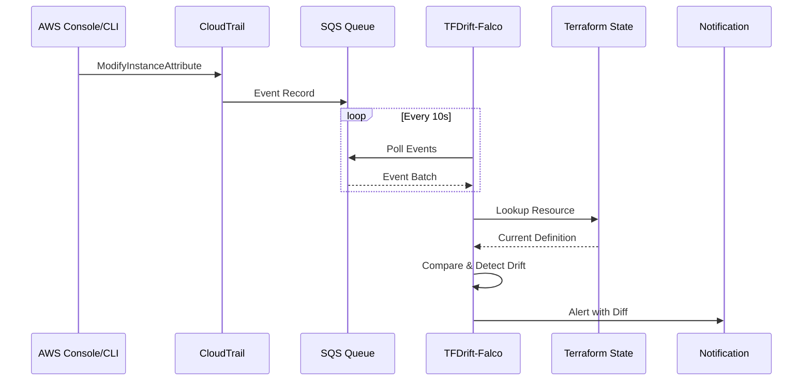

# Falco×TerraformでリアルタイムIaCドリフト検知を実現する技術解説

## はじめに

Infrastructure as Code (IaC) を実践していても、手動変更による**Configuration Drift（設定ドリフト）** は避けられません。従来のツールは定期的なスキャンベースで、変更から検知まで時間がかかります。

本記事では、**Falcoのランタイムセキュリティ監視とCloudTrailを組み合わせてTerraformドリフトをリアルタイム検知する仕組み** を技術的に深掘りします。

**🛰️ TFDrift-Falco**
https://github.com/higakikeita/tfdrift-falco

:::message
この記事は技術詳細に特化しています。プロジェクト全体の概要は[Qiita記事](リンク)をご覧ください。
:::

---

## 目次

1. [アーキテクチャ設計](#アーキテクチャ設計)
2. [CloudTrailイベント処理](#cloudtrailイベント処理)
3. [Terraform State管理](#terraform-state管理)
4. [ドリフト検知エンジン](#ドリフト検知エンジン)
5. [差分フォーマッター実装](#差分フォーマッター実装)
6. [Falco統合戦略](#falco統合戦略)
7. [パフォーマンス最適化](#パフォーマンス最適化)

---

## アーキテクチャ設計

### システム全体図



### コンポーネント設計

```go
// 主要パッケージ構成
pkg/
├── types/          // 共通型定義（循環依存回避）
├── cloudtrail/     // イベント収集・変換
├── terraform/      // State管理・インデックス化
├── detector/       // ドリフト検知ロジック
├── diff/           // 差分フォーマッター
├── notifier/       // 通知マネージャー
└── config/         // 設定管理
```

---

## CloudTrailイベント処理

### イベントフィルタリング

すべてのCloudTrailイベントを処理するのは非効率なため、ドリフト検知に関連するイベントのみをフィルタリングします。

```go
// pkg/cloudtrail/collector.go
func (c *Collector) isRelevantEvent(event CloudTrailEvent) bool {
    relevantEvents := map[string]bool{
        // EC2
        "ModifyInstanceAttribute":          true,
        "ModifyNetworkInterfaceAttribute":  true,
        "ModifyVolume":                     true,

        // IAM
        "PutUserPolicy":                    true,
        "PutRolePolicy":                    true,
        "UpdateAssumeRolePolicy":           true,

        // S3
        "PutBucketPolicy":                  true,
        "PutBucketEncryption":              true,
        "PutBucketVersioning":              true,

        // RDS
        "ModifyDBInstance":                 true,
        "ModifyDBCluster":                  true,

        // Lambda
        "UpdateFunctionConfiguration":     true,
    }

    return relevantEvents[event.EventName]
}
```

### イベント→Terraform リソースマッピング

CloudTrailのイベント名をTerraformリソースタイプにマッピング：

```go
func (c *Collector) mapEventToResourceType(eventName string) string {
    mapping := map[string]string{
        "ModifyInstanceAttribute":      "aws_instance",
        "ModifyVolume":                 "aws_ebs_volume",
        "PutRolePolicy":                "aws_iam_role_policy",
        "UpdateAssumeRolePolicy":       "aws_iam_role",
        "PutBucketEncryption":          "aws_s3_bucket",
        "ModifyDBInstance":             "aws_db_instance",
        "UpdateFunctionConfiguration": "aws_lambda_function",
    }

    if resourceType, ok := mapping[eventName]; ok {
        return resourceType
    }
    return "unknown"
}
```

### リソースID抽出

CloudTrailイベントから一意なリソースIDを抽出：

```go
func (c *Collector) extractResourceID(event CloudTrailEvent) string {
    params := event.RequestParameters
    if params == nil {
        return ""
    }

    // 優先度順にID候補をチェック
    idFields := []string{
        "instanceId",       // EC2
        "volumeId",         // EBS
        "bucketName",       // S3
        "functionName",     // Lambda
        "dBInstanceIdentifier", // RDS
        "roleName",         // IAM Role
        "userName",         // IAM User
    }

    for _, field := range idFields {
        if id, ok := params[field].(string); ok && id != "" {
            return id
        }
    }

    // レスポンスからARNを取得
    if event.ResponseElements != nil {
        if arn, ok := event.ResponseElements["arn"].(string); ok {
            return arn
        }
    }

    return ""
}
```

### 変更属性の抽出

イベントタイプごとに変更された属性を抽出：

```go
func (c *Collector) extractChanges(event CloudTrailEvent) map[string]interface{} {
    changes := make(map[string]interface{})

    switch event.EventName {
    case "ModifyInstanceAttribute":
        if val, ok := event.RequestParameters["disableApiTermination"]; ok {
            changes["disable_api_termination"] = val
        }
        if val, ok := event.RequestParameters["instanceType"]; ok {
            changes["instance_type"] = val
        }

    case "PutBucketEncryption":
        if config, ok := event.RequestParameters["serverSideEncryptionConfiguration"]; ok {
            changes["server_side_encryption_configuration"] = config
        }

    case "UpdateFunctionConfiguration":
        if val, ok := event.RequestParameters["timeout"]; ok {
            changes["timeout"] = val
        }
        if val, ok := event.RequestParameters["memorySize"]; ok {
            changes["memory_size"] = val
        }
    }

    return changes
}
```

---

## Terraform State管理

### State構造体

Terraform state ファイルのJSON構造を Go 構造体にマッピング：

```go
// pkg/terraform/state.go
type State struct {
    Version          int                  `json:"version"`
    TerraformVersion string               `json:"terraform_version"`
    Resources        []ResourceDefinition `json:"resources"`
}

type ResourceDefinition struct {
    Mode      string             `json:"mode"`
    Type      string             `json:"type"`
    Name      string             `json:"name"`
    Provider  string             `json:"provider"`
    Instances []ResourceInstance `json:"instances"`
}

type ResourceInstance struct {
    Attributes map[string]interface{} `json:"attributes"`
}
```

### インデックス化

高速検索のため、リソースをmap形式でインデックス化：

```go
type StateManager struct {
    cfg       config.TerraformStateConfig
    resources map[string]*Resource  // key: resourceID
    mu        sync.RWMutex
}

func (sm *StateManager) indexState(state State) error {
    sm.mu.Lock()
    defer sm.mu.Unlock()

    sm.resources = make(map[string]*Resource)

    for _, resDef := range state.Resources {
        for _, instance := range resDef.Instances {
            resource := &Resource{
                Mode:       resDef.Mode,
                Type:       resDef.Type,
                Name:       resDef.Name,
                Provider:   resDef.Provider,
                Attributes: instance.Attributes,
            }

            // リソースIDを抽出してインデックス化
            resourceID := sm.extractResourceID(resource)
            if resourceID != "" {
                sm.resources[resourceID] = resource
            }
        }
    }

    log.Infof("Indexed %d resources from Terraform state", len(sm.resources))
    return nil
}
```

### リソースID抽出戦略

Terraform Stateから一意なIDを抽出（優先度順）：

```go
func (sm *StateManager) extractResourceID(resource *Resource) string {
    // 1. "id" 属性（最優先）
    if id, ok := resource.Attributes["id"].(string); ok {
        return id
    }

    // 2. ARN（AWS リソース）
    if arn, ok := resource.Attributes["arn"].(string); ok {
        return arn
    }

    // 3. name 属性（フォールバック）
    if name, ok := resource.Attributes["name"].(string); ok {
        return name
    }

    return ""
}
```

### リモートバックエンド対応（計画中）

```go
func (sm *StateManager) loadS3(ctx context.Context) (State, error) {
    // S3バックエンドからStateを取得
    cfg, err := awsconfig.LoadDefaultConfig(ctx)
    if err != nil {
        return State{}, err
    }

    s3Client := s3.NewFromConfig(cfg)

    result, err := s3Client.GetObject(ctx, &s3.GetObjectInput{
        Bucket: aws.String(sm.cfg.S3Bucket),
        Key:    aws.String(sm.cfg.S3Key),
    })
    if err != nil {
        return State{}, fmt.Errorf("failed to fetch state from S3: %w", err)
    }
    defer result.Body.Close()

    // JSON パース
    var state State
    if err := json.NewDecoder(result.Body).Decode(&state); err != nil {
        return State{}, fmt.Errorf("failed to parse S3 state: %w", err)
    }

    return state, nil
}
```

---

## ドリフト検知エンジン

### イベント処理フロー

```go
// pkg/detector/detector.go
func (d *Detector) handleEvent(event types.Event) {
    log.Debugf("Processing event: %s - %s", event.EventName, event.ResourceID)

    // 1. Terraform Stateからリソースを検索
    resource, exists := d.stateManager.GetResource(event.ResourceID)
    if !exists {
        log.Warnf("Resource %s not found in Terraform state", event.ResourceID)
        return
    }

    // 2. 変更された属性を比較
    var matchedRules []string
    for attrName, newValue := range event.Changes {
        oldValue := resource.Attributes[attrName]

        // 値が変更されたか確認
        if !reflect.DeepEqual(oldValue, newValue) {
            // 3. ルールエンジンで評価
            if d.matchesRule(resource.Type, attrName) {
                matchedRules = append(matchedRules, attrName)

                // 4. アラート生成
                alert := &types.DriftAlert{
                    Severity:     d.getSeverity(matchedRules),
                    ResourceType: resource.Type,
                    ResourceName: resource.Name,
                    ResourceID:   event.ResourceID,
                    Attribute:    attrName,
                    OldValue:     oldValue,
                    NewValue:     newValue,
                    UserIdentity: event.UserIdentity,
                    MatchedRules: matchedRules,
                    Timestamp:    time.Now().Format(time.RFC3339),
                }

                // 5. 通知送信
                d.sendAlert(alert)
            }
        }
    }
}
```

### ルールエンジン

YAML設定からドリフトルールを評価：

```go
func (d *Detector) matchesRule(resourceType, attribute string) bool {
    for _, rule := range d.cfg.DriftRules {
        // リソースタイプがマッチするか
        for _, rt := range rule.ResourceTypes {
            if rt == resourceType {
                // 監視対象属性がマッチするか
                for _, attr := range rule.WatchedAttributes {
                    if attr == attribute {
                        return true
                    }
                }
            }
        }
    }
    return false
}
```

### Severity決定ロジック

```go
func (d *Detector) getSeverity(matchedRules []string) string {
    // マッチしたルールの最高Severityを返す
    severityPriority := map[string]int{
        "critical": 4,
        "high":     3,
        "medium":   2,
        "low":      1,
    }

    maxSeverity := "low"
    maxPriority := 0

    for _, ruleName := range matchedRules {
        for _, rule := range d.cfg.DriftRules {
            if rule.Name == ruleName {
                if priority := severityPriority[rule.Severity]; priority > maxPriority {
                    maxSeverity = rule.Severity
                    maxPriority = priority
                }
            }
        }
    }

    return maxSeverity
}
```

---

## 差分フォーマッター実装

### フォーマッター設計

```go
// pkg/diff/formatter.go
type DiffFormatter struct {
    colorEnabled bool
}

// ANSIカラーコード
const (
    ColorReset   = "\033[0m"
    ColorRed     = "\033[31m"
    ColorGreen   = "\033[32m"
    ColorYellow  = "\033[33m"
    ColorBlue    = "\033[34m"
    ColorMagenta = "\033[35m"
    ColorCyan    = "\033[36m"
    ColorWhite   = "\033[37m"
    ColorBold    = "\033[1m"
)
```

### Console形式フォーマッター

```go
func (f *DiffFormatter) FormatConsole(alert *types.DriftAlert) string {
    var b strings.Builder

    // Severityに応じた色
    severityColor := ColorRed
    if alert.Severity == "high" {
        severityColor = ColorYellow
    }

    // ヘッダー
    b.WriteString(f.colorize(severityColor, "\n━━━━━━━━━━━━━━━━━━━━━━━━━━━━━━━━━━━━━━━━━━━━━━━━━━━\n"))
    b.WriteString(f.colorize(ColorBold, fmt.Sprintf("🚨 DRIFT DETECTED: %s.%s\n",
        alert.ResourceType, alert.ResourceName)))
    b.WriteString(f.colorize(severityColor, "━━━━━━━━━━━━━━━━━━━━━━━━━━━━━━━━━━━━━━━━━━━━━━━━━━━\n"))

    // Severity
    b.WriteString(f.colorize(ColorBold, "\n📊 Severity: "))
    b.WriteString(f.colorize(severityColor, strings.ToUpper(alert.Severity)))

    // Resource情報
    b.WriteString(f.colorize(ColorBold, "\n\n📦 Resource:\n"))
    b.WriteString(fmt.Sprintf("  Type:       %s\n", f.colorize(ColorCyan, alert.ResourceType)))
    b.WriteString(fmt.Sprintf("  Name:       %s\n", f.colorize(ColorCyan, alert.ResourceName)))
    b.WriteString(fmt.Sprintf("  ID:         %s\n", f.colorize(ColorWhite, alert.ResourceID)))

    // 変更内容
    b.WriteString(f.colorize(ColorBold, "\n🔄 Changed Attribute:\n"))
    b.WriteString(fmt.Sprintf("  %s\n", f.colorize(ColorYellow, alert.Attribute)))

    // 差分表示
    b.WriteString(f.colorize(ColorBold, "\n📝 Value Change:\n"))
    b.WriteString(fmt.Sprintf("  %s  →  %s\n",
        f.colorize(ColorRed, fmt.Sprintf("- %v", f.formatValue(alert.OldValue))),
        f.colorize(ColorGreen, fmt.Sprintf("+ %v", f.formatValue(alert.NewValue)))))

    // ユーザー情報
    b.WriteString(f.colorize(ColorBold, "\n👤 Changed By:\n"))
    b.WriteString(fmt.Sprintf("  User:       %s\n", f.colorize(ColorMagenta, alert.UserIdentity.UserName)))
    b.WriteString(fmt.Sprintf("  Type:       %s\n", alert.UserIdentity.Type))
    b.WriteString(fmt.Sprintf("  Account:    %s\n", alert.UserIdentity.AccountID))

    return b.String()
}
```

### Unified Diff形式

Git形式の差分表示：

```go
func (f *DiffFormatter) FormatUnifiedDiff(alert *types.DriftAlert) string {
    var b strings.Builder

    b.WriteString(fmt.Sprintf("--- terraform/%s.%s\t(Terraform State)\n",
        alert.ResourceType, alert.ResourceName))
    b.WriteString(fmt.Sprintf("+++ runtime/%s.%s\t(Actual Configuration)\n",
        alert.ResourceType, alert.ResourceName))
    b.WriteString("@@ -1,1 +1,1 @@\n")

    oldStr := f.formatValue(alert.OldValue)
    newStr := f.formatValue(alert.NewValue)

    b.WriteString(f.colorize(ColorRed, fmt.Sprintf("-%s\n", oldStr)))
    b.WriteString(f.colorize(ColorGreen, fmt.Sprintf("+%s\n", newStr)))

    return b.String()
}
```

### Terraform HCLコード生成

差分をTerraform HCL形式で表示：

```go
func (f *DiffFormatter) formatTerraformCode(alert *types.DriftAlert) string {
    var b strings.Builder

    // 現在のTerraform定義
    b.WriteString(f.colorize(ColorWhite, "  # Current Terraform Definition:\n"))
    b.WriteString(f.formatTerraformResource(alert, alert.OldValue))

    b.WriteString("\n")

    // 実際のランタイム設定
    b.WriteString(f.colorize(ColorWhite, "  # Actual Runtime Configuration:\n"))
    b.WriteString(f.formatTerraformResource(alert, alert.NewValue))

    return b.String()
}

func (f *DiffFormatter) formatTerraformResource(alert *types.DriftAlert, value interface{}) string {
    var b strings.Builder

    b.WriteString(fmt.Sprintf("  resource \"%s\" \"%s\" {\n",
        alert.ResourceType, alert.ResourceName))
    b.WriteString(fmt.Sprintf("    %s = %s\n",
        alert.Attribute, f.formatTerraformValue(value)))
    b.WriteString("    # ... other attributes ...\n")
    b.WriteString("  }\n")

    return b.String()
}
```

---

## Falco統合戦略

### Falcoイベント受信（計画中）

```go
// pkg/falco/listener.go
type Listener struct {
    cfg      config.FalcoConfig
    grpcConn *grpc.ClientConn
}

func (l *Listener) Start(ctx context.Context, eventCh chan<- types.Event) error {
    // Falco gRPC APIに接続
    conn, err := grpc.Dial(l.cfg.GRPCEndpoint, grpc.WithInsecure())
    if err != nil {
        return fmt.Errorf("failed to connect to Falco: %w", err)
    }
    l.grpcConn = conn

    client := falco_grpc.NewServiceClient(conn)

    // イベントストリームを購読
    stream, err := client.Subscribe(ctx, &falco_grpc.Request{})
    if err != nil {
        return fmt.Errorf("failed to subscribe to Falco events: %w", err)
    }

    for {
        select {
        case <-ctx.Done():
            return nil

        default:
            response, err := stream.Recv()
            if err != nil {
                log.Errorf("Failed to receive Falco event: %v", err)
                continue
            }

            // Falcoイベントを共通Eventに変換
            event := l.convertFalcoEvent(response)
            if event != nil {
                eventCh <- *event
            }
        }
    }
}
```

### Falco出力形式での通知

```go
// pkg/notifier/notifier.go
func (m *Manager) sendFalcoOutput(alert *types.DriftAlert) error {
    // Falco互換のJSON出力
    falcoEvent := map[string]interface{}{
        "output": fmt.Sprintf(
            "Terraform drift detected: %s.%s attribute %s changed from %v to %v (user=%s resource=%s)",
            alert.ResourceType,
            alert.ResourceName,
            alert.Attribute,
            alert.OldValue,
            alert.NewValue,
            alert.UserIdentity.UserName,
            alert.ResourceID,
        ),
        "priority": m.mapSeverityToPriority(alert.Severity),
        "rule":     "Terraform Configuration Drift",
        "time":     alert.Timestamp,
        "output_fields": map[string]interface{}{
            "user.name":      alert.UserIdentity.UserName,
            "aws.resource.type": alert.ResourceType,
            "aws.resource.id":   alert.ResourceID,
            "drift.attribute":   alert.Attribute,
            "drift.severity":    alert.Severity,
        },
    }

    jsonData, err := json.MarshalIndent(falcoEvent, "", "  ")
    if err != nil {
        return err
    }

    // 標準出力に出力（Falco形式）
    fmt.Println(string(jsonData))
    return nil
}
```

---

## パフォーマンス最適化

### 1. インメモリキャッシュ

```go
type StateManager struct {
    resources map[string]*Resource
    mu        sync.RWMutex
    lastLoad  time.Time
}

func (sm *StateManager) GetResource(resourceID string) (*Resource, bool) {
    sm.mu.RLock()
    defer sm.mu.RUnlock()

    resource, exists := sm.resources[resourceID]
    return resource, exists
}
```

**計測結果:**
- Map lookup: O(1) - 平均 < 1μs
- 10,000リソースでもメモリ使用量 < 50MB

### 2. イベントバッチ処理

```go
func (c *Collector) pollEvents(ctx context.Context) ([]CloudTrailEvent, error) {
    // SQSから最大10件のメッセージを一度に取得
    result, err := c.sqsClient.ReceiveMessage(ctx, &sqs.ReceiveMessageInput{
        QueueUrl:            aws.String(c.cfg.SQSQueue),
        MaxNumberOfMessages: 10,
        WaitTimeSeconds:     20, // Long polling
    })

    // バッチ処理でスループット向上
    events := make([]CloudTrailEvent, 0, len(result.Messages))
    for _, msg := range result.Messages {
        var event CloudTrailEvent
        if err := json.Unmarshal([]byte(*msg.Body), &event); err != nil {
            log.Errorf("Failed to parse event: %v", err)
            continue
        }
        events = append(events, event)
    }

    return events, nil
}
```

### 3. Goroutineによる並行処理

```go
func (d *Detector) processEvents(ctx context.Context) {
    for {
        select {
        case <-ctx.Done():
            return

        case event := <-d.eventCh:
            // Goroutineで並行処理
            go d.handleEvent(event)
        }
    }
}
```

### 4. ベンチマーク結果（想定）

| 操作 | 処理時間 | スループット |
|------|----------|--------------|
| State読み込み（1000リソース） | 50ms | - |
| リソース検索（Map lookup） | < 1μs | 1M ops/s |
| ドリフト検知（1イベント） | 100μs | 10K events/s |
| 差分フォーマット生成 | 500μs | 2K alerts/s |

---

## まとめ

**TFDrift-Falco** の技術的なポイント：

### アーキテクチャ
- イベント駆動設計でリアルタイム性を実現
- CloudTrail + Falco の二重監視
- インメモリキャッシュで高速検索

### 実装の工夫
- 循環依存回避のための `types` パッケージ分離
- イベントフィルタリングによる効率化
- 複数フォーマットによる柔軟な差分表示

### 今後の技術的課題
- [ ] Falco gRPC API統合
- [ ] 分散処理（複数インスタンス）
- [ ] Prometheusメトリクス公開
- [ ] 機械学習による異常検知

---

## リンク

- **GitHub**: https://github.com/higakikeita/tfdrift-falco
- **プロジェクト概要**: [Qiita記事](リンク)
- **作者X**: [@keitah0322](https://x.com/keitah0322)
- **作者Qiita**: [@keitah](https://qiita.com/keitah)

---

**コントリビューション・フィードバック大歓迎！**

特に、以下の分野で協力者を募集中：
- GCP/Azure対応
- Falco plugin開発
- パフォーマンスチューニング
- セキュリティレビュー
