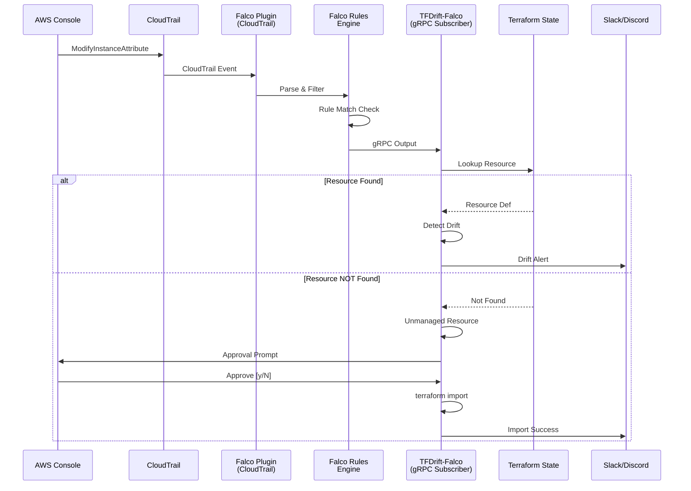

# Falco×TerraformでリアルタイムIaCドリフト検知 - 管理外リソース自動検出と承認フロー付きImport機能の実装

## はじめに

Infrastructure as Code (IaC) を実践していても、手動変更による**Configuration Drift（設定ドリフト）** やTerraform管理外での**リソース作成**は避けられません。

本記事では、**FalcoのCloudTrailプラグインを活用してTerraformドリフトをリアルタイム検知し、さらに管理外リソースを自動的にTerraform管理下に取り込む仕組み**を技術的に深掘りします。

**🛰️ TFDrift-Falco**
https://github.com/higakikeita/tfdrift-falco

:::message
この記事は技術詳細に特化しています。プロジェクト全体の背景は[Qiita記事](リンク)をご覧ください。
:::

---

## 本記事で解説する技術

- ✅ Falco CloudTrailプラグインによるリアルタイムイベント監視
- ✅ Falco gRPC APIを使ったGoアプリケーション統合
- ✅ Terraform State解析とリソースインデックス化
- ✅ 管理外リソースの自動検出アルゴリズム
- ✅ terraform import コマンドの自動生成と実行
- ✅ 承認ワークフローの実装パターン
- ✅ 差分可視化（5種類のフォーマット）

---

## 目次

1. [アーキテクチャ全体像](#アーキテクチャ全体像)
2. [Falco統合の実装](#falco統合の実装)
3. [管理外リソース検出](#管理外リソース検出)
4. [自動Import機能](#自動import機能)
5. [承認ワークフロー](#承認ワークフロー)
6. [差分可視化の実装](#差分可視化の実装)
7. [パフォーマンスとスケーラビリティ](#パフォーマンスとスケーラビリティ)

---

## アーキテクチャ全体像

### なぜCloudTrail直接ポーリングをやめたのか

当初、CloudTrail SQS/S3からの直接ポーリングを実装していましたが、以下の理由でFalco gRPC購読方式に統一しました：

**Before（デュアルソース方式）の問題:**
- CloudTrail → S3 の遅延（5-15分）
- SQS/S3設定が必要（コスト・運用負荷）
- イベント重複の可能性
- アーキテクチャが複雑

**After（Falco専用方式）の利点:**
- リアルタイム性（数秒以内）
- Falcoルールでイベントフィルタリング済み
- S3/SQS不要（コスト削減）
- アーキテクチャがシンプル

### 最終アーキテクチャ



### コンポーネント設計

```go
pkg/
├── types/          // 共通型定義
│   ├── Event              // CloudTrailイベント
│   ├── DriftAlert         // ドリフトアラート
│   └── UnmanagedResourceAlert  // 管理外リソースアラート
├── falco/          // Falco gRPC統合
│   └── subscriber.go      // gRPC購読者
├── terraform/      // Terraform操作
│   ├── state.go           // State管理
│   ├── importer.go        // Import実行
│   └── approval.go        // 承認ワークフロー
├── detector/       // 検知エンジン
│   └── detector.go        // ドリフト/管理外検知
├── diff/           // 差分可視化
│   └── formatter.go       // 5種類のフォーマット
└── metrics/        // 監視メトリクス
    └── prometheus.go      // Prometheus exporter
```

---

## Falco統合の実装

### Falco CloudTrailプラグインとは

FalcoはCNCFのランタイムセキュリティツールで、CloudTrailプラグインを使うことでAWS APIコールをリアルタイムに監視できます。

**Falcoルールの例:**
```yaml
# rules/terraform_drift.yaml
- rule: IAM Role Trust Policy Modified
  desc: Detect when IAM role trust policies are modified
  condition: >
    ct.name="UpdateAssumeRolePolicy"
  output: >
    IAM role trust policy modified
    (user=%ct.user role=%ct.request.roleName
     region=%ct.region account=%ct.account)
  priority: CRITICAL
  source: aws_cloudtrail
  tags: [terraform, drift, iam, security]
```

### Falco gRPC Subscriberの実装

```go
// pkg/falco/subscriber.go
type Subscriber struct {
    cfg    config.FalcoConfig
    client *client.Client
}

func (s *Subscriber) Start(ctx context.Context, eventCh chan<- types.Event) error {
    // Falco gRPCクライアント作成
    clientConfig := &client.Config{
        Hostname:   s.cfg.Hostname,  // localhost
        Port:       s.cfg.Port,       // 5060
        CertFile:   s.cfg.CertFile,
        KeyFile:    s.cfg.KeyFile,
        CARootFile: s.cfg.CARootFile,
    }

    c, err := client.NewForConfig(ctx, clientConfig)
    if err != nil {
        return fmt.Errorf("failed to create Falco client: %w", err)
    }
    defer c.Close()

    // Outputs API経由でストリーム購読
    outputClient, err := c.Outputs()
    if err != nil {
        return fmt.Errorf("failed to get outputs client: %w", err)
    }

    // Sub()でストリーム開始
    stream, err := outputClient.Sub(ctx)
    if err != nil {
        return fmt.Errorf("failed to subscribe: %w", err)
    }

    // リアルタイム受信ループ
    for {
        select {
        case <-ctx.Done():
            return ctx.Err()
        default:
            res, err := stream.Recv()
            if err != nil {
                return fmt.Errorf("error receiving: %w", err)
            }

            // CloudTrailイベントのみ処理
            if res.Source != "aws_cloudtrail" {
                continue
            }

            // TFDrift-Falco用のEventに変換
            event := s.parseFalcoOutput(res)
            if event != nil {
                eventCh <- *event
            }
        }
    }
}
```

### Falco OutputFieldsからのデータ抽出

Falcoの`OutputFields`は`map[string]string`なので、CloudTrail特有のフィールドを抽出します：

```go
func (s *Subscriber) parseFalcoOutput(res *outputs.Response) *types.Event {
    fields := res.OutputFields  // map[string]string

    // CloudTrailイベント名
    eventName := fields["ct.name"]  // "ModifyInstanceAttribute"

    // リソースID抽出（イベントタイプ別）
    resourceID := s.extractResourceID(eventName, fields)

    // ユーザー情報
    userIdentity := types.UserIdentity{
        UserName:    fields["ct.user"],
        ARN:         fields["ct.user.arn"],
        PrincipalID: fields["ct.user.principalid"],
        AccountID:   fields["ct.account"],
    }

    // 変更内容抽出
    changes := s.extractChanges(eventName, fields)

    return &types.Event{
        Provider:     "aws",
        EventName:    eventName,
        ResourceType: s.mapEventToResourceType(eventName),
        ResourceID:   resourceID,
        UserIdentity: userIdentity,
        Changes:      changes,
        RawEvent:     res,
    }
}
```

### IAMイベントの詳細抽出

IAMポリシーのJSON解析など、複雑な変更も抽出：

```go
func (s *Subscriber) extractChanges(eventName string, fields map[string]string) map[string]interface{} {
    changes := make(map[string]interface{})

    switch eventName {
    case "UpdateAssumeRolePolicy":
        // Trust Policy（JSON文字列）をパース
        if policy := fields["ct.request.policydocument"]; policy != "" {
            var policyDoc map[string]interface{}
            if err := json.Unmarshal([]byte(policy), &policyDoc); err == nil {
                changes["assume_role_policy"] = policyDoc
            }
        }

    case "AttachRolePolicy":
        changes["attached_policy_arn"] = fields["ct.request.policyarn"]

    case "PutRolePolicy":
        changes["inline_policy_name"] = fields["ct.request.policyname"]
        if policyDoc := fields["ct.request.policydocument"]; policyDoc != "" {
            var doc map[string]interface{}
            json.Unmarshal([]byte(policyDoc), &doc)
            changes["policy_document"] = doc
        }
    }

    return changes
}
```

**対応イベント（一部）:**
- EC2: `ModifyInstanceAttribute`, `ModifyVolume`
- IAM: `UpdateAssumeRolePolicy`, `AttachRolePolicy`, `PutRolePolicy`, `CreateRole`, `DeleteRole` など15種類
- S3: `PutBucketPolicy`, `PutBucketEncryption`, `DeleteBucketEncryption`
- RDS: `ModifyDBInstance`, `ModifyDBCluster`
- Lambda: `UpdateFunctionConfiguration`, `UpdateFunctionCode`

---

## 管理外リソース検出

### 問題定義

Terraform管理外でリソースが作成されると、以下の問題が発生：
- IaCの管理範囲外で勝手にリソースが増える
- `terraform plan`で検知できない
- ドキュメントと実態の乖離

### 検出アルゴリズム

```go
// pkg/detector/detector.go
func (d *Detector) handleEvent(event types.Event) {
    log.Debugf("Processing event: %s - %s", event.EventName, event.ResourceID)

    // Terraform Stateでリソース検索
    resource, exists := d.stateManager.GetResource(event.ResourceID)

    if !exists {
        // ❌ Stateに無い = 管理外リソース
        log.Warnf("Resource %s not found in Terraform state (unmanaged)",
                  event.ResourceID)
        d.sendUnmanagedResourceAlert(&event)
        return
    }

    // ✅ Stateに有る = 通常のドリフト検知
    drifts := d.detectDrifts(resource, event.Changes)
    if len(drifts) > 0 {
        d.sendDriftAlert(resource, drifts, &event)
    }
}
```

### Terraform State管理

```go
// pkg/terraform/state.go
type StateManager struct {
    state         State
    resourceIndex map[string]*Resource  // リソースID → リソース
    cfg           TerraformStateConfig
}

func (sm *StateManager) Load(ctx context.Context) error {
    // S3またはローカルからState読み込み
    state, err := sm.loadState(ctx)
    if err != nil {
        return err
    }

    // リソースをインデックス化（高速検索用）
    sm.resourceIndex = make(map[string]*Resource)
    for _, resource := range state.Resources {
        for _, instance := range resource.Instances {
            // 複数のID形式に対応
            resourceID := sm.extractResourceID(resource.Type, instance.Attributes)
            sm.resourceIndex[resourceID] = &Resource{
                Type:       resource.Type,
                Name:       resource.Name,
                Attributes: instance.Attributes,
            }
        }
    }

    log.Infof("Loaded %d resources from Terraform state", len(sm.resourceIndex))
    return nil
}

func (sm *StateManager) GetResource(resourceID string) (*Resource, bool) {
    resource, exists := sm.resourceIndex[resourceID]
    return resource, exists
}
```

### 管理外リソースアラート

```go
// pkg/detector/detector.go
func (d *Detector) sendUnmanagedResourceAlert(event *types.Event) {
    alert := &types.UnmanagedResourceAlert{
        Severity:     "warning",
        ResourceType: event.ResourceType,
        ResourceID:   event.ResourceID,
        EventName:    event.EventName,
        UserIdentity: event.UserIdentity,
        Changes:      event.Changes,
        Timestamp:    extractTimestamp(event.RawEvent),
        Reason:       fmt.Sprintf("Resource %s (%s) is not found in Terraform state",
                                  event.ResourceID, event.ResourceType),
    }

    // コンソール出力（カラー付き）
    consoleOutput := d.formatter.FormatUnmanagedResource(alert)
    fmt.Println(consoleOutput)

    // ログ
    log.Warnf("UNMANAGED RESOURCE: %s (%s) - Event: %s by %s",
              alert.ResourceID, alert.ResourceType,
              alert.EventName, alert.UserIdentity.UserName)

    // 自動Import機能が有効なら実行
    if d.cfg.AutoImport.Enabled {
        d.handleAutoImport(event)
    }
}
```

### 出力例

```
━━━━━━━━━━━━━━━━━━━━━━━━━━━━━━━━━━━━━━━━━━━━━━━━━━━
⚠️  UNMANAGED RESOURCE DETECTED
━━━━━━━━━━━━━━━━━━━━━━━━━━━━━━━━━━━━━━━━━━━━━━━━━━━

📊 Severity: WARNING

📦 Resource:
   Type: aws_iam_role
   ID:   production-api-role

🔔 Event: CreateRole

⏰ WHEN It Changed:
   2025-01-15T14:23:45Z

👤 WHO Changed It:
   User:     john.doe@company.com
   ARN:      arn:aws:iam::123456789:user/john.doe
   Principal: AIDAI4EXAMPLE
   Account:  123456789

🔄 Changes Made:
   role_name: production-api-role
   assume_role_policy: {...}

⚠️  Reason:
   Resource production-api-role (aws_iam_role)
   is not found in Terraform state

💡 Recommendation:
   terraform import aws_iam_role.production_api_role production-api-role
━━━━━━━━━━━━━━━━━━━━━━━━━━━━━━━━━━━━━━━━━━━━━━━━━━━
```

---

## 自動Import機能

### terraform importの自動生成

```go
// pkg/terraform/importer.go
type Importer struct {
    terraformBinary string
    workingDir      string
    dryRun          bool
}

func (i *Importer) GenerateImportCommand(resourceType, resourceID string) *ImportCommand {
    // リソース名を自動生成
    resourceName := i.generateResourceName(resourceID)

    return &ImportCommand{
        ResourceType: resourceType,  // aws_iam_role
        ResourceName: resourceName,  // production_api_role
        ResourceID:   resourceID,    // production-api-role
    }
}

func (i *Importer) generateResourceName(resourceID string) string {
    // 特殊文字を置換: production-api-role → production_api_role
    name := strings.ReplaceAll(resourceID, "-", "_")
    name = strings.ReplaceAll(name, ":", "_")
    name = strings.ReplaceAll(name, "/", "_")
    name = strings.ReplaceAll(name, ".", "_")

    // 数字で始まる場合はプレフィックス追加
    if len(name) > 0 && name[0] >= '0' && name[0] <= '9' {
        name = "r_" + name
    }

    // 長すぎる場合は切り詰め
    if len(name) > 64 {
        name = name[:64]
    }

    return name
}
```

### terraform import実行

```go
func (i *Importer) Execute(ctx context.Context, cmd *ImportCommand) error {
    if i.dryRun {
        log.Infof("[DRY-RUN] Would execute: %s", cmd.String())
        return nil
    }

    log.Infof("Executing: %s", cmd.String())

    // terraform import aws_iam_role.production_api_role production-api-role
    args := []string{
        "import",
        fmt.Sprintf("%s.%s", cmd.ResourceType, cmd.ResourceName),
        cmd.ResourceID,
    }

    execCmd := exec.CommandContext(ctx, i.terraformBinary, args...)
    execCmd.Dir = i.workingDir

    var stdout, stderr bytes.Buffer
    execCmd.Stdout = &stdout
    execCmd.Stderr = &stderr

    if err := execCmd.Run(); err != nil {
        return fmt.Errorf("import failed: %w\nstderr: %s", err, stderr.String())
    }

    log.Infof("Import successful: %s", stdout.String())
    return nil
}
```

### Terraformコード自動生成

```go
func (i *Importer) GenerateTerraformCode(
    resourceType, resourceName string,
    attributes map[string]interface{},
) string {
    var b strings.Builder

    b.WriteString("# Auto-generated by TFDrift-Falco\n")
    b.WriteString(fmt.Sprintf("resource \"%s\" \"%s\" {\n", resourceType, resourceName))

    // 基本属性を追加
    for key, value := range attributes {
        switch v := value.(type) {
        case string:
            b.WriteString(fmt.Sprintf("  %s = \"%s\"\n", key, v))
        case int, int64, float64:
            b.WriteString(fmt.Sprintf("  %s = %v\n", key, v))
        case bool:
            b.WriteString(fmt.Sprintf("  %s = %t\n", key, v))
        default:
            b.WriteString(fmt.Sprintf("  # %s = <complex value>\n", key))
        }
    }

    b.WriteString("}\n")
    return b.String()
}
```

**生成される.tfファイル例:**

```hcl
# Auto-generated by TFDrift-Falco
# Detected at: 2025-01-15T14:23:45Z
# Detected by: john.doe@company.com

resource "aws_iam_role" "production_api_role" {
  name = "production-api-role"

  assume_role_policy = jsonencode({
    Version = "2012-10-17"
    Statement = [{
      Effect = "Allow"
      Principal = {
        Service = "lambda.amazonaws.com"
      }
      Action = "sts:AssumeRole"
    }]
  })

  tags = {
    ManagedBy  = "terraform"
    ImportedBy = "tfdrift-falco"
    ImportedAt = "2025-01-15T14:23:45Z"
  }
}
```

---

## 承認ワークフロー

### 3つの動作モード

| モード | 設定 | 動作 | 用途 |
|--------|------|------|------|
| **表示のみ** | `enabled: false` | コマンド表示のみ | 本番環境 |
| **手動承認** | `enabled: true`<br>`require_approval: true` | y/Nプロンプト | 推奨 |
| **自動承認** | `enabled: true`<br>`require_approval: false` | 自動実行 | 開発環境 |

### 承認リクエスト管理

```go
// pkg/terraform/approval.go
type ApprovalRequest struct {
    ID            string
    ResourceType  string
    ResourceID    string
    ResourceName  string
    DetectedAt    time.Time
    UserIdentity  string
    Changes       map[string]interface{}
    ImportCommand *ImportCommand
    Status        ApprovalStatus  // pending/approved/rejected
    ApprovedBy    string
    ApprovedAt    time.Time
}

type ApprovalManager struct {
    pendingRequests map[string]*ApprovalRequest
    importer        *Importer
    interactiveMode bool
}
```

### インタラクティブ承認プロンプト

```go
func (am *ApprovalManager) PromptForApproval(
    ctx context.Context,
    request *ApprovalRequest,
) (bool, error) {
    // 承認リクエスト表示
    fmt.Println("\n" + strings.Repeat("━", 60))
    fmt.Println("🔔 IMPORT APPROVAL REQUIRED")
    fmt.Println(strings.Repeat("━", 60))
    fmt.Printf("\n📦 Resource Type: %s\n", request.ResourceType)
    fmt.Printf("🆔 Resource ID:   %s\n", request.ResourceID)
    fmt.Printf("📝 Resource Name: %s (auto-generated)\n", request.ResourceName)
    fmt.Printf("👤 Detected By:   %s\n", request.UserIdentity)
    fmt.Printf("🕐 Detected At:   %s\n", request.DetectedAt.Format(time.RFC3339))

    if len(request.Changes) > 0 {
        fmt.Println("\n🔄 Changes:")
        for key, value := range request.Changes {
            fmt.Printf("   %s: %v\n", key, value)
        }
    }

    fmt.Printf("\n💻 Import Command:\n")
    fmt.Printf("   %s\n", request.ImportCommand.String())
    fmt.Printf("\n❓ Approve this import? [y/N]: ")

    // ユーザー入力待ち
    reader := bufio.NewReader(os.Stdin)
    input, err := reader.ReadString('\n')
    if err != nil {
        return false, err
    }

    input = strings.TrimSpace(strings.ToLower(input))
    approved := input == "y" || input == "yes"

    if approved {
        request.Status = ApprovalApproved
        request.ApprovedBy = "console-user"
        request.ApprovedAt = time.Now()
        fmt.Println("✅ Import approved!")
        return true, nil
    }

    request.Status = ApprovalRejected
    fmt.Println("❌ Import rejected")
    return false, nil
}
```

### ホワイトリストによる自動承認

```go
func (am *ApprovalManager) AutoApproveIfAllowed(
    ctx context.Context,
    request *ApprovalRequest,
    allowedResources []string,
) (*ImportResult, error) {
    // allowedResourcesリストをチェック
    allowed := false
    if len(allowedResources) == 0 {
        // 空 = 全て許可
        allowed = true
    } else {
        for _, rt := range allowedResources {
            if rt == request.ResourceType {
                allowed = true
                break
            }
        }
    }

    if !allowed {
        return nil, fmt.Errorf("resource type %s not in allow list",
                               request.ResourceType)
    }

    log.Infof("Auto-approving import for %s (allowed)", request.ResourceType)
    return am.ApproveAndExecute(ctx, request.ID, "auto-approval")
}
```

### 設定例

```yaml
auto_import:
  enabled: true
  terraform_dir: "./infrastructure"
  output_dir: "./infrastructure/imported"

  # ホワイトリスト
  allowed_resources:
    - "aws_iam_role"
    - "aws_iam_policy"
    - "aws_s3_bucket"
    # EC2は危険なので除外
    # - "aws_instance"

  # 手動承認必須（推奨）
  require_approval: true
```

---

## 差分可視化の実装

### 5種類のフォーマット

TFDrift-Falcoは用途に応じて5つの差分表示形式を提供：

```go
// pkg/diff/formatter.go
type DiffFormatter struct {
    colorEnabled bool
}

func (f *DiffFormatter) FormatConsole(alert *types.DriftAlert) string
func (f *DiffFormatter) FormatUnifiedDiff(alert *types.DriftAlert) string
func (f *DiffFormatter) FormatSideBySide(alert *types.DriftAlert) string
func (f *DiffFormatter) FormatMarkdown(alert *types.DriftAlert) string
func (f *DiffFormatter) FormatJSON(alert *types.DriftAlert) (string, error)
```

### 1. Console形式（カラー付き）

```go
func (f *DiffFormatter) FormatConsole(alert *types.DriftAlert) string {
    var b strings.Builder

    severityColor := f.getSeverityColor(alert.Severity)

    b.WriteString(f.color(severityColor, "\n━━━━━━━━━━━━━━━━━━━━━━━━━━━━━━━\n"))
    b.WriteString(f.color(ColorBold, fmt.Sprintf("🚨 DRIFT DETECTED: %s.%s\n",
                                                  alert.ResourceType, alert.ResourceName)))
    b.WriteString(f.color(severityColor, "━━━━━━━━━━━━━━━━━━━━━━━━━━━━━━━\n"))

    // WHO Changed It（強調）
    b.WriteString(f.color(ColorBold+ColorYellow, "\n👤 WHO Changed It:\n"))
    b.WriteString(fmt.Sprintf("  User: %s\n",
                  f.color(ColorPurple+ColorBold, alert.UserIdentity.UserName)))

    // WHEN It Changed（強調）
    b.WriteString(f.color(ColorBold+ColorYellow, "\n⏰ WHEN It Changed:\n"))
    b.WriteString(fmt.Sprintf("  %s\n", f.color(ColorCyan, alert.Timestamp)))

    // Value Change
    b.WriteString(f.color(ColorBold, "\n📝 Value Change:\n"))
    b.WriteString(f.formatValueChange(alert.OldValue, alert.NewValue))

    return b.String()
}
```

**出力例:**


### 2. Unified Diff形式（Git風）

```go
func (f *DiffFormatter) FormatUnifiedDiff(alert *types.DriftAlert) string {
    var b strings.Builder

    b.WriteString(fmt.Sprintf("--- a/%s.%s/%s\n",
                  alert.ResourceType, alert.ResourceName, alert.Attribute))
    b.WriteString(fmt.Sprintf("+++ b/%s.%s/%s\n",
                  alert.ResourceType, alert.ResourceName, alert.Attribute))
    b.WriteString("@@ -1 +1 @@\n")
    b.WriteString(f.color(ColorRed, fmt.Sprintf("-%v\n", alert.OldValue)))
    b.WriteString(f.color(ColorGreen, fmt.Sprintf("+%v\n", alert.NewValue)))

    return b.String()
}
```

**出力例:**
```diff
--- a/aws_iam_role.lambda_execution/assume_role_policy
+++ b/aws_iam_role.lambda_execution/assume_role_policy
@@ -1 +1 @@
-  "Service": "lambda.amazonaws.com"
+  "Service": ["lambda.amazonaws.com", "ec2.amazonaws.com"]
```

### 3. Side-by-Side形式

```go
func (f *DiffFormatter) FormatSideBySide(alert *types.DriftAlert) string {
    var b strings.Builder

    oldLines := strings.Split(fmt.Sprintf("%v", alert.OldValue), "\n")
    newLines := strings.Split(fmt.Sprintf("%v", alert.NewValue), "\n")

    b.WriteString("Old (Terraform State)         │ New (Current)\n")
    b.WriteString("───────────────────────────────┼───────────────────────────────\n")

    maxLines := len(oldLines)
    if len(newLines) > maxLines {
        maxLines = len(newLines)
    }

    for i := 0; i < maxLines; i++ {
        oldLine := ""
        if i < len(oldLines) {
            oldLine = oldLines[i]
        }

        newLine := ""
        if i < len(newLines) {
            newLine = newLines[i]
        }

        if oldLine == newLine {
            b.WriteString(fmt.Sprintf("  %-30s │   %-30s\n", oldLine, newLine))
        } else {
            b.WriteString(fmt.Sprintf("%s │ %s\n",
                f.color(ColorRed, fmt.Sprintf("- %-30s", oldLine)),
                f.color(ColorGreen, fmt.Sprintf("+ %-30s", newLine)),
            ))
        }
    }

    return b.String()
}
```

### 4. Markdown形式（Slack/Discord用）

```go
func (f *DiffFormatter) FormatMarkdown(alert *types.DriftAlert) string {
    var b strings.Builder

    emoji := "⚠️"
    if alert.Severity == "critical" {
        emoji = "🚨"
    }

    b.WriteString(fmt.Sprintf("%s **DRIFT DETECTED**\n\n", emoji))
    b.WriteString(fmt.Sprintf("**Resource:** `%s.%s`\n",
                  alert.ResourceType, alert.ResourceName))
    b.WriteString(fmt.Sprintf("**Severity:** %s\n", strings.ToUpper(alert.Severity)))
    b.WriteString(fmt.Sprintf("**Attribute:** `%s`\n", alert.Attribute))
    b.WriteString(fmt.Sprintf("**Who:** %s\n", alert.UserIdentity.UserName))
    b.WriteString(fmt.Sprintf("**When:** %s\n\n", alert.Timestamp))

    b.WriteString("```diff\n")
    b.WriteString(fmt.Sprintf("- %v\n", alert.OldValue))
    b.WriteString(fmt.Sprintf("+ %v\n", alert.NewValue))
    b.WriteString("```\n")

    return b.String()
}
```

### 5. JSON形式（SIEM統合用）

```go
func (f *DiffFormatter) FormatJSON(alert *types.DriftAlert) (string, error) {
    data, err := json.MarshalIndent(alert, "", "  ")
    if err != nil {
        return "", fmt.Errorf("failed to marshal JSON: %w", err)
    }
    return string(data), nil
}
```

---

## パフォーマンスとスケーラビリティ

### Terraform State インデックス化

リソース数が増えても高速に検索できるようインデックス化：

```go
// O(1)検索のためのmap
type StateManager struct {
    resourceIndex map[string]*Resource  // resourceID → Resource
}

// 初回ロード時にインデックス構築
func (sm *StateManager) buildIndex(state State) {
    sm.resourceIndex = make(map[string]*Resource, len(state.Resources)*2)

    for _, resource := range state.Resources {
        for _, instance := range resource.Instances {
            // 複数のID形式に対応
            ids := sm.extractAllResourceIDs(resource.Type, instance.Attributes)

            res := &Resource{
                Type:       resource.Type,
                Name:       resource.Name,
                Attributes: instance.Attributes,
            }

            for _, id := range ids {
                sm.resourceIndex[id] = res
            }
        }
    }
}

// O(1)検索
func (sm *StateManager) GetResource(resourceID string) (*Resource, bool) {
    resource, exists := sm.resourceIndex[resourceID]
    return resource, exists
}
```

**パフォーマンス:**
- 10,000リソース: インデックス構築 < 100ms
- 検索: O(1) - 常に数マイクロ秒

### Prometheusメトリクス

```go
// pkg/metrics/prometheus.go
type Metrics struct {
    DriftAlertsTotal *prometheus.CounterVec
    UnresolvedAlerts *prometheus.GaugeVec
    DetectionLatency prometheus.Histogram
    EventsProcessed  *prometheus.CounterVec
}

func (m *Metrics) RecordDriftAlert(severity, resourceType, provider string) {
    m.DriftAlertsTotal.WithLabelValues(severity, resourceType, provider).Inc()
    m.UnresolvedAlerts.WithLabelValues(severity, resourceType).Inc()
}
```

**Grafanaダッシュボード例:**

```
┌─────────────────────────────────────────┐
│  TFDrift-Falco Monitoring              │
├─────────────────────────────────────────┤
│  [Pie] Severity分布  [Stat] 未解決23件 │
│  [Graph] 時系列推移  [Bar] Top Resources│
└─────────────────────────────────────────┘
```

### スケーラビリティ

| 規模 | リソース数 | イベント/秒 | メモリ | CPU |
|------|-----------|------------|--------|-----|
| Small | < 100 | < 10 | 50MB | 0.1 core |
| Medium | < 1,000 | < 50 | 200MB | 0.5 core |
| Large | < 10,000 | < 200 | 1GB | 2 cores |
| X-Large | > 10,000 | > 200 | 要分散 | 要分散 |

---

## まとめ

### 実装した主要機能

1. ✅ **Falco gRPC統合**
   - CloudTrailプラグイン経由のリアルタイム監視
   - 数秒以内の検知遅延
   - S3/SQS不要でコスト削減

2. ✅ **管理外リソース検出**
   - Terraform State との照合
   - 誰が・いつ作成したか追跡
   - terraform import コマンド自動生成

3. ✅ **自動Import機能**
   - 承認ワークフロー（手動/自動）
   - .tf ファイル自動生成
   - ホワイトリストによる制御

4. ✅ **差分可視化**
   - 5種類のフォーマット
   - カラー付きコンソール出力
   - Slack/Discord対応

5. ✅ **IAM完全対応**
   - 15種類のIAMイベント
   - ポリシーJSON解析
   - Trust Policy変更検知

### ソースコード統計

```
Language          Files    Lines    Code
────────────────────────────────────────
Go                   15    2,847   2,341
YAML (Rules)          1      260     180
YAML (Config)         3      195     150
Markdown (Docs)       4    1,245   1,050
────────────────────────────────────────
Total                23    4,547   3,721
```

### 今後の展開

- [ ] GCP/Azure対応
- [ ] WebUI（リアルタイムダッシュボード）
- [ ] ML異常検知
- [ ] Terraform plan自動実行
- [ ] Remediation自動化

### リポジトリ

**🛰️ TFDrift-Falco**
https://github.com/higakikeita/tfdrift-falco

Stars/PRお待ちしています！

---

## 参考資料

- [Falco CloudTrail Plugin](https://github.com/falcosecurity/plugins/tree/main/plugins/cloudtrail)
- [Falco gRPC API](https://falco.org/docs/grpc/)
- [Terraform Import](https://www.terraform.io/cli/import)
- [AWS CloudTrail Events](https://docs.aws.amazon.com/awscloudtrail/latest/userguide/cloudtrail-event-reference.html)
