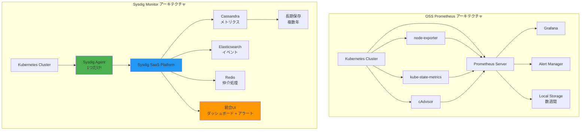
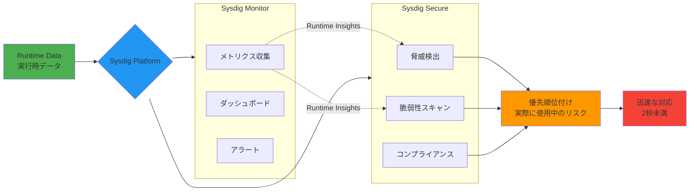
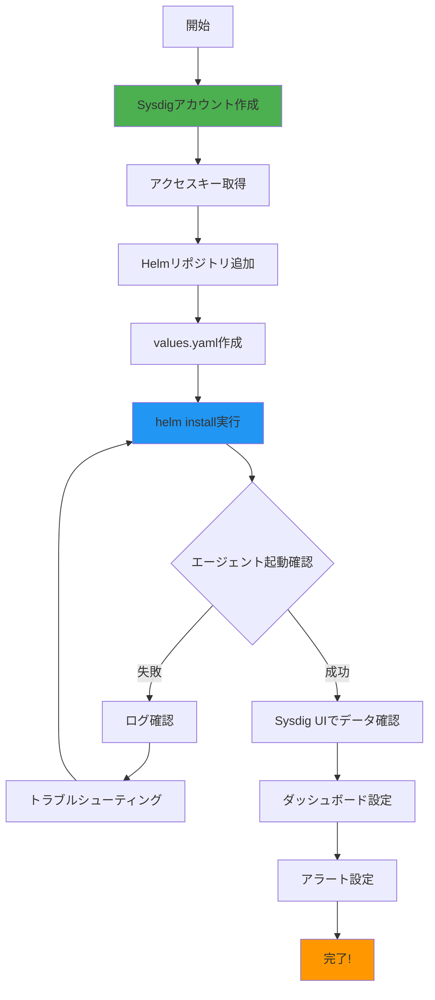
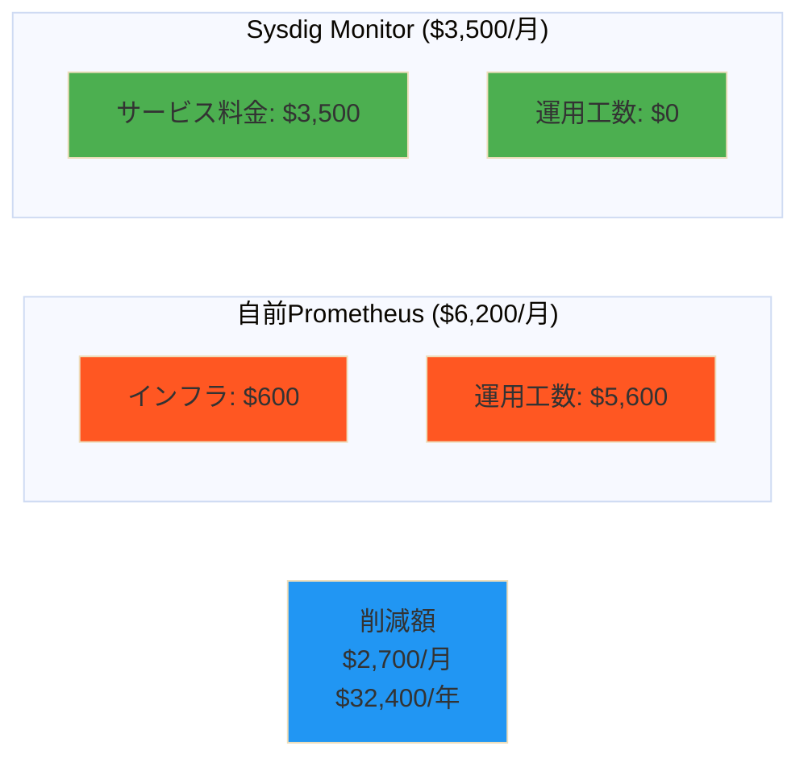

# Sysdig Monitor をみんなに使って欲しい 徹底解説

## なぜ今、Sysdig Monitorなのか？

クラウドネイティブ環境の監視に悩んでいませんか？Prometheusは素晴らしいツールですが、運用が大変。APMソリューションは高価でオーバースペック。セキュリティと監視が別々のツールで管理が煩雑...。

そんな課題を解決するのが **Sysdig Monitor** です。本記事では、Prometheusの100%マネージドサービスとして、そしてCNAPP（Cloud-Native Application Protection Platform）として進化したSysdig Monitorを徹底解説します。

---

## 目次

1. [Sysdig Monitorの3つの強み](#sysdig-monitorの3つの強み)
2. [Prometheusの100%マネージドサービス](#prometheusの100マネージドサービス)
3. [洗練されたダッシュボードとアウトオブボックス機能](#洗練されたダッシュボードとアウトオブボックス機能)
4. [監視とセキュリティの統合プラットフォーム（CNAPP）](#監視とセキュリティの統合プラットフォームcnapp)
5. [実践編：Sysdig Monitorを使ってみる](#実践編sysdig-monitorを使ってみる)
6. [ユースケース別の活用例](#ユースケース別の活用例)
7. [コスト比較詳細](#コスト比較詳細)
8. [トラブルシューティング](#トラブルシューティング)
9. [よくある質問（FAQ）](#よくある質問faq)
10. [まとめ](#まとめ)

---

## Sysdig Monitorの3つの強み

### 1. Prometheusの100%マネージドサービス

オープンソースのPrometheusは素晴らしいモニタリングツールですが、本番環境で運用するには多くの課題があります。

**Prometheusの典型的な課題**

- **複雑なコンポーネント管理**: Prometheus本体、Grafana、Alert Manager、KSM（kube-state-metrics）、node exporter、cAdvisorなど、5〜7個のコンポーネントを個別に管理する必要がある
- **スケーラビリティの限界**: 垂直スケーリングのみサポート。ローカルストレージに依存し、クラスタリング機能がない
- **データ保持期間の制約**: ストレージの制約により、通常は数週間程度のデータしか保持できない
- **マルチクラスタ管理の複雑さ**: 各クラスタにPrometheusをデプロイする必要があり、統合ビューを作成するのが困難

**Sysdig Monitorによる解決**

Sysdig Monitorは、これらの課題をエンタープライズグレードのマネージドサービスとして解決します。

| 項目 | OSS Prometheus | Sysdig Monitor |
|------|----------------|----------------|
| **導入コンポーネント** | 5-7個（Prometheus、Grafana、Alert Manager、KSM、node exporter等） | **1個**（Sysdig Agentのみ） |
| **スケーリング** | 垂直スケーリングのみ | **水平スケーリング**対応 |
| **データ保持** | 数週間（ストレージに依存） | **複数年**（Cassandra/Elasticsearchバックエンド） |
| **HA構成** | 手動で構築 | **標準装備** |
| **PromQL互換性** | 完全対応 | **完全互換** |
| **アラートルール移行** | 手動 | **ワンクリックインポート** |
| **マルチクラスタビュー** | 手動統合が必要 | **統合ダッシュボード標準装備** |

**技術アーキテクチャの違い**

- **Prometheus**: 垂直スケーリングモデル、ローカルディスクベースの時系列データベース
- **Sysdig Monitor**: 水平スケーリングモデル、Cassandra（メトリクス）+ Elasticsearch（イベント）+ Redis（仲介処理）の分散アーキテクチャ



これにより、Sysdig Monitorは大規模環境でも安定したパフォーマンスを維持し、長期的なトレンド分析やコンプライアンス要件に対応できます。

**Prometheus互換性の実際**

Sysdig MonitorはPromQLを完全サポートしており、既存のPrometheusクエリやアラートルールをそのまま利用できます。

- **Remote Write対応**: 既存のPrometheusサーバーからSysdigへメトリクスを送信可能
- **Import Prometheus Rules**: 既存のアラートルールをワンクリックでインポート
- **カスタムメトリクス自動検出**: Prometheusエクスポーターで公開されたメトリクスを自動収集

### 2. 洗練されたダッシュボードとアウトオブボックス機能

Prometheusをデプロイした後、Grafanaでダッシュボードを一から作成した経験はありませんか？Sysdig Monitorなら、その手間が不要です。

**すぐに使える機能**

- **80+のダッシュボードテンプレート**: Kubernetes、Docker、AWS、Azure、GCP、データベース、ミドルウェア等、主要なサービスに対応
- **サービス自動検出**: エージェントが自動的にサービスを検出し、適切なメトリクスを収集
- **eBPF技術**: Kernelレベルでのマイクロ秒単位の可視化。システムコールレベルでのトラブルシューティングが可能
- **GUI/APIベースの設定**: 直感的なWebインターフェースで設定可能。もちろんPromQLも使える

**エンタープライズ機能**

- **チームベースのアクセス制御**: LDAP/SAML統合により、組織のIAMと連携
- **データスコープ管理**: チームごとに見えるデータを制限可能
- **カスタムダッシュボード共有**: ダッシュボードやアラートをチーム間で共有

**メトリクス収集の効率化**

Sysdig Agentは10秒ごとにインフラストラクチャをポーリングし、デフォルトで以下のメトリクスを自動収集します：

- Kubernetesメトリクス（KSM相当）
- ノードメトリクス（node exporter相当）
- コンテナメトリクス（cAdvisor相当）
- カスタムPrometheusメトリクス
- APMメトリクス（オプション）

### 3. 監視とセキュリティの統合プラットフォーム（CNAPP）

従来の監視ツールとセキュリティツールは別々に管理されており、インシデント発生時に情報を突き合わせるのに時間がかかっていました。Sysdigは、**監視（Monitor）とセキュリティ（Secure）を統合したCNAPPプラットフォーム**として、この課題を解決します。

**CNAPPとは？**

CNAPP（Cloud-Native Application Protection Platform）は、以下の機能を統合したセキュリティプラットフォームです：

- **CSPM** (Cloud Security Posture Management): クラウド設定の管理
- **CWPP** (Cloud Workload Protection Platform): ワークロード保護
- **CIEM** (Cloud Infrastructure Entitlement Management): 権限管理
- **CDR** (Cloud Detection and Response): 脅威検出と対応

**Sysdig CNAPPの統合アプローチ**

Sysdigの強みは、**Runtime Insights**と呼ばれる実行時データを活用することです。



**具体的な統合の価値**

1. **コンテキストに基づく脅威検出**
   - 監視データから得られる実行時のコンテキスト（プロセス、ネットワーク接続、システムコール等）をセキュリティ分析に活用
   - 誤検知を削減し、本当に危険な脅威を優先的に検出

2. **脆弱性の優先順位付け**
   - CVEデータベースに登録されている脆弱性は膨大
   - Sysdigは**実際に実行されているコンポーネント**に絞って脆弱性を評価
   - 「使われていないライブラリの脆弱性」に時間を浪費しない

3. **リアルタイム脅威検出**
   - オープンソースのFalcoルールエンジンを基盤とした脅威検出
   - **2秒未満**で脅威を検出（BigCommerce社の事例）
   - 機械学習とドリフト制御による異常検出

4. **Cloud Attack Graph**
   - 資産、活動、リスクを相互に関連付け
   - 隠れた攻撃経路を可視化
   - 「このコンテナが侵害されると、どのリソースに影響があるか」を即座に把握

**実績データ**

BigCommerce社の導入事例：
- 脅威検出時間: **2秒未満**
- 脆弱性発見率: **20%増加**
- 誤検知: **大幅に削減**

**Gartner認定**

Sysdigは、2025年のGartner Market Guide for CNAPPで代表的ベンダーとして選出され、Customers' Choice（顧客満足度）で**4.9/5点**、推奨率**99%**を獲得しています。

---

## 実践編：Sysdig Monitorを使ってみる

ここからは、実際にSysdig Monitorをセットアップして使ってみましょう。

### 環境準備

**前提条件**

- Kubernetesクラスタ（1.19以上推奨）
- Helm 3.x
- Sysdigアカウント（無料トライアル可）

**アカウント作成**

1. [Sysdig公式サイト](https://sysdig.com/)から無料トライアルに申し込み
2. アクセスキーを取得（管理画面の Settings > Agent Installation から確認可能）

### 初期セットアップ：Kubernetes環境へのデプロイ

**セットアップフロー全体像**



**Step 1: Helmリポジトリの追加**

```bash
helm repo add sysdig https://charts.sysdig.com
helm repo update
```

**Step 2: values.yamlの作成**

最小構成のvalues.yamlを作成します：

```yaml
global:
  sysdig:
    accessKey: YOUR_ACCESS_KEY_HERE
    region: us1  # us1, us2, us3, us4, eu1, au1, custom等
  clusterConfig:
    name: my-production-cluster

# Sysdig Monitorのみを使用する場合（Secureは不要）
nodeAnalyzer:
  enabled: false

# Prometheus互換のメトリクス収集を有効化
agent:
  sysdig:
    settings:
      prometheus:
        enabled: true
        interval: 10
        log_errors: true
```

**Step 3: インストール**

```bash
helm install -n sysdig-agent --create-namespace \
  sysdig-agent sysdig/sysdig-deploy \
  -f values.yaml
```

**Step 4: エージェントの起動確認**

```bash
kubectl get pods -n sysdig-agent

# 出力例
# NAME                          READY   STATUS    RESTARTS   AGE
# sysdig-agent-xxxxx            1/1     Running   0          2m
# sysdig-agent-yyyyy            1/1     Running   0          2m
```

エージェントのログを確認：

```bash
kubectl logs -n sysdig-agent -l app=sysdig-agent --tail=50

# 以下のようなメッセージが表示されればOK
# "Successfully connected to Sysdig backend"
# "Metrics collection started"
```

**Step 5: Sysdig UIでデータ確認**

1. Sysdig MonitorのWebコンソールにログイン
2. 左メニューから「Explore」を選択
3. クラスタ名が表示され、メトリクスが流れ始めていることを確認

初回データ送信まで約10秒、ダッシュボードに反映されるまで約1分程度かかります。

### 既存Prometheusからの移行

すでにPrometheus環境がある場合、段階的に移行できます。

**移行戦略**

1. **並行運用期間**: 既存PrometheusとSysdig Monitorを並行稼働
2. **メトリクス検証**: 両者のメトリクスを比較し、一致を確認
3. **アラート移行**: Import Prometheus Rules機能でアラートを移行
4. **完全移行**: 既存Prometheusを停止

**Step 1: Remote Writeの設定**

既存のPrometheusサーバーからSysdigへメトリクスを送信する設定：

```yaml
# prometheus.yml に追加
remote_write:
  - url: https://ingest-us1.app.sysdig.com/prometheus/remote/write
    bearer_token: YOUR_SYSDIG_API_TOKEN
    queue_config:
      capacity: 10000
      max_shards: 200
      min_shards: 1
      max_samples_per_send: 5000
      batch_send_deadline: 5s
```

**Step 2: メトリクスの自動移行**

以下のメトリクスはSysdig Agentが自動的に収集するため、個別の設定は不要です：

- **KSM（kube-state-metrics）**: Kubernetesオブジェクトの状態メトリクス
- **node exporter**: ノードのCPU、メモリ、ディスク等
- **cAdvisor**: コンテナのリソース使用量

**Step 3: アラートルールのインポート**

Sysdig Monitorの管理画面から：

1. 左メニュー「Alerts」→「Alert Rules」
2. 「Import Prometheus Rules」ボタンをクリック
3. 既存のPrometheusアラートルールファイル（YAML）をアップロード
4. 自動的にSysdig形式に変換される

または、PromQLを直接使用してアラートを作成：

```yaml
# Sysdig Alert設定例
alert: HighCPUUsage
expr: avg(cpu.used.percent) > 80
for: 5m
labels:
  severity: warning
annotations:
  summary: "CPU使用率が80%を超えています"
```

**Step 4: Grafanaダッシュボードの代替**

Sysdigの標準ダッシュボードライブラリから、既存のGrafanaダッシュボードと同等のものを選択します：

- Kubernetes Overview → Sysdig「Kubernetes Cluster Overview」
- Node Exporter Full → Sysdig「Host Infrastructure」
- Container Monitoring → Sysdig「Container and Pod」

カスタムダッシュボードが必要な場合は、PromQLを使って再作成できます。

### 監視設定の実践

**1. カスタムメトリクスの追加**

アプリケーション固有のメトリクスを収集する場合：

```yaml
# values.yamlに追加
agent:
  sysdig:
    settings:
      prometheus:
        enabled: true
        interval: 10
        # カスタムPrometheusエンドポイントを追加
        jobs:
          - job_name: 'my-app-metrics'
            kubernetes_sd_configs:
              - role: pod
                namespaces:
                  names:
                    - my-app-namespace
            relabel_configs:
              - source_labels: [__meta_kubernetes_pod_annotation_prometheus_io_scrape]
                action: keep
                regex: true
              - source_labels: [__meta_kubernetes_pod_annotation_prometheus_io_path]
                action: replace
                target_label: __metrics_path__
                regex: (.+)
```

**2. ダッシュボードのカスタマイズ**

Sysdig UIでダッシュボードを作成：

1. 左メニュー「Dashboards」→「Create Dashboard」
2. パネルを追加して、PromQLクエリを入力：

```promql
# CPUスロットリング率
rate(container_cpu_cfs_throttled_seconds_total[5m])

# メモリワーキングセット
container_memory_working_set_bytes / container_spec_memory_limit_bytes * 100

# ネットワークスループット
rate(container_network_transmit_bytes_total[5m])
```

**3. アラート設定**

重要なアラートを設定：

```yaml
# 高CPU使用率アラート
alert: HighCPUUsage
expr: avg(cpu.used.percent) by (kubernetes_pod_name) > 80
for: 5m
severity: warning

# OOMKillアラート
alert: ContainerOOMKilled
expr: increase(container_oom_events_total[5m]) > 0
severity: critical

# ディスク使用率アラート
alert: HighDiskUsage
expr: (filesystem.used / filesystem.capacity * 100) > 85
for: 10m
severity: warning
```

**4. チーム管理とアクセス制御**

複数チームで運用する場合：

1. 左メニュー「Settings」→「Teams」
2. 新しいチームを作成（例：Dev Team、Ops Team、Security Team）
3. データスコープを設定（各チームが見えるリソースを制限）
   - 例：Dev Teamは`namespace:development`のみ閲覧可能
4. SAML/LDAP統合を設定（Settings > User Management）

### セキュリティ統合の実践（Sysdig Secure）

監視だけでなく、セキュリティ機能も統合する場合：

**1. Sysdig Secureの有効化**

values.yamlを更新：

```yaml
global:
  sysdig:
    accessKey: YOUR_ACCESS_KEY_HERE
  clusterConfig:
    name: my-production-cluster

# Node Analyzerを有効化（脆弱性スキャン等）
nodeAnalyzer:
  enabled: true
  nodeAnalyzer:
    benchmarkRunner:
      deploy: true  # CISベンチマーク
    hostScanner:
      deploy: true  # ホストスキャン
    imageAnalyzer:
      deploy: true  # イメージスキャン

# Runtime Threat Detectionを有効化
admissionController:
  enabled: true
  sysdig:
    url: https://secure.sysdig.com

# KSPMを有効化
global:
  kspm:
    deploy: true
```

アップグレードを実行：

```bash
helm upgrade -n sysdig-agent sysdig-agent \
  sysdig/sysdig-deploy -f values.yaml
```

**2. Runtime Threat Detectionの確認**

Sysdig Secureコンソールで：

1. 左メニュー「Threats」→「Runtime Policies」
2. デフォルトで有効化されているFalcoルールを確認
3. カスタムルールを追加（例：特定のコマンド実行を検知）

```yaml
# カスタムFalcoルールの例
- rule: Unexpected Shell in Container
  desc: Shell executed in container
  condition: >
    spawned_process and
    container and
    proc.name in (sh, bash, zsh) and
    container.image.repository in (nginx, redis, postgres)
  output: >
    Shell spawned in unexpected container
    (user=%user.name container=%container.name image=%container.image.repository)
  priority: WARNING
```

**3. 脆弱性スキャンの設定**

1. 左メニュー「Vulnerabilities」→「Runtime」
2. 実行中のコンテナイメージの脆弱性を確認
3. 「In Use」フィルターで、実際に実行されているパッケージの脆弱性のみを表示
4. CVSSスコアと実行状態を組み合わせて優先順位付け

**4. コンプライアンスチェック**

1. 左メニュー「Compliance」
2. CIS Benchmarks、PCI-DSS、NIST等のコンプライアンスレポートを確認
3. 不合格項目の詳細と修正方法を確認

---

## ユースケース別の活用例

### ケース1: スタートアップ〜中規模SaaS企業

**シナリオ**: 「まだPrometheusは未導入だが、スケーラブルな監視が必要」

**推奨構成**

- **Sysdig Monitor**: 基本的な監視とアラート
- **Sysdig Secure（オプション）**: セキュリティコンプライアンスが必要な場合

**メリット**

- Prometheusのセットアップと運用を完全にスキップ
- 初日から本格的なダッシュボードとアラートが利用可能
- スケールアウト時も設定変更不要（マネージドサービスが自動対応）

**概算コスト**

Sysdigは従量課金制で、Agent数やコンテナ時間によって料金が変動します。

- 小規模（10ノード、100コンテナ）: 約$500〜1,000/月
- 中規模（50ノード、500コンテナ）: 約$2,500〜5,000/月

**自前Prometheusとのコスト比較**

自前構築の隠れたコスト：
- インフラコスト: EC2インスタンス、EBS、ネットワーク転送費
- 運用工数: 月40〜80時間（デプロイ、アップデート、トラブルシュート、スケーリング対応）
- 機会費用: エンジニアの時間を製品開発に投入できない

Sysdigは初期コストは高く見えますが、長期的なTCO（Total Cost of Ownership）では有利になるケースが多いです。

### ケース2: 既存Prometheus環境からの移行

**シナリオ**: 「Prometheusは既に運用しているが、運用負荷を削減したい」

**移行ステップ**

1. **Week 1-2**: Sysdig Agentをデプロイし、並行運用開始
2. **Week 3**: メトリクスの一致を確認、差分があれば調整
3. **Week 4**: アラートルールをインポート、通知チャネルを設定
4. **Week 5**: ダッシュボードを移行、チームにトレーニング
5. **Week 6**: 既存Prometheusを段階的に停止

**並行運用期間のチェックリスト**

- [ ] 主要メトリクスが両システムで一致しているか
- [ ] アラートが適切に発火しているか
- [ ] ダッシュボードが業務に必要な情報を提供しているか
- [ ] チームメンバーがSysdig UIに慣れているか
- [ ] 既存のPrometheusに依存したスクリプトやツールはないか

### ケース3: セキュリティ強化が必要なエンタープライズ

**シナリオ**: 「SOC2/ISO27001対応が必要」

**推奨構成**

- **Sysdig Monitor + Sysdig Secure**: フルCNAPPソリューション
- **KSPM**: クラウド設定の継続的な監査
- **Runtime Threat Detection**: リアルタイム脅威検出
- **Compliance Reporting**: 自動コンプライアンスレポート

**CNAPP機能の活用**

1. **脆弱性管理の自動化**
   - CI/CDパイプラインでイメージスキャン
   - Runtimeで実際に使用されているパッケージを優先
   - 修正ガイダンスの自動生成

2. **脅威検出と対応**
   - Falcoルールによるリアルタイム検出
   - 異常なプロセス起動、ファイルアクセス、ネットワーク接続を検知
   - インシデント発生時のフォレンジックデータ（システムコールトレース）

3. **コンプライアンスレポート**
   - CIS Kubernetes Benchmark
   - PCI-DSS、SOC2、ISO27001マッピング
   - 自動修復ガイドの提供

**監査対応の効率化**

Sysdigのコンプライアンスレポートは、監査人に直接提出できる形式で出力可能です：

```bash
# API経由でコンプライアンスレポートを取得
curl -X GET \
  -H "Authorization: Bearer YOUR_API_TOKEN" \
  "https://secure.sysdig.com/api/compliance/report?standard=cis_kubernetes"
```

---

## コスト比較詳細

### 自前Prometheus環境の隠れたコスト

**インフラコスト（月額、中規模環境の例）**

- EC2インスタンス（Prometheus x2）: $200
- EC2インスタンス（Grafana x1）: $100
- EC2インスタンス（Alert Manager x2）: $150
- EBSストレージ（500GB x2）: $100
- ネットワーク転送: $50
- **合計: 約$600/月**

**運用工数（月額）**

- デプロイとアップデート: 8時間
- トラブルシューティング: 16時間
- スケーリング対応: 8時間
- ダッシュボード作成・メンテナンス: 16時間
- アラートチューニング: 8時間
- **合計: 約56時間/月**

エンジニアの時給を$100と仮定すると、**$5,600/月**の機会費用が発生します。

**総コスト: $6,200/月**

### Sysdig Monitorの価格モデル

Sysdigは従量課金制で、以下の要素で料金が決まります：

- Agent数またはコンテナ時間
- データ保持期間
- オプション機能（APM、Secure等）

中規模環境（50ノード、500コンテナ）の例：
- **Sysdig Monitor: 約$3,000〜4,000/月**
- 運用工数: ほぼゼロ（マネージドサービスのため）

**ROI計算例**

- 自前Prometheus: $6,200/月
- Sysdig Monitor: $3,500/月
- **月額削減額: $2,700**
- **年間削減額: $32,400**



さらに、以下の付加価値も考慮する必要があります：

- より高度なダッシュボードとアラート機能
- 長期データ保持（複数年）
- エンタープライズサポート
- セキュリティ機能（Sysdig Secureを追加した場合）

---

## トラブルシューティング

実際の運用で遭遇する可能性のある問題と解決方法をまとめました。

### エージェントが起動しない

**症状**: Sysdig AgentのPodが `CrashLoopBackOff` または `Error` 状態

**原因と解決方法**:

1. **アクセスキーが正しくない**
   ```bash
   # Secretを確認
   kubectl get secret -n sysdig-agent sysdig-agent -o jsonpath='{.data.access-key}' | base64 -d

   # 正しいキーで更新
   kubectl create secret generic sysdig-agent \
     --from-literal=access-key=YOUR_CORRECT_KEY \
     --dry-run=client -o yaml | kubectl apply -n sysdig-agent -f -
   ```

2. **リージョン設定が間違っている**
   ```bash
   # ログで確認
   kubectl logs -n sysdig-agent -l app=sysdig-agent --tail=100

   # "Failed to connect to collector" というエラーが出る場合、
   # values.yamlのregion設定を確認
   ```

3. **ネットワーク接続の問題**
   ```bash
   # エージェントからSysdigエンドポイントへの接続確認
   kubectl run -it --rm debug --image=curlimages/curl --restart=Never -- \
     curl -v https://ingest-us1.app.sysdig.com
   ```

### メトリクスが表示されない

**症状**: Sysdig UIでメトリクスが表示されない、またはデータが古い

**解決方法**:

1. **エージェントが正常に動作しているか確認**
   ```bash
   kubectl get pods -n sysdig-agent
   kubectl logs -n sysdig-agent -l app=sysdig-agent | grep "Successfully connected"
   ```

2. **メトリクス収集設定の確認**
   ```bash
   # ConfigMapを確認
   kubectl get configmap -n sysdig-agent sysdig-agent -o yaml

   # prometheus.enabledがtrueになっているか確認
   ```

3. **データが反映されるまで待つ**
   - 初回データ送信: 約10秒
   - UIに反映: 約1分
   - 履歴データ: 約5分

### Prometheus Remote Writeが動作しない

**症状**: 既存PrometheusからSysdigへメトリクスが送信されない

**解決方法**:

1. **API Tokenを確認**
   ```bash
   # Prometheus設定でbearer_tokenが正しいか確認
   # Settings > User Profile > API Token から取得
   ```

2. **Prometheusログを確認**
   ```bash
   # "remote_write" セクションのエラーを確認
   kubectl logs -n monitoring prometheus-xxx | grep remote_write
   ```

3. **ネットワークポリシー**
   - Prometheusから`ingest-<region>.app.sysdig.com`へのHTTPS(443)接続が許可されているか確認

### アラートが発火しない

**症状**: アラートルールを設定したが通知が来ない

**解決方法**:

1. **アラート条件の確認**
   ```promql
   # PromQL Explorerで条件を事前にテスト
   # アラート条件が実際にtrueになっているか確認
   ```

2. **通知チャネルの設定**
   - Settings > Notifications で通知チャネルが正しく設定されているか確認
   - テスト通知を送信して動作確認

3. **アラートのスコープ**
   - アラートのスコープフィルターが適切に設定されているか確認
   - 対象リソースが実際に存在するか確認

---

## よくある質問（FAQ）

### Q1: Sysdig MonitorはPrometheusの完全な代替になりますか？

**A**: はい、ほとんどのユースケースで代替可能です。

- ✅ PromQLクエリ: 完全互換
- ✅ アラートルール: インポート可能
- ✅ メトリクス収集: 自動対応（KSM、node exporter、cAdvisor相当）
- ✅ カスタムエクスポーター: サポート

ただし、以下のような特殊なケースでは検討が必要です：
- ❌ 完全にオフライン環境（インターネット接続不可）
- ❌ 非常に特殊なカスタムエクスポーター（要検証）

### Q2: 既存のGrafanaダッシュボードは使えますか？

**A**: Grafanaダッシュボードをそのまま使うことはできませんが、Sysdigで再作成できます。

**移行方法**:
1. Grafanaダッシュボードで使用しているPromQLクエリを確認
2. Sysdig UIのDashboard機能で同じクエリを使用してパネルを作成
3. Sysdigの標準ダッシュボードで代替できる場合も多い

多くの場合、Sysdigの標準ダッシュボードの方が高機能なため、移行後はGrafanaよりも使いやすいという声が多いです。

### Q3: データの保持期間はどれくらいですか？

**A**: プランによって異なりますが、通常は以下の通りです：

- **標準プラン**: 15日間（Prometheusの数週間より長い）
- **エンタープライズプラン**: 3ヶ月〜複数年（カスタマイズ可能）

長期保存が必要な場合は、営業担当に相談することで柔軟に対応可能です。

### Q4: コスト削減できると言っているが、本当ですか？

**A**: 環境規模と運用体制によりますが、多くの場合で削減可能です。

**コスト削減できるケース**:
- 中規模以上の環境（50ノード以上）
- エンジニアの人件費が高い地域
- 運用工数を削減したい組織

**コスト増加する可能性があるケース**:
- 小規模環境（10ノード未満）
- すでにPrometheusが完璧に自動化されている
- オープンソースのみで運用するポリシーがある

### Q5: Sysdig SecureなしでMonitorだけ使えますか？

**A**: はい、可能です。

- Sysdig MonitorとSysdig Secureは独立した製品
- Monitorのみで監視機能を利用可能
- 後からSecureを追加することも可能

ただし、CNAPPとしての統合価値を最大限活用するには、両方の利用を推奨します。

### Q6: マルチクラウド環境でも使えますか？

**A**: はい、マルチクラウド/ハイブリッドクラウドに最適です。

サポートされる環境：
- ✅ AWS (EKS, EC2, Fargate)
- ✅ Azure (AKS, VMs)
- ✅ Google Cloud (GKE, Compute Engine)
- ✅ オンプレミス Kubernetes
- ✅ OpenShift
- ✅ Rancher

すべての環境を統合ビューで監視でき、これがSysdigの大きな強みです。

### Q7: セキュリティは大丈夫ですか？データはどこに保存されますか？

**A**: エンタープライズグレードのセキュリティを提供しています。

**セキュリティ対策**:
- SOC 2 Type II 認証
- ISO 27001 認証
- GDPR準拠
- 転送中・保管中のデータ暗号化

**データ保存場所**:
- リージョンを選択可能（US、EU、APなど）
- オンプレミス版も提供（Sysdig On-Premises）

### Q8: 無料トライアルはありますか？

**A**: はい、30日間の無料トライアルがあります。

**トライアルで試せること**:
- 全機能の利用（Monitor + Secure）
- 無制限のデータ保持期間（トライアル期間中）
- フルサポート

[こちらから申し込み可能](https://sysdig.com/company/freetrial/)

### Q9: サポートは日本語対応していますか？

**A**: はい、日本のお客様向けのサポートがあります。

- 日本語ドキュメント（一部）
- 日本語サポートチーム
- 日本のパートナー企業によるサポート

技術文書の多くは英語ですが、サポートは日本語で受けられます。

### Q10: Prometheus以外のメトリクスソースもサポートしていますか？

**A**: はい、幅広いデータソースをサポートしています。

- ✅ Prometheus (Remote Write、エクスポーター)
- ✅ StatsD
- ✅ JMX
- ✅ AWS CloudWatch
- ✅ Azure Monitor
- ✅ Google Cloud Monitoring
- ✅ カスタムAPI統合

Sysdig Agentだけで多くの標準メトリクスを収集できますが、特殊なメトリクスも柔軟に統合可能です。

---

## まとめ：Sysdig Monitorが適している組織

### こんな組織におすすめ

- ✅ **Kubernetes/コンテナ環境を運用している**
  - Sysdigはクラウドネイティブ環境に特化しており、最高のパフォーマンスを発揮

- ✅ **Prometheusの運用負荷に悩んでいる**
  - 複数コンポーネントの管理、スケーリング、データ保持の課題を一気に解決

- ✅ **監視とセキュリティを統合したい**
  - 別々のツールを使うオーバーヘッドを削減し、コンテキストに基づく脅威検出が可能

- ✅ **APMはオーバースペック、でもメトリクス監視だけでは不安**
  - Datadogのような高価なAPMは不要だが、Prometheusだけでは機能不足という「ちょうど良い」ポジション

- ✅ **マルチクラウド/マルチクラスタ環境**
  - AWS、Azure、GCP、オンプレミスを横断した統合ビューが必要

- ✅ **コンプライアンス要件がある**
  - SOC2、ISO27001、PCI-DSS等の監査対応を効率化

### Sysdig Monitorが適さないケース

逆に、以下のケースでは他の選択肢を検討すべきです：

- ❌ **小規模な単一サーバー環境**
  - 5台以下のサーバーであれば、Prometheusの直接運用でも管理可能

- ❌ **完全なAPMが必要**
  - 分散トレーシング、アプリケーションパフォーマンス詳細分析が必要な場合は、Datadog、New Relic、Dynatrace等を検討

- ❌ **極度にコスト重視**
  - 運用工数を度外視してインフラコストのみを最小化したい場合

### Sysdig Monitorが描く未来

Sysdig Monitorは、単なる「Prometheusのマネージドサービス」を超えて、**監視とセキュリティを統合した次世代プラットフォーム**として進化し続けています。

**3つの大きな価値**

1. **Prometheus互換で既存投資を無駄にしない**
   - PromQLクエリ、アラートルール、エクスポーターをそのまま活用
   - ベンダーロックインのリスクを最小化

2. **運用負荷ゼロのマネージドサービス**
   - スケーリング、HA構成、バックアップを気にする必要なし
   - エンジニアは製品開発に集中できる

3. **監視からセキュリティまでシームレスなプラットフォーム**
   - Runtime Insightsによる実行時データ活用
   - 脅威検出、脆弱性管理、コンプライアンスを一元管理
   - オープンソース（Falco、eBPF）ベースの透明性

**始めるには**

1. [Sysdig無料トライアルに登録](https://sysdig.com/company/freetrial/)（30日間無料）
2. Helmチャートで簡単デプロイ（所要時間: 5分）
3. 即座にダッシュボードとアラートが利用可能

Prometheusの運用に疲れていませんか？Sysdig Monitorで、監視とセキュリティの未来を体験してください。

---

## 参考リンク

- [Sysdig公式サイト](https://sysdig.com/)
- [Sysdig Monitor製品ページ](https://sysdig.com/products/monitor/)
- [Sysdig Docs](https://docs.sysdig.com/)
- [Helmチャートリポジトリ](https://charts.sysdig.com/)
- [Prometheusとの技術比較（公式ブログ）](https://sysdig.com/blog/prometheus-monitoring-and-sysdig-monitor-a-technical-comparison/)
- [Prometheus移行ガイド（日本語）](https://sysdig.jp/blog/migrating-prometheus-to-sysdig/)
- [Falco - Cloud Native Runtime Security](https://falco.org/)
- [Sysdig GitHub](https://github.com/draios/sysdig)
- [Sysdig Community Slack](https://sysdig.com/company/slack/)

---

**著者について**

この記事は、実際のPrometheus運用経験とSysdig Monitorの検証結果に基づいて作成されました。クラウドネイティブ環境の監視とセキュリティに興味がある方は、ぜひSysdig Monitorを試してみてください。

**更新履歴**

- 2025-10-31: 初版公開
